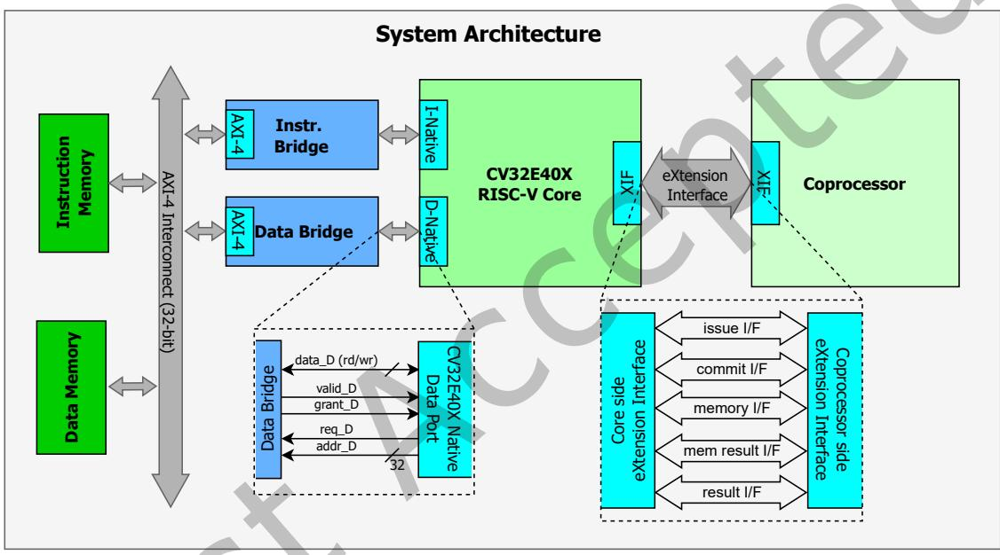
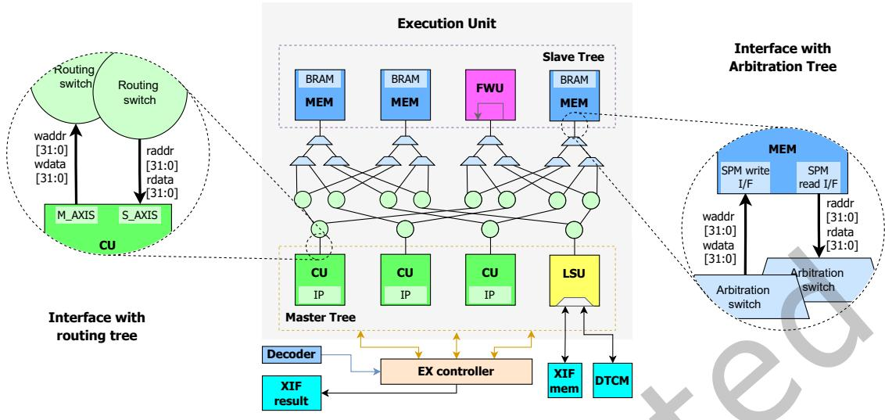
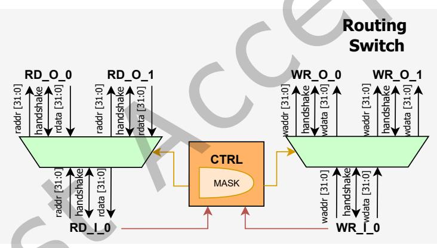
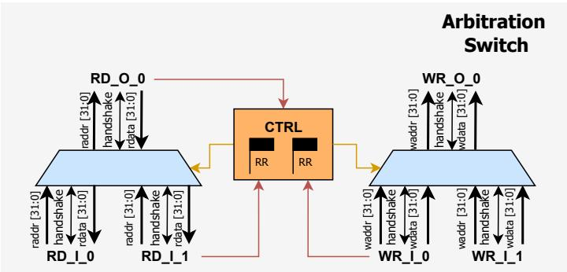
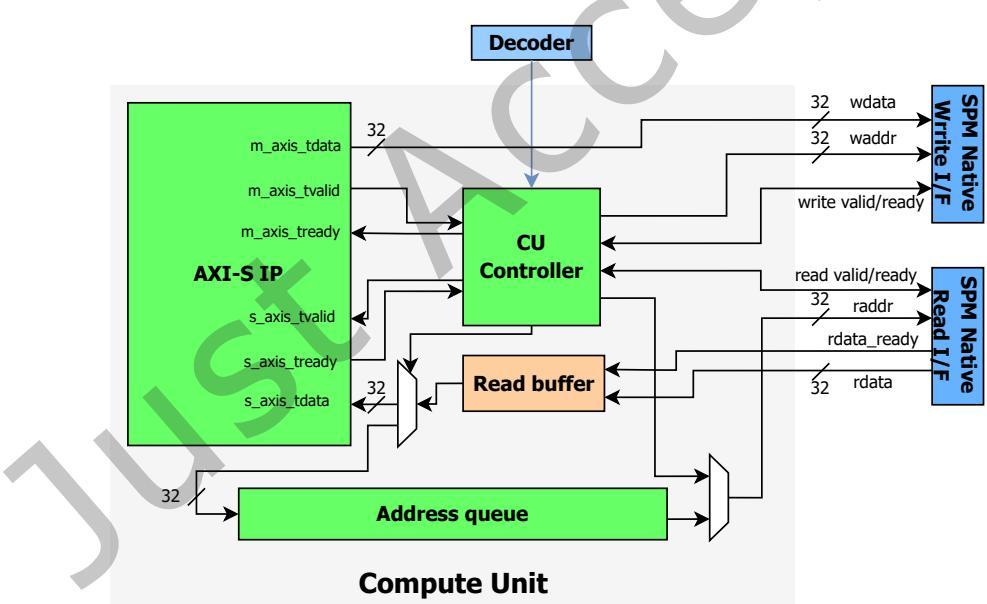
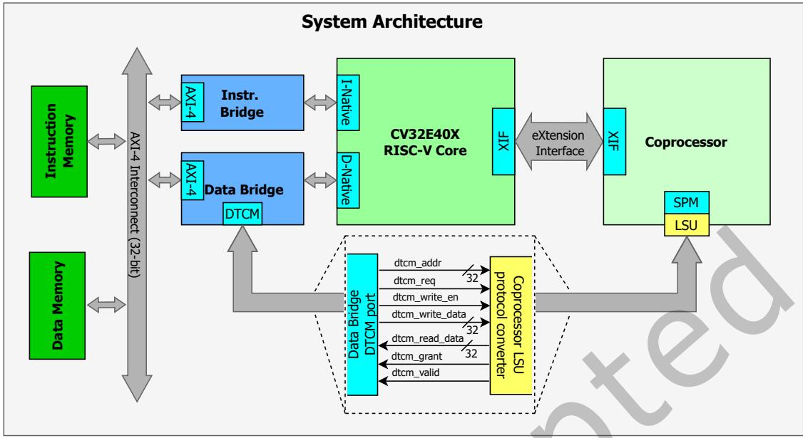
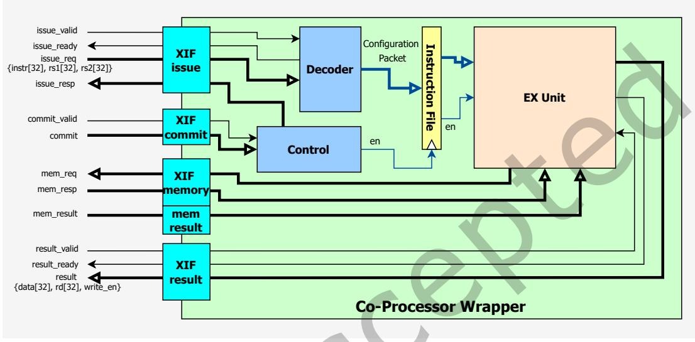

# A Configurable RISC-V Co-Processor with Instruction-Controlled Stream-Based Accelerators 论文解析

[📄 下载论文原文 (PDF)](original.pdf){:download="riscv_coprocessor.pdf"} &nbsp;|&nbsp; [🔗 在线阅读](original.pdf){:target="_blank"} &nbsp;|&nbsp; [DOI: 10.1145/3816253](https://doi.org/10.1145/3816253){:target="_blank"}

## 0. 论文基本信息

**作者 (Authors)**: Rohan Krishna Vijayaraghavan, Ahmed Kamaleldin, Matthias Nickel, Lester Kalms, Diana Göhringer

**发表期刊/会议 (Journal/Conference)**: ACM Trans. Reconfig. Technol. Syst.

**发表年份 (Publication Year)**: 2026

**研究机构 (Affiliations)**: Technische Universität Dresden, Center of Scalable Data Analytics and Artificial Intelligence (ScaDS.AI), Technische Universität Dresden

---

## 1. 摘要

**目的**
提出一种模块化、可配置的RISC-V协处理器架构，用于在边缘设备上高效集成和管理多个**流式硬件加速器**（AXI-Stream IP），以应对深度神经网络等计算密集型工作负载对高性能与低功耗的双重需求，同时简化硬件加速器的编程与系统集成流程。

**方法**
- **架构设计**：基于开源RISC-V核心（CV32E40X）通过**eXtension Interface (XIF)** 紧耦合一个可扩展协处理器。协处理器内部集成：
  - **多Bank Scratchpad Memory (SPM)**：支持可配置数量的存储体（如8×8配置），通过低延迟的**对数互连网络**（单周期路由-仲裁树）连接所有主设备（计算单元、加载/存储单元）与从设备（内存Bank、转发单元）。
  - **计算单元 (Compute Unit, CU)**：为每个加速器IP配备专用控制器，实现内存映射到流的转换，支持**地址队列**用于非连续数据访问模式。
  - **转发单元 (Forwarding Unit, FWU)**：允许CU之间直接流式数据传递，避免经过内存，实现操作链的流水线化。
- **编程模型**：扩展RISC-V指令集，定义自定义指令（如XCFG、XCMP、XLOADC等），并通过**内联汇编宏**和**C级软件宏**封装，使开发者能够以函数调用的方式配置、启动和同步加速器。同时，SPM直接映射到核心地址空间，支持直接数据访问。
- **时钟域解耦**：通过**异步FIFO**将协处理器执行单元与核心时钟域分离，使加速器可在更高频率下独立运行。
- **工具链支持**：利用Python脚本自动生成硬件架构和软件宏，实现“即插即用”的集成流程。

**结果**
- **资源与功耗**：在AMD/Xilinx RFSoC 4×2 FPGA上，8×8配置的协处理器仅消耗**1.9% LUTs**（8012个），动态功耗从先前工作的67mW降至**49mW**（降低27%）。
- **性能**：
  - **操作链通过FWU**：随着链长增加（最多8个CU），有效吞吐量提升，尤其在大输入长度下（如1024字）接近1字/周期。
  - **指令延迟**：自定义配置指令固定5周期；数据移动指令每字5周期。直接SPM内存映射相比原有XIF方式实现**3.35倍**加速。
  - **互连拥塞**：当多个主设备争用同一从设备时，平均每字等待周期随争用数线性增长，但通过仲裁树公平调度。
  - **可扩展性**：8×8网络可达**333 MHz**，8×16网络达**294 MHz**，更大配置（如32×32）频率降至164MHz，LUT利用率升至20%以上。
- **案例：ShuffleNet V2**：将HLS生成的7个独立IP段集成到协处理器中。相比独立IP实现，资源利用率降低**51% LUTs**、**29% FFs**、**25% BRAMs**，而响应延迟基本持平，同时获得对每个内核IP的细粒度指令级控制。

**结论**
所提出的RISC-V协处理器提供了一个**轻量、可扩展、易于编程**的加速器集成平台，通过自定义指令集与软件宏抽象显著降低开发复杂度。通过多Bank SPM、低延迟互连、FWU链支持以及时钟域解耦，实现了高吞吐、低延迟的流式加速，同时保持极低的FPGA资源开销。ShuffleNet-V2案例验证了其在真实DNN工作负载中的有效性——在相似延迟下，资源利用大幅降低。未来工作将探索动态部分重构，以支持运行时加速器热插拔。

---

## 2. 背景知识与核心贡献

**研究背景与动机**

- AI与ML驱动的边缘设备应用快速增长，对高计算性能与低功耗提出严峻挑战。
- 专用硬件加速器虽能卸载计算密集型负载、提升能效，但现有异构SoC架构设计过程**耗时且成本高昂**。
- 当前开放硬件平台多聚焦于**松耦合的外设式加速器**集成，开发者需自行管理底层通信、数据共享与一致性。
- 现有紧耦合协处理器方案（如Spatz、TYRCA）多针对特定领域或单一操作优化，**缺乏支持多种流式加速器且提供指令级软件控制的通用可配置平台**。
- 虽存在XIF、RoCC等接口用于紧耦合集成，但尚无提供**直接即插即用**、具备指令控制流式加速器能力的协处理器研究。

**核心贡献**

- **模块化可配置协处理器架构**：提出一个基于RISC-V的模块化协处理器，可扩展地托管多个**AXI-Stream协议加速器IP**。该架构具备硬件/软件可配置性，无需修改核心流水线即可集成。
- **自定义指令集与软件宏抽象**：设计配套的自定义RISC-V指令扩展（如**XCFG、XCMP、XLDA、XCFGA**），通过软件宏封装，实现加速器**配置、执行与内存管理的指令级控制**，降低编程复杂性。
- **低延迟可扩展互连网络**：开发树形对数结构的**单周期互连**，连接多Bank Scratchpad Memory（SPM）与计算单元（CU），支持**CU到CU直接数据转发（FWU）**，避免数据经过内存的高延迟路径。
- **地址队列增强CU**：为CU增加地址队列，支持**任意非连续数据访问模式**（如内存对齐、重排），扩展了加速器适用范围。
- **双时钟域解耦设计**：通过异步FIFO将协处理器执行单元与核心时钟域解耦，使加速器可独立运行在**294-333 MHz**（8x8配置），突破核心频率限制。
- **即插即用自动化工具流**：提供Python脚本，可根据IP列表自动生成协处理器硬件架构与软件宏，实现**最小化集成工作**。

**核心性能与资源数据**

| 指标（8x8配置） | 数值 |
|---|---|
| FPGA平台 | AMD/Xilinx RFSoC 4x2 |
| 最大频率（执行单元） | 294-333 MHz |
| 资源占比（LUTs） | ≤ 3% |
| 动态功耗（较先前工作） | **降低27%**（49 mW vs 67 mW） |
| 架构特点 | 支持8 CU + 16 Banks，**单周期互连** |

**系统架构图**：展示了协处理器通过XIF接口紧耦合于CV32E40X RISC-V核心，并连接指令/数据内存与AXI总线的完整SoC视图。

 *Fig. 1. Integration of the co-processor with a 32-bit RISC-V core in the proposed SoC, highlighting the core-memory and core-co-processor interface.*

---

## 3. 核心技术和实现细节

### 0. 技术架构概览

**整体技术架构**

- 系统采用 **RISC-V CV32E40X** 核心与 **自定义协处理器** 紧密耦合，通过 **eXtension Interface (XIF)** 实现指令级交互。

- 协处理器内部包含以下主要组件：

    - **Co-processor Wrapper**：负责解析通过 XIF 下发的自定义指令，管理指令解码、提交和结果回写。
    - **Load/Store Unit (LSU)**：管理协处理器本地 **多 bank scratchpad memory (SPM)** 与核心数据内存间的数据搬运。支持两种模式：通过 XIF 内存接口的串行传输，以及通过 **Data Bridge** 将 SPM 直接映射到核心地址空间的紧耦合模式，后者支持并行访问。
    - **Compute Unit (CU)**：每个 CU 由一个轻量控制器和一个 **AXI4-Stream 加速器 IP** 组成。控制器负责将 SPM 中的数据流式送入 IP 输入，并将 IP 输出流写入 SPM。CU 可附加 **地址队列**，支持非连续内存访问模式。
    - **单周期树状互联网络**：由 **路由树 (Routing Tree)** 和 **仲裁树 (Arbitration Tree)** 构成，支持多个 Master (CU / LSU) 访问多个 Slave (SPM bank / Forwarding Unit)。每级节点对读写路径独立处理，仲裁器采用 **轮询 (round-robin)** 避免饥饿。
    - **Forwarding Unit (FWU)**：位于 Slave 侧，提供 Master 间直接数据转发，无需经过 SPM bank，实现 **流水线级联**。
    - **双时钟域设计**：协处理器执行单元与核心运行于不同时钟域，通过 **异步 FIFO** 隔离 XIF 内存接口和 DTCM 接口的跨域信号，使加速器 IP 可运行于更高频率。

- 整体架构图如 **Fig.1 (SoC 概览)** 和 **Fig.2 (协处理器 wrapper 内部)** 所示，详细互联逻辑见 **Fig.7 (执行单元拓扑)**。

### 1. Custom Instruction Set Extension via XIF

**核心实现原理**

该协处理器通过 **eXtension Interface (XIF)** 与 **CV32E40X RISC-V 内核**实现紧耦合。XIF 支持五个主要接口：issue（指令下发）、commit（提交）、memory（内存请求）、memory result（内存响应）、result（写回结果）。协处理器拦截内核视为非法指令的 **自定义 R-type 指令**，内核将指令码及 rs1/rs2 寄存器值通过 issue 接口转发给协处理器。协处理器解码指令后，通过 commit 接口确认执行，并在完成后通过 result 接口返回状态或写回数据（写入 rd 寄存器）。这种设计**无需修改内核流水线**，仅依赖 XIF 协议即可扩展指令集。

---

**指令执行流程**

- **指令卸载**：内核遇到自定义指令（如 `xcfg`）时，若 XIF 判定该指令合法，则通过 issue 接口将指令码及 rs1/rs2 值传递给协处理器。
- **解码与配置**：协处理器内的 **Decoder** 解析指令的 funct3/funct7 字段，识别指令类型（如 XLOADC、XCFG），并将解码结果（包括目标 CU ID、地址、长度等）存入本地指令寄存器。
- **提交与触发**：内核通过 commit 接口确认指令可执行。协处理器的 **Instruction Controller** 接收 commit 信号后，驱动执行单元（Execute Unit）开始处理。
- **执行与同步**：
  - **LSU 指令**（如 XLOAD、XSTORE）：通过 memory/memory result 接口直接与内核数据内存交互，完成数据搬移。每个 32-bit 字传输约消耗 5 个时钟周期（负载/存储各有详细分解）。
  - **CU 指令**（如 XCFG、XCMP）：配置 CU 的源/目的地址和长度后立即返回状态，CU 独立执行流操作。内核需通过重新下发 XCFG 指令（带相同参数）轮询 CU 状态：若 CU 忙则返回 0，完成则返回 1。
- **结果写回**：执行完成后，协处理器通过 result 接口返回状态值（1 表示成功，0 表示错误）并可能写回 rd 寄存器。

---

**参数设置与指令格式**

自定义指令均采用 **R-type 编码**，通过 funct3、funct7 字段区分类型。主要指令及参数如下：

- **LSU 数据移动指令**（表 2）：
  - `XLOADC` (funct3=000)：rs1=源地址（外部内存），rs2=长度，返回状态到 rd。
  - `XLOAD` (funct3=001)：rs1=目标地址（SPM 内部），rd=状态。
  - `XSTOREC` (funct3=010)：rs1=源地址（SPM），rs2=长度。
  - `XSTORE` (funct3=011)：rs1=目标地址（外部内存）。
- **CU 配置与控制指令**（表 3）：
  - `XCFG` (funct3=100)：funct7=目标 CU ID，rs1=源地址（SPM），rs2=输入长度。
  - `XCMP` (funct3=101)：funct7=目标 CU ID，rs1=目的地址（SPM），rs2=输出长度。
- **地址队列相关指令**（表 4）：
  - `XLDA` (funct3=110)：funct7=目标 CU ID，rs2=输入长度（地址序列长度）。
  - `XCFGA` (funct3=111)：funct7=目标 CU ID，rs2=输入长度（触发使用地址队列）。

指令通过 **inline assembly 宏**（Listing 1）封装在 C 代码中，用户调用宏如 `xcfg(id, addr, len)` 即可生成对应机器码。

---

**输入输出关系**

- **输入**：全局编译时的 RISC-V 自定义指令（32-bit 指令字）及内核提供的 rs1/rs2 寄存器值（32-bit 地址或长度）。
- **处理**：指令在协处理器内解码，转化为内部控制信号（如 CU 配置字、LSU 传输参数）。协处理器通过 XIF memory 接口与内核数据内存交互，或直接控制 CU 与 SPM 间的流式数据搬运。
- **输出**：执行结果（成功/失败状态）通过 XIF result 接口写回内核的 rd 寄存器。对于 CU 指令，协处理器不阻塞内核流水线，而是后续通过轮询获取完成标记。

---

**在整体架构中的作用**

该指令扩展是整个协处理器的 **软件控制入口**，使开发者能以标准 RISC-V 指令流管理异构加速器：

- **配置**：通过 `XCFG` 设定 CU 的源地址、长度；通过 `XLOADC/XLOAD` 将数据从内核内存搬入 SPM。
- **执行**：通过 `XCMP` 触发 CU 流式处理；通过 `XLDA/XCFGA` 实现非连续地址访问（如数据重排）。
- **同步**：通过轮询 `XCFG` 返回值判断 CU 完成状态。
- **内存管理**：通过直接映射 SPM 到内核地址空间（Section 3.3 的扩展），用户可使用普通 load/store 指令访问 SPM，或继续使用 XLOAD/XSTORE 进行批量搬移（后者延迟更低）。

综上所述，XIF 指令扩展实现了 **低开销的指令级控制**：CU 执行不阻塞内核，LSU 仅在不直接映射时阻塞，且所有配置与同步均通过指令完成，无需传统 API 或驱动。这种设计在保持灵活性的同时，显著降低了软件开销。

### 2. Multi-bank Scratchpad Memory with LSU and DTCM Mapping

**核心观点**
多bank scratchpad memory（SPM）与Load Store Unit（LSU）及DTCM映射共同构成协处理器的高带宽数据通路。其设计目标是解除核心与加速器之间的数据移动瓶颈，使核心可直接访问SPM，同时保留自定义指令用于大批量数据迁移。

**实现原理**
- **多bank SPM拓扑**：SPM由若干双端口RAM bank组成，每个bank提供独立读写通道，深度和bank数量均为编译时可配置参数。bank地址映射采用位段划分——低位为内部地址，高位为bank选择位，确保跨bank并行访问。
- **LSU基础功能**：LSU最初作为桥梁，通过XIF（eXtension Interface）从核心数据存储器向SPM搬运数据。其内部包含：
  - 两个地址生成单元（一个对应SPM bank，一个对应外部核心内存）。
  - 数据缓冲区，用于吸收XIF侧与SPM侧之间的读写延迟差异。
  - 有限状态机，按固定顺序执行XLOADC/XLOAD（加载）或XSTOREC/XSTORE（存储）指令，每次搬运一个32-bit word，并处理握手与突发结束信号。
- **DTCM映射扩展**：为解决XIF搬运产生的流水线停顿和额外周期开销，LSU被扩展，通过连接至核心数据桥的Tightly Coupled Data Memory（DTCM）端口，将整个多bank SPM地址空间直接映射到核心的物理地址空间（基地址0x4000_0000）。此时LSU内部的缓冲被旁路，核心可通过标准加载/存储指令（如`lw/sw`）直接读写SPM。

**算法流程与参数设置**
- **配置参数**：
  - `N_banks`：bank数量，可配置（如8个bank）。
  - `bank_depth`：每个bank深度，单位word（如1024×32-bit）。
  - `DTCM_base_addr`：硬件映射的起始地址（例如0x4000_0000）。
  - 每个bank在DTCM空间内连续编址，长度为`bank_depth * 4`字节。
- **运行时数据流**：
  1. **静态初始化**：在程序编译期，通过GCC `__attribute__((section(".spm_data_0")))` 将数据直接放置在SPM区域，无需运行时代码。
  2. **自定义指令搬运（可选）**：对运行时非对齐或外部数据，仍可使用XLOAD/XSTORE指令，每word花费5个时钟周期（核心侧1–4周期 + 协处理器侧1–4周期），但核心会停顿。
  3. **加速器执行**：CU（Compute Unit）通过快速单周期interconnect从SPM读取数据，无需核心干预。

**输入输出关系**
- **输入**：核心通过DTCM映射写入SPM的数据（如输入特征图、权重）或自定义指令写入的数据。
- **输出**：加速器处理完毕结果写回SPM后，核心可通过DTCM直接读出，或通过自定义指令搬回外部内存。
- **双向同步**：读写操作均为同步——核心或LSU的写操作完成后，CU才能读取；CU写入完成后，核心才可读取。FWU（Forwarding Unit）允许CU间直接流式转发，减少SPM读写冲突。

**在整体中的作用**
- **消除核心停顿**：DTCM映射使核心无需等待自定义指令，即可在程序初始化或并行阶段存取SPM，与CU执行重叠。
- **降低延迟**：直接内存映射省去XIF协议开销，对于每次访问至少节省5个周期。
- **提升吞吐**：多bank设计配合并行interconnect，允许多个CU同时访问不同bank，支持高带宽流式运算。
- **简化编程**：通过链接脚本和GCC section attribute，将数据布局与硬件地址空间对齐，开发者无需手动管理DMA。

### 3. Scalable Single-Cycle Interconnect Network

**核心实现原理**  
该互连网络是一个**对数级路由-仲裁（logarithmic routing-arbitration）** 的交叉网络，将主控树（Master Tree）中的计算单元（**CU**s）和负载/存储单元（**LSU**）与从属树（Slave Tree）中的多bank Scratchpad Memory（**SPM**）以及转发单元（**FWU**）连接起来。其核心目标是实现**单周期访问路径**（single-cycle access），并支持多个主控并发访问不同从属单元，同时通过轮询仲裁避免冲突。网络由两个树形结构组成：**路由树（Routing Tree）** 和**仲裁树（Arbitration Tree）**，之间通过组合逻辑相连。  

**路由树（Routing Tree）**  
- 位于主控树一侧，由多层**路由开关（Routing Switch）** 级联而成。  
- 每个开关根据目标从属单元地址中的**bank选择位**，将请求定向到两个输出方向之一。  
- 地址解析：地址分为**内部地址**（bank内偏移）和**log₂(从属数量)** 位的bank选择位。例如8个从属（bank深度1024字）时，低10位为内部地址，高3位选择bank。  
- 路由开关的每一层比较bank选择位的对应比特与树掩码，决定路径方向。请求从主控出发，逐层向下路由，最终到达仲裁树的对应层级。  
- 路由树的层数为 **log₂(从属数量)**。  
 *Fig. 7. The Execution unit featuring the low-latency interconnect (4x4 as an example here). The execution unit communicates with the core through the EX controller, and with the external memory through the LSU. The interfaces between the interconnect and the master & slave trees are highlighted. Fig. 8. Architecture of the routing switch.*

**仲裁树（Arbitration Tree）**  
- 位于从属树一侧，由多层**仲裁开关（Arbitration Switch）** 级联而成。  
- 每个仲裁开关有两个输入、一个输出，每层使用**轮询（round-robin）** 标志决定当两个输入同时有效时哪个获得服务，避免饿死。  
- 仲裁树的层数为 **log₂(主控数量)**。  
- 读和写路径独立，因此读仲裁与写仲裁互不影响。  
- 从属树包含SPM bank和FWU，每个从属单元有独立地址范围。  
 *Fig. 9. Architecture of the arbitration switch.*

**参数设置与可配置性**  
- 网络规模为 **M × S**，其中 M 为主控数量（CUs + LSU），S 为从属数量（SPM banks + FWUs）。  
- 典型配置：**8×8**（7个CU + 1个LSU 作为主控，7个SPM bank + 1个FWU 作为从属）。  
- 每个SPM bank为双端口BRAM，深度可配置（如1024字），数据宽度32位。  
- FWU作为特殊从属，实现主控间直接数据转发而不经过SPM，支持IP链式操作。  
- 主控单元通过编译时分配的**CU ID**区分，LSU固定ID为0。

**输入输出关系与操作流程**  
- **请求流向**：主控（CU或LSU）发出读/写请求，包含目标从属的地址和数据（写时）。请求经路由树逐层定向至对应仲裁树入口；仲裁树将请求转发至目标从属单元。从属返回的数据或写确认沿相同路径逆向返回。  
- 请求在路由和仲裁树中均为**组合逻辑**路径，目标是在从属响应后，整个传输在一个时钟周期内完成（从主控发出到数据返回）。  
- **并发能力**：多个主控可同时访问不同从属（无竞争），或同时访问同一从属的不同操作（读/写独立）。只有在多个主控同时访问同一从属的同样操作（如两个读）时才会发生仲裁，此时轮询仲裁引入等待，平均等待时间与竞争主控数量和树层级相关（文档图11显示典型2-4周期延迟）。

**在整体架构中的作用**  
- 该互连网络是**执行单元（Execution Unit）** 的核心背板，将多bank SPM、多CU（含加速器IP）和LSU高效连接起来。  
- 它使得CU可以**直接读取/写入任意SPM bank**，并支持**CU-to-CU通过FWU直接交换数据**，无需CPU介入，也无需将数据先写回SPM再读出。  
- 由于网络为单周期组合逻辑，在时钟频率允许范围内（8×8配置下可达**333 MHz**），CU与SPM之间可实现**低延迟、高带宽**的数据流。  
- 互连网络的规模直接影响最大频率（文档表6），8×8以上频率显著下降，但资源增长可控（8×8占用约2% LUT），因此设计中推荐**4×4至8×16**作为实际可用区间。

### 4. Compute Unit with Address Queue for Non-Sequential Access

**核心概念**
为解决流式加速器仅支持顺序内存访问的局限，**Compute Unit (CU)** 被扩展了**地址队列 (Address Queue)** 机制，使其能够处理非连续、任意排列的地址模式（如卷积的步长访问、池化操作的取数、数据重排等），而无需主核心在每次访问时计算并下发单个地址。

**实现原理与结构**
- 在CU内部，原本从**Scratchpad Memory (SPM)** 读取数据并直接送入**AXI4-Stream IP**的路径被插入一个多路选择器（MUX）。该MUX允许数据流导向两个方向之一：
  - **正常路径**：数据直接发往IP输入端口。
  - **地址加载路径**：数据被写入**地址队列**（FIFO结构）。
- 地址队列本身是一个内部存储单元，用于保存从SPM预取的**目标地址值**（每个地址为32位）。队列深度可按需配置。
- 当CU处于**执行模式**时，地址队列的输出作为SPM读端口地址源，代替原有的顺序计数器。从SPM返回的数据再按正常路径流式传输至IP。

**算法流程与参数设置**
整个操作分为两个阶段：

1. **地址加载阶段 (Address-Load Mode)**
   - 软件预先在SPM的某区域生成一张地址表（每个元素对应一个目标数据的地址）。
   - 通过**XCFG**指令（配置源地址指向该地址表）后，再执行**XLDA**指令（目标CU ID，输入长度）。CU会将MUX切换至“队列加载”方向，从SPM读取这些地址并依次推入**地址队列**。
   - **参数**：`XLDA`指令的`rs2`字段指定要加载的地址数量（长度）；`rs1`被忽略（地址已由XCFG设定）。

2. **执行模式 (Execution Mode)**
   - 地址加载完成后，通过**XCFGA**指令（目标CU ID，输入长度）使能队列作为地址源。该指令通知CU：后续读操作不再使用顺序计数器，而是从**地址队列**逐项弹出地址。
   - 随后再执行**XCMP**指令（目标CU ID，输出地址、输出长度）启动流式执行。CU便开始依次从队列取出地址→从SPM读取对应数据→通过内部FIFO缓冲→发给AXI4-Stream IP。
   - **参数**：`XCFGA`的`rs2`指定输入长度（应与地址队列中的地址数量一致）。

**输入输出关系**
- **输入**：
  - 第一阶段输入：存储在SPM中的**地址列表**（由软件生成，例如连续地址或可配置的索引序列）。
  - 第二阶段输入：实际数据，地址由队列决定。
- **输出**：连续的数据流，按队列中的地址顺序从SPM取出，送入IP。
- **数据流向**：SPM → CU读接口 → MUX（第一阶段进队列，第二阶段经FIFO） → IP输入端口。

**在整体中的作用**
- **解除顺序地址限制**：使CU能够支持卷积中**strided window**、池化中的**最大/平均取数**、特征图重排等非连续访问模式，而这些在原始设计中必须由RISCV核心逐字执行读/写指令，导致巨大开销。
- **减少核心干预**：地址表可预先计算并存储在SPM中，通过一次定制指令序列（`XCFG + XLDA + XCFGA + XCMP`）完成整个操作，核心只需在最后轮询完成状态，无需在每个数据元素上干预。
- **提升性能**：论文中提到，对于非对齐访问，**地址队列**实现比纯顺序CU加速显著，尤其当访问模式复杂时，核心负载减轻，整体吞吐量提升。
- **可编程性**：通过软件生成地址序列，CU可灵活适应不同IP的需求（如多输入口、数据重组），无需修改硬件逻辑。

 *Fig. 6. Compute unit augmented with an address queue.*
*Figure 6: 带有地址队列的CU架构，MUX位于SPM读数据路径上，队列输出作为读地址源之一。*

**参数设置小结**
| 指令 | 作用 | 关键参数 |
|------|------|----------|
| XCFG | 配置源地址（地址表位置） | CU ID, 源地址, 长度 |
| XLDA | 将地址表从SPM加载到队列 | CU ID, 输入长度 |
| XCFGA | 启用队列作为读地址源 | CU ID, 输入长度 |
| XCMP | 启动流式执行 | CU ID, 目的地址, 输出长度 |

该扩展后，CU不仅支持顺序流，还能处理任意内存访问模式，成为通用的**内存映射流式控制器**，显著提升了协处理器在复杂数据访问场景下的适用性和效率。

### 5. Forwarding Unit for Direct CU-to-CU Streaming

**核心观点**：Forwarding Unit (FWU) 是嵌入在 co-processor 的 slave tree 中的一种特殊内存映射单元，它利用缓冲的读写端口实现两个 Compute Unit (CU) 之间的直接数据流转发，从而无需将中间结果写入 Scratchpad Memory (SPM) 再读出。这一机制显著降低了流水线链式执行中的延迟与内存带宽消耗，是提升多 IP 协同工作效率的核心设计。

**实现原理**
- FWU 在逻辑上表现为一个具备独立读接口和写接口的从设备，映射到 slave tree 的唯一地址范围（如文档中 `FWU_ADDR = 2048`）。
- FWU 内部维护一个双向 FIFO 缓冲区：写端口接收来自 master (producer CU) 的写入请求，将数据推入缓冲区；读端口响应 consumer CU 的读取请求，从缓冲区弹出数据。两端通过独立的握手信号控制，允许异步操作。
- 当 producer CU 和 consumer CU 同时访问同一个 FWU 地址时，FWU 在内部将写数据直接桥接到读端，仅在缓冲不足或空时阻塞对应的 master。这种设计使得数据无需经过任何 memory bank，实现了零次内存拷贝的链式传输。

**算法流程与参数设置**
- **配置阶段**：在软件中，通过自定义指令 `xcfg` 和 `xcmp` 将 producer CU 的 **输出地址** 和 consumer CU 的 **输入地址** 均设置为 FWU 的地址范围（如 `FWU_ADDR`）。地址译码逻辑会在 slave tree 中将其导向 FWU 而非 SPM  banks。
- **启动阶段**：两个 CU 通过 `xcmp` 指令同时启动（或先后即刻启动）。此时 producer CU 开始从 SPM 读取输入数据，处理后通过其 AXI4-Stream 输出端口向 FWU 写入；consumer CU 则开始从 FWU 读取数据，经内部 FIFO 缓冲后送入其输入流。
- **执行阶段**：FWU 内部的 arbiter 协调读写操作。当 producer 写入一个字时，该字被存入缓冲区；consumer 读取时，若缓冲区非空则立即返回，否则等待。读写端口可并行工作。
- **完成检测**：由于 FWU 不提供中断，核心需通过 `xcfg` 指令轮询 consumer CU 的状态，或直接等待其输出完成（如配置 output length 后轮询）。
- **参数设置**：FWU 的缓冲区深度可配置（文档示例中使用 1024 字深度）。此外，FWU 需要与其他 slave units（memory banks）共享 slave tree 的地址空间，其基地址必须在系统地址映射中固定，并在软件宏中定义。

**输入输出关系**
- **输入**：来自 producer CU 的写数据流（32-bit words），通过 interconnect 的 routing tree 和 arbitration tree 到达 FWU 的写端口。
- **中间状态**：数据暂存于 FWU 内部 FIFO，该 FIFO 同时作为读端口的输入源。
- **输出**：送往 consumer CU 的读数据流。由于 FWU 是内存映射的，其读写接口与普通 memory bank 的接口完全一致，因此 CU 控制器无需特殊适配即可使用 FWU。
- **整体作用**：在 co-processor 中，FWU 将原本需要两阶段（写 SPM → 读 SPM）的流水线缩减为单阶段直接转发。文档的实验数据显示，对于 1024 字输入，FWU 链式执行相比 SPM 中间存储方式获得了 **1.49× 速度提升**。此外，多级 FWU 链（如图 10 所示）可使有效吞吐量随链长增加而接近单个 IP 的峰值（1 word/cycle），因为各级 IP 可以同时处理不同窗口的数据，形成真正的流水线并行。

**架构中的嵌入方式**
FWU 被插入在 slave tree 的末端，与 SPM banks 并列。在文档的 8×8 配置中，7 个 SPM banks 与 1 个 FWU 共享地址空间。FWU 的物理位置不会改变 interconnect 的单周期延迟特性，因为其内部 FIFO 引入了少量寄存器级数，但整体仍保持低延迟。文档中的 scalability 实验（表 6）显示，在 8×8 网络中，包含 FWU 的执行单元最高频率可达 **333 MHz**，资源占用仅约 **2% LUTs**，证明 FWU 的设计效率极高。

**总结**：FWU 通过巧妙地复用 slave tree 的地址译码与仲裁机制，在不改变 CU 接口的前提下实现了高性能的 IP 间直接流式通信。它是最小侵入式的硬件优化，却带来了显著的吞吐提升和延迟降低，是 co-processor 支持任意长度链式加速器的关键使能技术。

### 6. Dual-Clock Domain Decoupling

**核心观点**：Dual-Clock Domain Decoupling 通过将执行单元（互联网络和 CU 控制器）与 RISC-V 核心及协处理器包装器置于独立的时钟域，并采用异步 FIFO 桥接跨域通信，使加速器 IP 能够以高于核心的频率独立运行，同时简化时序收敛并提升系统可扩展性。

**实现原理**
- 划分两个时钟域：
  - **核心域 (clk)**：包含 RISC-V 核心、协处理器包装器（指令解码器、控制器）、XIF 接口逻辑及 LSU 的部分控制逻辑。
  - **执行域 (clk_ex)**：包含执行单元（加速器 IP、CU 控制器、多级路由/仲裁互联网络、多 Bank Scratchpad Memory、FWU）。
- 跨域接口分类：
  - **控制/配置类信号**：包括 XIF 的 issue/commit/result 接口中的寄存器操作数、状态返回、握手信号。这些信号在协处理器包装器内已本地寄存，跨越时钟域时仅需简单同步（如双级触发），无需 FIFO。
  - **内存传输类接口**：包括 XIF 的 memory 和 memory result 通道，以及核心数据桥的 DTCM 端口。这些接口使用请求-响应握手协议，必须通过异步 FIFO 解耦。
- 异步 FIFO 配置：
  - 采用 Xilinx xpm_fifo_async 原语，天然支持双时钟同步并推断为 BRAM。
  - 每个跨域接口拆分为独立通道：
    - **请求通道**：将 enable、地址、写数据打包后推入 FIFO（核心域写入，执行域读出）。
    - **响应通道**：将 valid 标志、读数据打包后推入 FIFO（执行域写入，核心域读出）。
  - 核心侧响应 valid 信号处理：为避免跨周期 valid 信号被核心时钟采样失配，响应 FIFO 输出时 valid 被脉冲化（与 clk_ex 对齐），核心仅在 clk 上升沿且 valid 有效时完成握手。

**算法流程与参数设置**
- 流程简述：
  1. 核心通过 XIF 或 DTCM 发起请求（如配置 CU、启动流式传输、加载数据）。
  2. 请求信号在核心域打包，写入对应异步 FIFO。
  3. 执行域时钟 clk_ex 独立运行，从 FIFO 中弹出一请求并执行，期间无需等待核心时钟。
  4. 执行结果（状态、读数据）打包写入响应 FIFO。
  5. 核心域从响应 FIFO 读取结果，完成握手。
- 参数配置：
  - **异步 FIFO 深度**：未明确指定，但文档提到使用 BRAM，推测深度足以容纳典型突发长度（如 16 或 32 个 word）以避免溢出。
  - **时钟频率**：核心域 clk 固定为 **100 MHz**（原型平台下核心限制）；执行域 clk_ex 取决于网络尺寸（表 6），例如 8×8 配置下最大 **333 MHz**，8×16 配置下 **294 MHz**。设计目标是最小周期受限于互联网络到 SPM 的路径延迟。
  - **同步策略**：对控制类信号采用双级同步器（无 FIFO），对数据类信号采用深度可配置的异步 FIFO。

**输入输出关系**
- 输入：
  - 来自核心的 XIF memory 接口：读/写请求，包含源/目标地址、长度、写数据。
  - 来自核心数据桥 DTCM 接口：核心直接访问 SPM 的地址和数据（读写）。
  - 来自核心的配置指令：通过 XIF issue 接口的寄存器操作数，指定 CU ID、地址、长度等。
- 输出：
  - 返回至核心的状态值（通过 XIF result 接口）：配置成功/失败、CU 忙碌/空闲。
  - 返回至核心的读数据（通过 XIF memory result 接口或 DTCM 响应通道）。
  - 执行单元内部：多个 CU 控制器从 SPM 读数据、流式处理、写回结果，并通过 FWU 进行 CU 间直接数据转发（同一时钟域内）。

**在整体架构中的作用**
- **频率隔离**：解除核心时钟（受通用处理器复杂流水线限制）对加速器 IP 的瓶颈，使 IP 可运行在更高频率（如 8×8 配置下从 100 MHz 提升至 333 MHz），直接提高吞吐量。
- **时序简化**：跨域路径被异步 FIFO 切断，执行单元的时序分析独立于核心域，简化整体 FPGA 实现流程，尤其在大规模互联网络（8×16、16×16）下优势明显。
- **资源与性能权衡**：异步 FIFO 引入少量 BRAM 和 LUT 开销（表 5 显示 7 个 BRAM、约 300 个 LUT），但相比无时钟域隔离时整个 SoC 不得不运行在核心低速下，该开销可接受。实验表明 8×8 网络在 333 MHz 时仅消耗 **2% LUT** 资源（RFSoC 4x2）。
- **可扩展性评估**：文档利用双时钟域特性，独立对执行单元进行频率扫描（表 6），以确定不同网络尺寸（2×2 到 32×32）下的最大频率和资源消耗，从而指导实际部署时选择最佳配置点（推荐 4×4 至 8×16）。

**关键实现细节总结**

| 参数/特性 | 核心域 (clk) | 执行域 (clk_ex) | 跨域机制 |
|-----------|--------------|------------------|----------|
| 组件 | RISC-V 核心、协处理器包装器、LSU 控制器 | 互联网络、CU 控制器、SPM、FWU | - |
| 典型频率 | 100 MHz | 294-333 MHz (8×8 ~ 8×16) | 异步 FIFO |
| 数据接口 | XIF memory / memory result, DTCM | 内存映射读写端口 | 每通道独立异步 FIFO |
| 控制接口 | XIF issue/commit/result | 配置寄存器 | 双级同步器 |
| 资源开销 (8×8) | - | 核心利用约 1% LUT | 异步 FIFO 约 0.2% LUT + 7 BRAM |

**图片参考**
- 图 4（数据桥与 SPM 连接）展示了 DTCM 路径作为双时钟域中一个关键跨域接口： *Fig. 4. Data bridge connecting the core’s native data port to the AXI-4 interconnect and the co-processor scratchpad memory.*
- 图 2（协处理器包装器架构）显示了执行单元（EX unit）与包装器之间的边界，该边界即为双时钟域分界： *Fig. 2. Architecture of the co-processor wrapper, featuring the XIF, decoder and instruction controllers, and the EX unit which hosts the custom accelerators.*

---

## 4. 实验方法与实验结果

**实验设置**
- **目标板卡与工具**： AMD/Xilinx RFSoC 4×2 评估板，Vivado 2024.2。全部 SoC（含 RISC-V 核心 CV32E40X 与协处理器）实现于 FPGA 逻辑上，指令内存 4 KB，数据内存 1024 KB（均为 BRAM）。
- **基准配置**： 协处理器采用 **8×8 拓扑**（8 主端口、8 从端口），主端口含 7 个 CUs + 1 个 LSU，从端口含 7 个 Scratchpad 存储 Bank + 1 个 Forwarding Unit (FWU)。每个 Bank 深度 **1024 字**（32-bit）。每个 CU 附接一个 Xilinx AXI4-Stream FIFO IP（深度 1024 字）作为占位加速器。
- **工作频率**： 基线使用单时钟域（核心与协处理器同频，100 MHz）。双时钟域解耦后执行单元（Execution Unit）可独立运行更高频率；可扩展性测试中，执行单元时钟频率被扫调。
- **基准测试工作负载**：
  - 链式单元吞吐量（图 10）： 不同链长（1-8 CUs）与不同输入尺寸（32, 64, 128, 256, 512, 1024 字）。
  - 拥塞延迟（图 11）： 多主节点竞争单个从节点时的平均等待周期。
  - 可扩展性（表 6）： 网络规模从 **2×2** 至 **32×32**。
  - 端到端用例（5.3节）： 使用 HLS 生成的 ShuffleNet V2 ONNX 模型，将模型划分为7个独立段，在 8×8 协处理器上运行（每 Bank 深度 16K 字以适应大张量）。

**结果数据分析**

**资源利用**
- 基线 8×8 空载设计（表 5）： 全部 SoC（含核心、内存、协处理器）消耗约 **14,755 LUTs**（占板载 3.5%）、**8,560 寄存器**、**95 BRAM**、**3 DSP**。协处理器自身占 **8,117 LUTs**，其中路由树占 2,016、仲裁树占 2,128、CU 控制器每单元 339 LUTs、LSU 控制器 307 LUTs。
- 对比先前工作 [30]： 相同 8×8 配置下，协处理器动态功耗降低 **27%**（从前 67 mW 降为 49 mW），资源因路由/仲裁树优化而下降。
- 可扩展性资源增长（表 6）： 从 **2×2 → 2×4** 几乎无增长（~2K LUTs）；**4×4** 为 3,417 LUTs；**8×8** 为 8,101 LUTs；**16×16** 为 24,573 LUTs；**32×32** 达 85,993 LUTs（占板载 20.2%）。资源近似随主端口数与从端口数双线性增长，在 16×16 后陡增。

**时序与频率**
- 单时钟域下核心限制为 100 MHz。双时钟域解耦后，执行单元频率受限于互连组合逻辑路径（CU FIFO → 从树）。
- 可扩展性表 6： **2×2 / 2×4** 可达 625 MHz，最小周期 1.6 ns；**4×4** 降为 555 MHz；**8×8** 降为 333 MHz；**16×16** 降为 212 MHz；**32×32** 降为 164 MHz。作者认为 **4×4 至 8×16** 是实际可用区间（频率 ≥ 294 MHz，资源 < 3% LUTs）。

**链式吞吐量（图 10）**  
- 使用 FWU 进行操作链式并行时，**有效吞吐量**（每周期处理字数）随输入尺寸和链长增加而提升。
- 链长=1（无链式）时，吞吐量始终低于 1 word/cycle，但小输入尺寸（如 32）仅约 **0.25**；大输入尺寸（1024）提升至约 **0.5**（原因：指令开销占比减小）。
- 链长=8 时，大输入尺寸下吞吐量可达 **接近 1.0**。例如输入长度 1024 时，8 链节吞吐约 0.9。
- 短输入（32）时链式增益有限，最多约 **0.35**，仍受指令延迟主导。

**拥塞延迟（图 11）**  
- 定义：在多主节点向同一从节点发起读写时，平均每个字传输等待的时钟周期数。
- 当竞争主节点数从 2 增至 6 时，平均等待从约 **2.5 周期**增至约 **7 周期**（峰值在 6 节点时约 7.5）。当竞争节点数再增至 7 时平均等待下降至约 6（可能是由于 LSU 空闲、不参与竞争）。
- 等待周期来源于仲裁树层级：两个主节点在首层仲裁器碰撞时各自等待 **2** 周期；若分布在两不同首层仲裁器且在上层碰撞，等待周期叠加。

**自定义指令延迟**  
- 配置/控制指令（XLOADC, XSTOREC, XCFG, XCMP, XLDA, XCFGA）固定 **5 周期**。
- 数据移动指令 XLOAD/XSTORE：每字 **5 周期**（XLOAD：1 核心侧 + 4 协处理器侧；XSTORE：2 核心侧 + 3 协处理器侧）。
- 使用直接 Scratchpad 内存映射（通过 DTCM 桥）时，可避免 XLOAD/XSTORE：对于 1024 字输入，速度提升 **3.35×**。

**ShuffleNet V2 用例（图 14）**  
- **延迟**： 各段在协处理器上的响应延迟与独立 HLS IP 实现**相当**（略高但可忽略）。
- **资源降低**： 与独立 IP 实现相比（图 14b），FF 减少 **29%**，LUT 减少 **51%**，BRAM 减少 **25%**，DSP 减少 **58%**。原因：FWU 链式消除了内部 FIFO；权值共享 Scratchpad 而非在 IP 内本地存储；分割/多播操作由软件地址管理代替硬件单元。
- 延迟未恶化（保持可比）而资源大幅下降，证明协处理器平台对 CNN 推理的节能高效。

**消融实验分析**

论文未明确使用“消融”一词，但通过多个对比实验揭示了各组件贡献：

- **FWU 消融**： 对比有 FWU（图 10）与无 FWU（链长=1 的状况）。有 FWU 后链式吞吐量提升，尤其大输入配长链时从 ~0.5 word/cycle 提升至 ~0.9。**FWU 是吞吐量倍增的核心**。
- **直接 SPM 映射 vs. 旧 XIF 数据搬运**： Listing 3（旧法需 XLOAD/XSTORE，花费每字 5 周期） vs. Listing 4（通过 __attribute__((section)) 直接放置数据到 SPM，消除运行时拷贝）。报告 1024 字输入时 **3.35× 加速**。该改动将 LSU 简化为桥接模块而非主动搬运器。
- **地址队列消融**： 通过新指令 XLDA/XCFGA（表 4）与自定义宏（Listing 8）支持非连续访问模式。虽然没有直接性能对比数据，但扩展了 CU 用途（例如矩阵转置、维度重排）。原版 CU 仅能顺序访问，地址队列解决了这一限制。
- **双时钟域解耦**： 在可扩展性分析（表 6）中体现效果。若未解耦，整个系统最大频率被核心拉低至约 100 MHz；解耦后执行单元可运行于更高频率（如 333 MHz 在 8×8），从而提升加速器实际吞吐。**异步 FIFO 隔离时序，使频率从核心限制中解放**。
- **资源优化消融**： 对比先前工作 [30] 的 8×8 设计，当前版本 LUT 消耗从 ~10.1K（推算）降至 8.1K，动态功耗从 67 mW 降至 49 mW（–27%）。归功于精简 LSU、路由/仲裁树开关级优化。
- **ShuffleNet 中的链式 vs. 独立 IP**： 直接比较了“将 ONNX 节点合成一个整体大 IP”与“拆分为多个小 IP 并用 FWU 链式”的区别。结果说明资源大幅下降。**这本质上是调度策略消融**：硬件集中控制 vs. 软件控制的细粒度流水。

---

