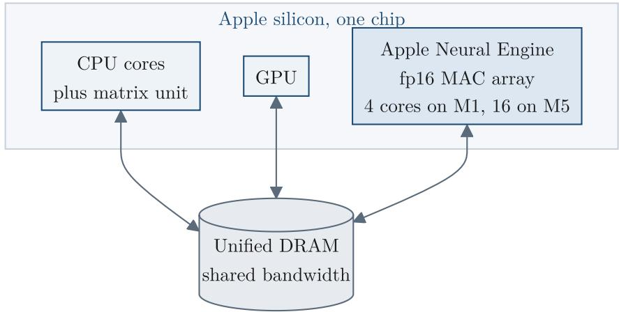
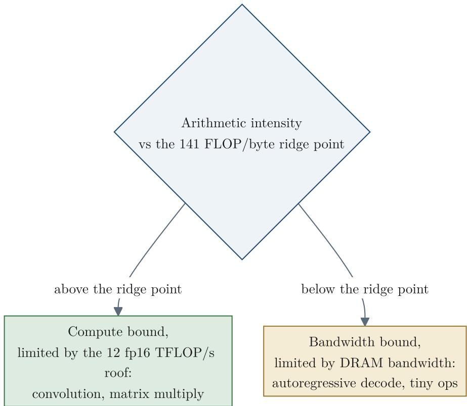
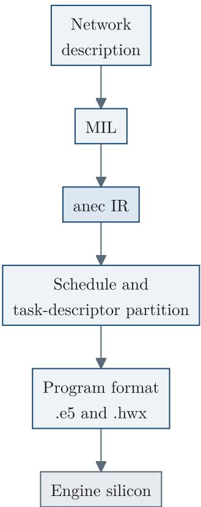
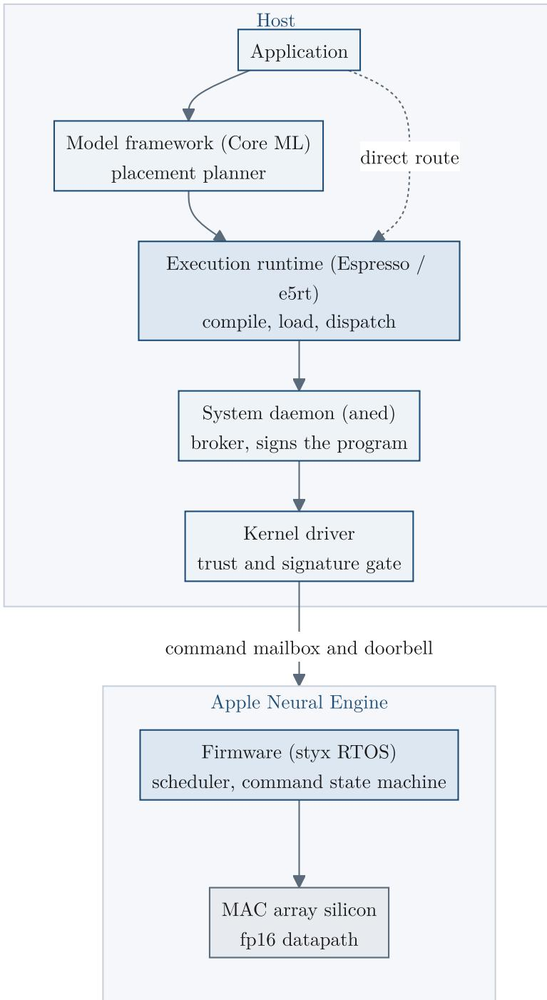
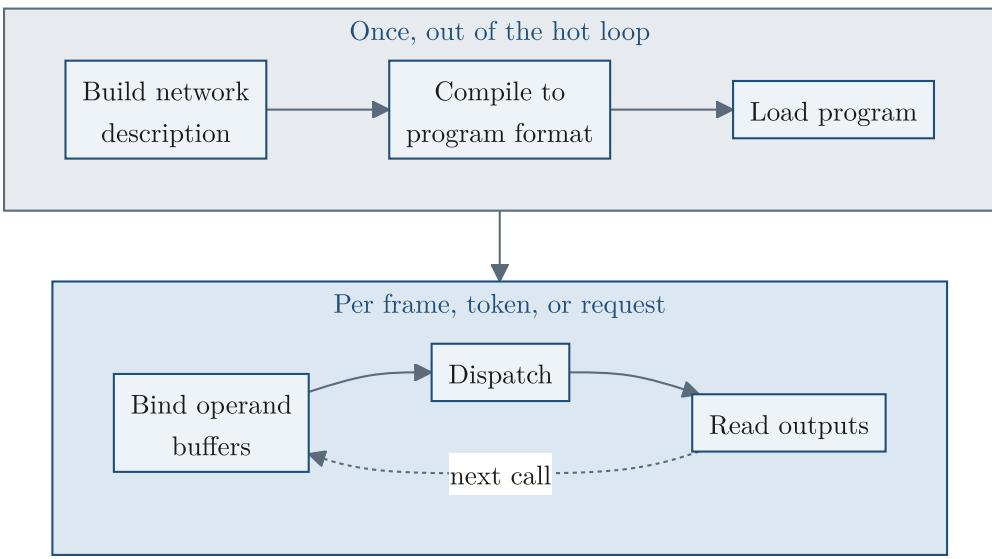
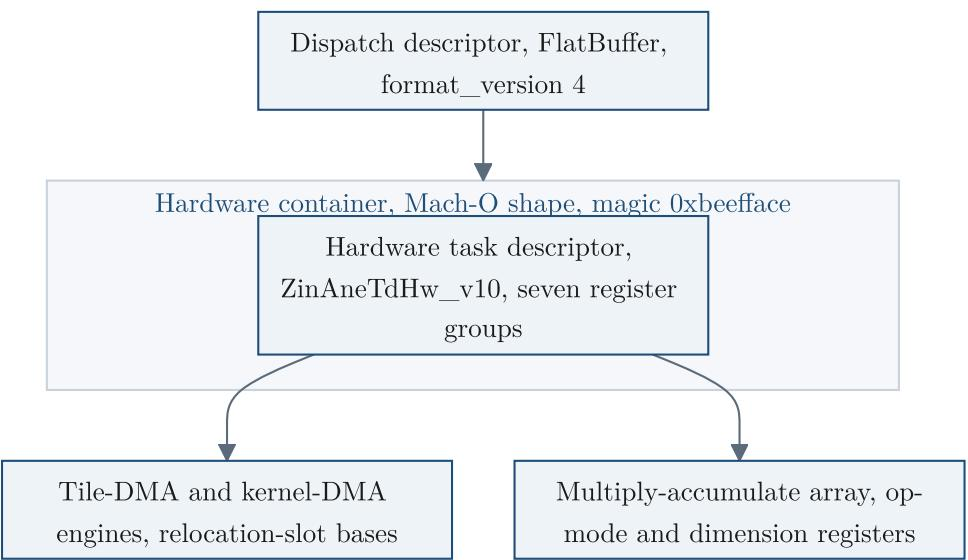

# Apple Neural Engine: Architecture, Programming, and Performance 论文解析

[📄 下载论文原文 (PDF)](original.pdf){:download="ane_arxiv.pdf"} &nbsp;|&nbsp; [🔗 在线阅读](original.pdf){:target="_blank"} &nbsp;|&nbsp; [arXiv: 2606.22283](https://arxiv.org/abs/2606.22283){:target="_blank"}

## 0. 论文基本信息

**作者 (Authors)**: Spencer H. Bryngelson

**发表期刊/会议 (Journal/Conference)**: ArXiv

**发表年份 (Publication Year)**: 2026

**研究机构 (Affiliations)**: Georgia Institute of Technology

---

## 1. 摘要

**目的**  
本文旨在全面逆向工程并记录 **Apple Neural Engine (ANE)** 的完整软硬件栈，包括硅片数据路径、编译工具链、运行时代码、内核驱动、固件协议及性能特征，填补该加速器长期缺乏公开文档的空白。

**方法**  
- 在 **M1 (H13)** 和 **M5 (H17s)** 两款实体芯片上执行直接测量，通过绕过 Core ML 框架的私有 **Espresso** 运行时对引擎进行编程与监控。  
- 对未加密的固件映像、内核驱动缓存、编译器二进制及系统守护进程进行**静态反编译**，提取寄存器映射、命令协议、硬件抽象层参数表及操作合法性规则。  
- 使用内核级只读探针捕获膨胀后的程序二进制与地址翻译路径，并通过端到端编译‑运行实验验证每个操作的可达性。

**结果**  
- **架构**：ANE 是固定功能的 **fp16 矩阵加速器**，采用宽累加器（fp32 类），输入经 radix-4 瓦片舍入后送入单一累加器路径。**M1 提供约12 fp16 TFLOP/s 计算天花板**与 **85 GB/s DRAM 带宽**，**2 MB 片上工作集**阈值是关键设计极限；**M5 将核心数从4扩展至16**，时钟从约1.14 GHz升至约1.89 GHz，带宽提升至约145 GB/s。  
- **编程模型**：引擎以**独立协处理器**模式运行，编译一次、分派多次；分派固定开销约0.23 ms（M1）。存在一条**无需特殊授权的用户态直接路径**，可按编译‑加载‑绑定‑分派五步使用。**压缩权重格式**（int4 调色板、结构化稀疏）在 M1 上原生流式传输（int4 加速比2.37×），int8 与分块仿射在该代上会折叠为密集 fp16。  
- **操作集**：确认约108个操作在 M1 上原生运行；**3D 卷积、本征状态类型、bf16 I/O 及灵活形状**无法通过直接路径访问。纹理引擎采样器在 A14 之后可用，**sin/cos** 在 A15 之后原生。  
- **性能对比**：在 256 通道 3×3 卷积上，ANE 比 GPU **快3.8倍、能效高9倍**；解码任务因带宽和分派开销限制，GPU 在批处理16时快约2.7倍且能效高4.6倍。训练环路可完全在引擎上运行，跨代精度差异在千分之一以内。  
- **底层机制**：给出了编译器四阶段流水线、45个原生硬件层描述符、**28个编译目标**（含与 M 系列芯片的映射关系）、主机‑固件 93 命令协议、IOMMU 页表条目格式及安全隔离模型。

**结论**  
ANE 是一个高效的 fp16 矩阵加速器，在视觉、编码器及中等规模矩阵乘任务中显著超越 GPU；其直接访问路径虽无文档且版本脆弱，但为研究、测量与现场实验提供了完整的功能集合。本文的逆向工程与跨代测量为该加速器提供了首个公开的、从硅片到应用的系统级技术参考。

---

## 2. 背景知识与核心贡献

**研究背景**

- Apple Neural Engine（ANE）是苹果从 A11（2017）及 M1（2020）起内置在其所有 SoC 中的固定函数矩阵加速器，全球部署量超过 25 亿台设备。
- 尽管应用广泛，ANE 的文档几乎完全缺失：无公开指令集、无驱动接口、无确认计算是否在其上运行的方法，其数据通路、数值格式、性能/功耗模型、编译器、程序格式、内核驱动、固件及命令协议均未公开。

**研究动机**

- 填补上述知识空白，提供一份从硅片直至系统接口的完整逆向工程文档。
- 使开发者、研究人员能够理解、预测并有效利用 ANE 的能力，包括其性能边界、编程限制以及跨芯片的兼容性。

**核心贡献**

- **完整的硬件架构分析**：基于直接测量（M1 与 M5）和静态反编译（私有运行时、编译器、内核驱动、固件），逆向推导出 ANE 的 fp16 数据通路、宽累加器（wide accumulator）、乘累加阵列几何结构、片上工作集（2 MB 阈值）及多级缓存/DRAM 层级。
- **性能模型（Roofline）**：建立了 ANE 的 roofline 模型，包含计算天花板（~12 fp16 TFLOP/s）、带宽天花板（~85 GB/s）、脊点（141 FLOP/byte）、每调度固定开销（0.23 ms）及能效曲线（0.37 pJ/FLOP 最优）。
- **操作能力矩阵**：编制了跨越 A11 至 A18、M1 至 M5 家族的每芯片操作支持表，区分了“声明支持”与“实际可运行”的操作，揭示了诸如 3D 卷积虽有能力位却无法在 ANE 上执行等关键发现。
- **低层级软件栈文档**：详细记录了 Core ML 之下的私有直接访问路径（无需特殊授权），包括 Espresso 运行时、程序加载/调度接口、权重量化/压缩格式（int4 调色板、结构化稀疏等）及其流式传输决策机制。
- **编译器、程序格式与固件协议**：反编译了 ANE 编译器（28 个目标）、程序容器格式（.hwx, .e5, Mach-O 变体）、内核驱动 IOKit ABI、未加密固件及包含 93 条命令的主机-固件通信协议，并解码了硬件任务描述符寄存器映射。
- **跨家族预测验证**：提出了从 M1 到 M5 的芯片家族映射规则（`M(n) → H(n+12)`），并通过对 M5 的实际测量验证了基于 M1 分析预测的十项跨代行为（吞吐量、工作集、操作限制等）。
- **训练与科学计算适配**：展示了如何利用 ANE 进行完整的端到端训练（前向、反向、优化器状态驻留）及数值计算（如离散傅里叶变换、固定迭代求解器），并量化了跨代训练精度偏差（<0.001）。

---

## 3. 核心技术和实现细节

### 0. 技术架构概览

**整体技术架构**

Apple Neural Engine (ANE) 是一个固定功能的 fp16 矩阵加速器，嵌入在 Apple Silicon SoC 中，与 CPU、GPU 共享统一 DRAM 池。其架构从底层硅片到上层软件可分为六个核心层级。

- **硅片层 (Silicon Layer)**
  - **MAC 阵列**：由多个 **NE Core**（M1 上为 4 个物理核，M5 上为 16 个）组成，每个核心含一个 8 深度的累加器文件。
  - **数据通路**：输入和权重均为 fp16，乘积累加到**宽累加器**（fp32 级），最终输出圆整为 fp16。支持 int8 双倍吞吐模式。
  - **内存层次**：
    - **片上 SRAM 工作集**：M1 为 2 MB，M5 为 4.72 MB。超过此阈值时，操作数会被分块并从 DRAM 流式传输。
    - **64 体 SRAM**，16 字节交织粒度，银行冲突由编译器静态优化。
    - **内核系数存储**：64 KB（M1 上的密集权重上限）。
  - **内存管理**：通过专用 IOMMU (**DART**) 将主机缓冲区映射到设备虚拟地址空间（16 KB 页，3.5 GiB 窗口）。固件在加载时会将主机 IOVA 重新基址到固件空间（`0x1bc4` 高半区）。

- **固件层 (Firmware Layer)**
  - 运行在名为 **CHINOOK** 的嵌入式 ARM 实时操作系统上（RTKit 框架）。
  - **执行循环**：接受 4 类命令（过程调用、带 bars 的过程调用、带事件的过程调用、缓存触发），解析后推入任务队列（8 级固定优先级调度器）。
  - **命令协议**：93 个命令标识符 (`CSNE_CMD_*`)，通过共享邮箱（doorbell）与主机通信。
  - **电源管理**：5 个独立门控域（1 个基域 + 4 个计算集群），空闲时完全断电（0 W 待机）。无本地 DVFS，由 SoC 级电源管理器控制。

- **内核驱动层 (Kernel Driver Layer)**
  - 三个内核扩展协作：**AppleH11ANEInterface**（硬件驱动）、**AppleT8132ANEHAL**（每 die 抽象层）、**AppleANELoadBalancer**（多引擎仲裁）。
  - **用户客户端**：控制客户端（17 个选择器）和直接路径客户端（9 个选择器），提交时使用 `selector 2`（2376 字节输入）调用硬件 doorbell。
  - **权限模型**：`com.apple.ane.iokit-user-access` 是打开设备的内核权限，仅 **aned** 和 **aneuserd** 持有。所有其他应用通过系统守护进程（**aned**）代理访问。

- **用户空间软件栈 (User-Space Software Stack)**
  - **顶层**：**Core ML** 框架，带有基于成本图（Dijkstra）的放置分割器，将工作分段分配给 CPU、GPU、ANE。
  - **运行时层**：**Espresso/e5rt** 运行时，是编译和执行的核心。公开 292+ 个入口点，支持直接编译、加载、绑定、执行，无需 Core ML。
  - **直接路径**：绕过 Core ML，直接从用户空间调用 e5rt API，无需分割器，且无权限要求（对于编译器接受的操作）。这是本文所有测量的基础。

- **编译器及程序格式 (Compiler & Program Format)**
  - **单一编译器二进制**：根据 28 个目标架构（通过 `MinimumFamily<N>` 特性和 **HAL** 表实现）生成不同代码。
  - **编译流水线**：融合 → 合法化 → 调度与任务描述符分区 → 内存与 DMA 优化。
  - **程序格式**：
    - **分派描述符**（FlatBuffer `E5Program`）：描述操作链（通常为 Cast → AneInference → Cast）。
    - **硬件容器**（Mach-O 变体，魔数 `0xbeefface`）：包含寄存器写入流、权重系数、任务描述符，后编译签名。
    - **固件容器**（AFPP）：三段式（ANEH/ANEP/ANES），用于加载。

- **性能模型 (Performance Model)**
  - **Roofline**：计算峰值（M1 约 12 fp16 TFLOPS）vs 带宽峰值（M1 DRAM 约 85 GB/s），脊点约 141 FLOP/byte。能效峰值约 0.37 pJ/FLOP。
  - **分派地板**（M1 约 0.23 ms），所有单次调用都无法低于此开销。
  - **工作集阈值**：2 MB（M1）是关键设计限制：超过则从 DRAM 流式传输，强度急剧下降。
  - **跨芯片缩放**：核心数和时钟比例驱动，数值行为在 `ulp` 级别一致；特定切片的 Q.4 固定比例饱和在 M1/A14 上存在，M3+ 上修复。

**跨芯片系列 (Cross-Chip Family)**
- 命名规则：`M(n) → H(n+12)`，即 M1=H13, M5=H17。
- 操作能力在 **A15** 后停止扩展，后续仅增加核心数（4/8/16/32/64通过后缀 `g/s/c/d` 标识）。
- fp8 格式（E4M3）仅由 **H18** 启用，集体通信（AllReduce 等）在多 die 部分仍为存根。

**关键架构图片**

芯片布局示意图（图 1.1）：  


Roofline 模型（图 9.1）：  


编译流水线（图 22.1）：  


**总结**：ANE 是一个**固定函数、低功耗、高确定性的协处理器**，通过分层软件栈（Core ML → Espresso → ANE daemon → 内核 → 固件 → 硅片）暴露。其根本限制是 fp16 精度、有限片上工作集和固定分派开销，这些构成了性能建模和应用程序设计的基线。本文是这一架构首次全面、逆向工程式的公开描述。

### 1. fp16 Datapath with Wide Accumulator

**核心观点**  
Apple Neural Engine 的计算核心是 **fp16 端到端** 的乘法阵列，但其累加器是 **fp32 类宽累加器**。这一设计在极低功耗下提供了接近精确的可表示和运算，但受限于每条输入乘积的 fp16 舍入，在严重抵消的步骤（如 Transformer down-projection）中会损失精度。

---

**实现原理**  

- **乘法阵列**：输入 Tensor 和权重均以 **fp16** 格式存储和传输，乘法本身也是 fp16 操作。压缩后的权重（如 int4 palette, int8 affine）会在进入乘法器前被重建为 fp16。  
- **宽累加器**：乘积的累加并不在 fp16 中进行，而是由 **单一路宽寄存器（fp32 类精度）** 完成。两个舍入点将累加包围：
  - 输入 Tile 在进入累加器前被舍入到 fp16。
  - 最终结果在输出端口被舍回 fp16。  
- **累加器宽度**：这是固定的硬件属性，非参数可调。实测表明，一个包含 16000 个 1 的序列求和结果是 **位精确** 的，而 naive fp16 循环在 2048 左右就会停住（因为累加值超过 2048 时，fp16 的间距 >1，后续的 1 会被吞掉）。

---

**算法流程**  

1. **输入准备**：输入 Tensor 的每个 Tile 在 DMA 进入前舍入到 fp16。  
2. **权重反量化**：若权重为压缩格式（int8/blockwise/sparse/palette），先通过 affine 或 lookup table 重建为 fp16。  
3. **乘法**：fp16 输入与 fp16 权重逐元素相乘。  
4. **累加**：所有乘积在 **宽累加器** 中累加，累加器内部精度为 fp32 级别，因此和值稳定且近乎精确。  
5. **后处理**：可选的 per-channel scale 和 bias 以 fp16 应用；可选的 activation table（33‑segment 分段线性）在 fp16 域计算。  
6. **输出**：最终结果舍入到 fp16 并写入 DRAM。

---

**关键参数**  

| 参数 | 值 | 说明 |
|------|-----|------|
| fp16 最大有限幅度 | 65504 | 超过此值会饱和到 ±Inf |
| 宽累加器输出饱和阈值 | 32768 | 矩阵乘/多 tap 卷积的输出累积在此处截断 |
| 宽度轴 crop DMA 增益 | 16 | 非零 begin offset 的 slice 会乘以 16，导致 4095 以上的值溢出 |
| 累加器位精确可求和元素数 | 16000 个 1 | 取消探测确认累加器宽度 > fp16 |
| 第一阶段归约 Tile 宽度 | 4 个 lanes | 每 4 个输入 lane 先进行 fp16 舍入后再送入宽累加器 |

---

**输入/输出关系**  

- **输入**：任何 Tensor/权重均为 **fp16**（或压缩后重建为 fp16）。  
- **输出**：最终结果也是 **fp16**，中间累加量不暴露给外部。  
- **精度保持**：当运算的中间和落在 fp16 表示范围内时（如卷积、矩阵乘、归一化），宽累加器使得结果接近 fp32 精度。  
- **精度损失**：当发生严重抵消时（如 large positive + large negative ≈ small difference），由于乘法操作数已经被 fp16 量化，抵消会放大 fp16 舍入误差。这种场景需在引擎外（CPU/GPU）以更宽精度计算。

---

**在整体架构中的作用**  

- **效率来源**：窄 fp16 乘法器和固定功能流水线使得每 FLOP 仅消耗约 0.37‑0.5 pJ，远低于 GPU。  
- **适用负载**：视觉、音频、编码器（卷积、矩阵乘、归一化）在宽累加器保护下保持精度，实现 3.8× 速度、9× 能效优势。  
- **限制**：Transformer 解码器中的下投影、残差加法等抵消严重步骤无法在引擎上安全运行，必须 offload。  
- **设计权衡**：宽累加器牺牲了对取消问题的原生支持，但换来了在主流工作负载上的极致能效和确定性（位精确）。该设计是引擎数值行为的基石，也是 roofline 模型和功率模型的底层依据。

### 2. Direct Dispatch Below Core ML

**核心观点**：Direct Dispatch Below Core ML 是一条绕过 Apple 官方 Core ML 模型框架的私有路径，允许普通用户空间程序直接编译、加载并调度神经网络到 Apple Neural Engine 上执行，无需经过 **placement planner**（放置规划器），且编译器接受的运算操作不要求任何特殊 **entitlement**（权限）。该路径下，开发者主动将引擎选为目标后端，而非被动等待框架的调度决策。

---

**实现原理**：直路建立在 Apple 私有 **Espresso 运行时**之上，该运行时原本供系统内部调度器使用。通过暴露的 C API（`e5rt_*` 系列函数），应用可以直接调用编译、加载、绑存、编码和执行等底层操作，绕过 Core ML 的模型分段与多设备成本模型。

- **软件堆栈层**：从应用向下至引擎硅片，直路在 **Espresso 运行时**层进入，替换掉上方的 Core ML 放置规划器。 图5.1 展示了完整的堆栈，其中灰色虚线路径是直路入口。

- **编译-调度分离**：网络的一次编译生成一个可加载程序，之后可对同一程序进行多次调度，仅改变输入数据。 图6.1 用流程图展示了这种“编译一次、调度多次”的拆分结构，热循环只在调度阶段迭代。

---

**算法流程**：直路严格遵循五个阶段，每个阶段对应运行时的一个功能族。

1. **构建网络描述**：开发者手动构建层图和权重，使用 **netplist**（`.espresso.net` 格式）定义操作、端口、数据流。此阶段不依赖于任何 `mlmodel` 容器。

2. **编译至引擎程序格式**：调用 `e5rt_e5_compiler_compile()` 将网络描述编译为引擎的可加载程序。编译过程中执行融合、合法化、调度和 DMA 优化，生成一个 **FlatBuffer 格式的调度描述符**配合 **0xbeefface Magics 的硬件容器**，并缓存到磁盘。

3. **加载程序**：使用 `e5rt_program_library_retain_program_function()` 和 `e5rt_program_function_load_for_execution()` 实例化编译后的程序函数。此阶段会完成地址重定位（将 **IOVA** 转换到固件 aperture），并验证程序的签名与信任缓存。

4. **绑定操作数缓冲区**：程序的每个外部输入/输出都是一个**已命名的端口**。通过 `e5rt_execution_stream_operation_retain_input_port()` 获取端口句柄，然后用 `e5rt_io_port_bind_buffer_object()` 将 CPU 缓冲区对象绑定到该端口。缓冲区通过 **DART**（IOMMU）映射到引擎的**设备虚拟地址空间**，确保连续传输。

5. **编码并执行调度**：在热循环内部，重复执行编码 - 提交 - 重置序列：调用 `e5rt_execution_stream_encode_operation()` 将操作编码到流，再调用 `e5rt_execution_stream_execute_sync()`（或异步的 `submit_async`）触发执行。提交最终进入 **IOKit** 的 `IOConnectCallAsyncMethod(selector=2)`，通过邮件箱门铃通知固件。

---

**参数设置**：直路通过一个 **字符串键值对字典**（`std::any` 类型）传递编译和运行时选项，而非固定结构体。

- **编译器选项**（`e5rt_e5_compiler_options_` 对象）：
  - `compute_device_types_mask`：必须包含值 `0x4` 以选中 ANE 后端。
  - `force_recompilation` / `force_fetch_from_cache`：控制是否绕过缓存。
  - `segmenter`：选择图分割策略，直路通常使用 `"graph"` 分割器以保持单引擎整体编译。
  - **重要性**：设置 `TargetArchitecture` 字符串（如 `"h13"` 或 `"h17s"`）可指定目标芯片家族，实现跨代兼容性。

- **运行时选项**（执行流配置对象 `e5rt_execution_stream_config_`）：
  - `enable_concurrent_sync_execution`：控制是否允许多个同步流并发。
  - `enable_low_latency_async_events`：启用低延迟异步事件路径。
  - `skip_io_fences`：跳过输入/输出栅栏以降低开销。

- **绑定阶段的关键参数**：`e5rt_buffer_object_alloc()` 需要指定缓冲区大小和类型（通常为 `0`），类型影响内存分配的对齐与缓存提示。

---

**输入输出关系**：程序的输入和输出通过**端口绑定**连接，且支持**驻留状态**（resident state）跨调度持续存在。

- **输入**：普通用户空间提供的 fp16 或 uint8 缓冲区。在直路中，输入端口被命名为可读字符串（如 `"x"`），通过 `e5rt_io_port_bind_buffer_object()` 绑定。引擎内部会将主机布局转换为引擎的**通道交错布局**（channel-interleaved layout），并送入 DMA 引擎。

- **输出**：引擎执行完毕后，结果写回绑定的输出缓冲区。直路支持将**一个输出缓冲区同时绑定到下一个调用的输入端口**，从而实现驻留状态（如 KV-cache 或优化器状态）无需在每次调度时重新传输。

- **中间数据**：在融合编译的程序内部，所有中间张量保持在引擎的**片上 2 MB 工作集**内，不经过主存，从而消除帧间拷贝开销。只有当工作集超限时，编译器才自动分块并流式通过 DRAM。

---

**整体作用**：直路在四个层面提供了核心价值。

- **绕过 Core ML 规划器**：直路去除了 Core ML 框架的 Dijkstra 最短路径分割和基于回归树的成本模型。开发者直接获得引擎的完全控制，避免模型被恶意分段到 GPU 或 CPU。

- **无需特殊 Entitlement**：编译器接受的运算（卷积、矩阵乘、归一化、注意力等）在直路上均可正常编译和调度，无需 `com.apple.ane.iokit-user-access` 等内核权限。唯一需要的权限是**程序加载时的签名检查**——该签名由系统守护进程 `aned` 在编译时自动注入，调用者无需手动签名。

- **性能完整性**：直路的调度路径与特权路径使用相同的底层内核接口（selector 2）。**单次提交即可驱动多个引擎内步骤而不返回主机**（通过驻留状态别名机制），吞吐率与多步逐次调用一致，证明直路在调度上无性能损失。

- **可观测性与研究基础**：直路使得**编译-运行**比能力位更可靠——只有当操作实际通过编译并在目标芯片上成功运行时，才确认其可用性。它暴露了编译器 validate 层与 codegen 层之间的鸿沟（如 `sort` 操作 validate 通过但 M1 codegen 拒绝），修正了仅凭能力表判断可用的错误。

### 3. Weight Compression and Native Streaming

**核心观点**

Apple Neural Engine (ANE) 支持四种压缩权重格式，它们均在乘加器输入处重建为 fp16。其中部分格式可在对应芯片上实现 **原生流式传输 (Native Streaming)**：压缩后的字节直接通过 DMA 从 DRAM 搬入引擎，在芯片上进行解压缩，从而显著降低权重读取所需的带宽，对带宽受限层（如解码投影）带来 1.5x~2.4x 的速度提升。流式能力由编译器硬件抽象层能力位按芯片世代控制，并非所有格式在所有世代上都可流式。

---

**实现原理**

*   **整体流程**: 编译后的权重块以特定格式枚举值标识其编码方式。运行时分发时，权重数据通过 DMA 传输，在进入乘加阵列前经过 **重建 (reconstruction)** 单元，将压缩表示解压为 fp16，然后进行标准的 fp16 乘加运算。重建过程对上层算子透明。
*   **四种格式的解量化数学表达式**：
    *   **int8 affine (int8 仿射)**: `w = s * (q - z)`。其中 `q` 是 int8 存储值，`s` 是 fp16 标量或每输出通道缩放因子，`z` 是零点。在 M1 世代上零点被强制为 0，形式退化为 `w = s * q`。对称量化。
    *   **int4 lookup-table (int4 调色板)**: `w = LUT[g/v][k][c mod v]`。无算术运算，直接从 fp16 码本中索引。码本包含 16 个 fp16 条目（4-bit 索引）或 256 个（8-bit 索引）。
    *   **structured sparsity (结构化稀疏)**: 掩码（1 bit/元素）加打包的 fp16 非零值。解压时按掩码位将非零值散布到对应位置，其他位置置 0。
    *   **blockwise affine (分块仿射)**: 每个连续元素块（block）有一个独立的 fp16 缩放因子 `s_b`，表达式为 `w = s_b * q`（无零点）。块大小由编译时确定。

**原生流式 vs 折叠到 dense**

*   **原生流式 (Native Streaming)**: 压缩后的字节（如 int8 值、4-bit 索引、掩码+非零值）直接作为 DMA 传输内容，芯片上的解压单元将其展开为 fp16 后再进入乘加。流式时 DRAM 到芯片的字节数减少。
*   **折叠到 dense (Fold to Dense)**: 压缩权重在编译器阶段就被扩展为完整的 fp16 常量，并以 fp16 格式存储和传输。此时带宽无节省（存储大小可能减半但传输带宽不变）。
*   **控制机制**: 硬件抽象层能力字节（如 `0x48f` 主使能，`0x529` 调色板使能，`0x528` 等 per-format 字节）在编译时决定该格式在当前目标芯片上是否流式。值 1 为流式，0 为折叠。

**输入输出关系**

*   **输入**: 存储在 `.hwx` 容器 `__KERN_N` 段中的压缩权重数据块。其结构由格式枚举确定，包含索引流、码本、掩码、缩放因子等。
*   **输出**: 重建后的 fp16 权重张量，直接馈入乘加阵列的输入缓存。输出精度与原始 fp16 权重相比仅增加量化误差（int4/int8 量化误差，稀疏无量化误差仅 fp16 舍入）。

**在整体中的作用**

*   **性能**: 在带宽受限层（如 N=4096 的矩阵乘法、低 batch 解码），流式压缩减少 DRAM 读取字节数，直接提升有效带宽和降低延迟。例如 M1 上 int4 palette 使用带宽为 fp16 的 1/4，加速比达 2.37x。
*   **能效**: 流量降低导致 DRAM 能量下降，总能量随延迟降低而降低（通常功率近似不变）。例如 M2 上 int4 能量仅为 fp16 的 0.41 倍。
*   **编程模型**: 对开发者透明。只需在模型转换时选择合适的量化类型（例如通过 coremltools 的 `ct.lut_quantizer` 或 `ct.sparse_quantizer`），编译器自动决定是否流式。
*   **世代依赖**: M1（H13）仅原生流式 int4 palette 和结构化稀疏（因为只有它们的主从能力位被置 1，且 int8 和 blockwise affine 的能力位为 0）。从 A14（H14）起 int8 affine 开始流式；从 A15（H15）起 blockwise affine 开始流式；M5（H17s）所有四种均流式。

**参数设置与能力位表**

| 能力位偏移 | 作用 | M1/H13 | A14/M2 | A15+/M3+ | M5/H17s |
|------------|------|--------|--------|-----------|----------|
| +0x48f   | 流式主使能 | 1 | 1 | 1 | 1 |
| +0x529   | 调色板 & stride 流式 | 1 | 1 | 1 | 1 |
| +0x528,0x532,0x537 | int8 affine per-format 流式 | 0 | 1 | 1 | 1 |
| +0x520,0x523,0x533,0x539 | blockwise affine per-format 流式 | 0 | 0 | 1 | 1 |

注意：结构化稀疏依赖主使能 +0x48f 以及单独的 mask‑and‑values 路径，不受 per-format 位限制，因此在所有世代上均流式。

**算法流程（编译时决策）**

```
给定目标芯片 chip 和权重张量 weights:
1. 确定目标芯片支持流式的格式列表。
2. 对每种候选格式，评估量化误差 vs fp32 参考（例如 cosine similarity > 0.99）。
3. 按每元素字节数从少到多排序候选格式。
4. 选择第一个同时满足误差容忍且为该芯片原生流式的格式。
5. 如果芯片不支持流式该格式，则选择折叠到 dense（仍然有存储节省但无带宽节省）。
6. 编译器生成对应格式的权重块和描述符，运行时自动按流式或折叠 DMA 传输。
```

**M1 示例**：
*   候选格式：int4 palette（流式，2.37x）, sparse（流式，>50% 零时 1.55x）, int8 affine（折叠，无带宽增益），blockwise affine（折叠）。
*   若权重密集且精度允许，选择 int4 palette；若高度稀疏，选择 sparse；否则 fallback 到 int8 affine 仅节省存储。

### 4. Roofline Performance Model with 2 MB Working Set

**核心观点**  
Apple Neural Engine (ANE) 的性能遵循经典的 **Roofline 模型**，其天花板由两个物理上限决定：**Compute Roof**（约 12 fp16 TFLOP/s）和 **DRAM Bandwidth Roof**（约 85 GB/s）。两者交叉形成 **Ridge Point**（约 141 FLOP/byte）。在此之上，一个硬性的 **2 MB on-chip working-set threshold** 是主要的设计瓶颈：一旦层的活跃数据超过 2 MB，它将被迫从 DRAM 流式传输，算术强度急剧下降。此外，每次 Dispatch 都有一个约 0.23 ms 的固定开销地板（**Dispatch Floor**），低于此的微操作无法通过加速器提速。

---

**实现原理**

- **Compute Roof**：由 MAC 阵列的峰值吞吐决定。在 M1（H13）上，**fp16** 模式为 **4 lanes/core × 4 cores × ~1.14 GHz**，经实测可获得接近 **12 TFLOP/s** 的斜线速率（overhead-subtracted matmul slope）。实际单次大矩阵乘约为 **4.8 TFLOP/s**，单次卷积约为 **1.8 TFLOP/s**。**int8** 双倍模式使峰值约翻倍至 **~11 TOPS**。
- **Bandwidth Roof**：由 DRAM 控制器的可用带宽决定。文档中引擎的 **DRAM 带宽天花板**约为 **85 GB/s**（以 memory controller 测量）。但实际重量流（weight streaming）饱和值约为 **51 GB/s**，编译器内部常量也是 **50 GB/s**。独立的元素级操作（如 ReLU）有效带宽更低约 **10 GB/s**，因为 dispatch floor 占比大。
- **Ridge Point**：算术强度 \( I = \text{FLOP}/\text{Byte} \) 。当 \( I \times B \ge P \) 时，层变为计算受限；否则为带宽受限。\( I^* = P/B \approx 141\ \text{FLOP/byte} \)。
- **2 MB Working-Set Threshold**：片上 SRAM 工作集大小（HAL 表 offset 0x1b8 处值为 2 MB）。如果单次操作的最大活跃 tensor 超过此值，编译器将自动分块（tile）并从 DRAM 流式传输每个 tile，尽管结果正确，但吞吐会显著下降。实测阈值略高于 2 MB（约 2.28–2.34 MB），因 tiler 保留约 0.3 MB 的双缓冲和对齐余量。
- **Dispatch Floor**：每次 Dispatch 固定开销约 **0.23 ms**（M1），由用户态绑定、固件请求、doorbell 和完成处理构成。对于小操作（计算时间 < 0.23 ms），wall time 完全由 floor 主导。

---

**算法流程：如何定位一个层**

1. **计算算术强度**：根据层的形状统计总 FLOP 和必须移动的 DRAM 字节数。  
   \( I = \text{total\_flops} / \text{dram\_bytes} \)。
2. **检查工作集**：计算最大活跃 tensor 的字节数（输入、权重、输出中最大者）。若 **> 2 MB**，层立即归类为 **带宽受限**，且需要缩小工作集（如减少 channel、split spatial 或 batch）才能避免 DRAM 流式。
3. **检查 Dispatch Floor**：计算 \( \text{work\_seconds} = \text{total\_flops} / P \)。若 **< 0.23 ms**，层是 **dispatch 受限**，无法受益于更高计算峰值；应通过批处理或融合来累积工作。
4. **Ridge 分类**：若未受前两种情况限制且 \( I \ge 141 \)，则层为 **计算受限**，接近 12 TFLOP/s 屋顶；否则为 **带宽受限**，处于带宽斜线上。
5. **可达到速率**：\( R(I) = \min(P,\ I \times B) \)。

**输入输出关系**
- **输入**：层的形状、数据类型（fp16/int8）、是否压缩、是否带 Winograd 等。
- **输出**：三种分类之一（Compute-bound, Bandwidth-bound, Dispatch-bound）以及可达到的吞吐量和 latency 估计。该分类决定后续优化策略：计算受限时无需进一步调整；带宽受限时可压缩权重或融合提升算术强度；dispatch 受限时通过批处理或融合超越地板。

---

**在整体中的作用**

Roofline 模型是 **性能优化和调度的核心**。它集成在编译器的 **成本模型** 中，该模型由三个阶段组成：
- **阶段1**：根据操作和维度计算循环次数。
- **阶段2**：应用 Roofline：取计算时间与内存时间较大者。
- **阶段3**：加上固定的每层开销和 dispatch floor，输出 wall time 估计。

该模型驱动 **placement segmenter** 决定操作应该放在 engine、GPU 还是 CPU：只有当层预期在 engine 上计算受限且工作集 <= 2 MB 时，engine 才是首选。它还决定 **autotuner** 的改写选择：融合等效图后，消除中间 dispatch floor，提升有效算术强度。

**2 MB threshold** 本身是硬件上的硬约束：超过时，权重必须被 tiled 并从 DRAM 流式传输，而不是驻留在片上 SRAM。编译器会检查 `GetTensorSizeInBytes(rhs) >= HAL[0x1b8]` 来触发此路径。该阈值限制了能够被单次 fused dispatch 处理的模型大小，是 **视觉和编码器模型设计规则** 中的重要一项：单层最大活跃 operand 应 <= 2 MB。

**参数设置总结（M1/H13）**

| 参数 | 值 | 说明 |
|------|-----|-----|
| Compute Roof (overhead-subtracted) | 12 fp16 TFLOP/s | 用于斜率法 |
| Compute Roof (single large matmul) | 4.8 fp16 TFLOP/s | 实际饱和值 |
| Bandwidth Roof (DRAM ceiling) | 85 GB/s | memory controller 测量 |
| Bandwidth Roof (weight-stream wall-clock) | 51 GB/s | 编译器内部 50 GB/s |
| Ridge Point | 141 FLOP/byte | P/B |
| On-chip Working Set Threshold | 2 MB (实测 ~2.28–2.34 MB) | HAL 0x1b8 |
| Dispatch Floor | ~0.23 ms | 完整调用路径 |
| int8 over fp16 compute rate | 1.4–2x | 双倍 int8 模式 |
| Standalone activation-stream rate | ~24 GB/s | 单 relu/reduction |
| Single-relu effective stream | ~10 GB/s | 受 floor 限制 |

### 5. Cross-Generation Capability and Scalability

**跨代能力与可扩展性 (Cross-Generation Capability and Scalability) 技术剖析**

Apple Neural Engine (ANE) 的跨代设计遵循一个核心关系：**M(n) → H(n+12)**，即 M 系列芯片与 A 系列芯片使用相同的 ANE 架构，偏移量为 12。例如，M1 对应 H13（A13），M5 对应 H17s（A17）。这一关系在所有已测量芯片（M1, M2, M5）上得到验证，并用于跨代预测。

**编译器单一二进制与 28 个目标 Profile**

- 整个 ANE 的编译器是一个 **单一二进制**，包含对所有芯片的支持。不存在按芯片分发的不同编译器。
- 编译器通过一个 **per-target data table (HAL: Hardware Abstraction Layer)** 来区分不同芯片。该表记录了每个目标的数值限制（如最大张量维度、片上工作集大小、内核宽度）和能力标志（如纹理引擎、三角函数、随机数生成器）。
- 共有 **28 个编译器目标 profile**，覆盖从 A11 到 A18 以及各种变体（base, Pro, Max, Ultra 等）。每个 profile 由架构字符串（如 h13, h13g, h17s）唯一标识。
- 不同 profile 之间的差异完全由 HAL 表中的数据驱动，**编译代码本身不变**。这意味着为 M1 编译的同一个网络，在 M5 上也能编译并运行，只是性能会按核心数和时钟缩放。

**操作能力分层：MinimumFamily Floors (F0–F4)**

- 每个后端操作（如 convolution, matmul, softmax, sin）都有一个 **MinimumFamily<N> trait**，表示该操作在家族索引 ≥ N 的芯片上才是**原生可执行**的。
- 分层具体为：
  - **F0**：所有家族都支持。包括卷积、矩阵乘、池化、Elementwise、Reshape、Transpose、Concat。
  - **F1**（A11/A12 特殊层级）：较旧的限制，如 reshape 必须退化为 flatten，divide 只能处理常量除数。
  - **F2（A13 及之后）**：新增 softmax, layer normalization, 所有 reductions, scaled dot-product attention, erf, sqrt 等。M1 属于此层级。
  - **F3（A14 及之后）**：新增 crop-resize, resample 等纹理引擎操作。
  - **F4（A15 及之后）**：新增 sin, cos, 全局 argmin/argmax。Dropout 和随机数生成也在此开启。
- **没有操作被分层到 F4 以上**。这意味着 A16（M4）、A17（M5）、A18 在操作集合上是 A15 的严格超集，**不增加新的计算原语**。它们只增加核心数和时钟。

**后期世代：仅增加核心数和时钟**

- 从 A16 开始，所有目标（A16, A17, A18）的 **操作集、张量维度限制（65536）、内核宽度上限（16）、纹理引擎** 等完全相同。
- 区别仅在于 NE 核心数（通过 HAL 字段 `0x238` 读取）和运行时钟。
- 例如，M1 (H13) 基础版 4 核，M5 (H17s) 为 16 核，H17d 为 64 核。
- 因此，一个在 M1 上可运行的程序，在不修改任何代码的情况下，在 M5 上会因更多核心和更高时钟而**自动提速**，而无需重新编译或调整算法。

**跨代缩放的实际表现**

- **计算峰值**：M1 的 matmul slope 约 12 TFLOPS fp16；M5 约为 19.6 TFLOPS。卷积峰值从 M1 的约 1.8 TFLOPS 提升到 M5 的约 14.3 TFLOPS（约 5 倍），与核心数和时钟线性缩放一致。
- **工作集阈值**：M1 为 2 MB；M5 为 4.72 MB，随核心增加而扩大。
- **内存带宽**：M1 约 51 GB/s (weight stream)；M5 约 145 GB/s (两个 DRAM 读通道)，与核心数大致成比例。
- **数值精度**：跨代之间 fp16 结果仅在最坏情况下相差 **一个 ULP**（最后一位单位）。一个种子固定的小型 CNN 在 M1 和 M5 上训练 300 步后，最终测试准确率分别为 0.9080 和 0.9070，差异仅为一个样本（千分之一）。**数值跨代可移植**。

**参数设置与 HAL 表结构**

- HAL 表是一个固定大小的结构体（约 0x348 字节），包含：
  - **标量字段**：如 `0x1b8`（最大操作数字节，即片上工作集），`0x238`（NE 核心数），`0x138`（最大张量宽度），`0x70`（3D 卷积内核深度）等。
  - **能力字节区域**（`0x48f` 至 `0x8cc`，约 165 字节）。每个字节作为一个位标志（`hal[offset] & 1`）来启用或禁用某个特性。例如：
    - `0x81d`：纹理引擎（M1 为 0，A14 起为 1）
    - `0x4a9`：Dropout 和随机（A15 起为 1）
    - `0x52d`：E4M3 fp8 格式（仅在 A18 上为 1）
    - `0x48f`：内核流主使能（M1 起即为 1）
- 这些设置是**数据驱动的**，因此编译器在编译时只需读取当前目标的 HAL 表，即可决定使用哪个代码路径。

**输入输出关系与整体作用**

- **输入**：一个由高级框架（如 Core ML）或直接 netplist 表达的神经网络图。
- **处理流程**：编译器根据指定目标（如 `h13` 或 `h17s`）加载对应的 HAL 表。操作遵守 `MinimumFamily` 规则：如果目标家族低于操作的家族楼层，则操作被分解为由 F0 操作构成的等价序列。否则，直接生成本机任务描述符。
- **输出**：一个可在指定目标（及其更高版本）上运行的二进制程序。该程序不包含关于具体目标的硬编码，仅包含 HAL 参数控制的调度方式（如核心数、tile size、内存策略）。
- **整体作用**：这种设计允许开发者为最老的需要支持的目标编译一次，然后在所有后续芯片上获得**即插即用的性能提升**，无需重新编译或担心操作集不兼容。它保证了软件投资的长期有效性，同时使新硬件的价值（更快速度、更大内存）直接体现。对于 OTA（空中升级）或应用分发，这是一个关键特性：**一个模型包即可服务于整个家族**。

### 6. Compilation Pipeline and Program Format

**核心观点**：Apple Neural Engine 的编译器流水线将高层网络图通过 **四个阶段** 的逐步降低，最终生成一个 **参数化的调度描述符** (`.e5` FlatBuffer) 和 **签名的硬件容器** (`0xbeefface` Mach-O 变体)，后者包含的 **寄存器写入流**直接驱动 DMA 引擎和乘法阵列。

*   **编译流水线的四个阶段** (如图  所示)：
    *   **阶段一：融合 (Fusion)**：
        *   将整个**操作图**折叠为单一的融合计算操作，消除中间张量的主机往返。
        *   具体融合模式包括：**转置融合**（转置折叠到相邻操作）、**偏置与激活提升**（`conv + bias + relu` 变为一个 `anec.convolution` 操作）、**元素级拷贝消除**。
        *   **参数设置**：融合决策由 `ZinNEBypassLayer` 构造器决定，它规定了固定的 **七槽序贯链**：纹理重映射、广播、前激活、增益/偏置单元 (GOC)、后激活、输出转置、输出重量化。只有满足特定条件（如元素级加法的其中一个输入必须为常量）才能融合。
    *   **阶段二：合法化 (Legalization)**：
        *   确保融合后的图符合**硬件约束**：张量秩不超过5，每个维度在硬件抽象层 (HAL) 限制内，权重要么适配 64KB 密集权重上限 (kernel-memory budget)，要么通过流式路径适配 16MB 上限。
        *   可执行性检查由**50个逐层验证器** (`_ANECValidate<Op>Layer`) 完成，它们在阶段二运行，检查操作数个数、形状和特性字节。
        *   若图无法作为一个整体运行，则在此阶段通过**桥接操作切割**成多个段。
    *   **阶段三：调度与任务描述符分区 (Schedule & TD Partition)**：
        *   将合法化后的层图**线性化**为单一执行顺序，然后根据 **片上工作集预算** (`HAL[0x1b8]`，M1上为 2MB) 分割成**任务描述符分区**。
        *   **调度器** 使用贪心优先级队列，按固定打破平局序列（先环缓冲成员，再分支同级分数，合并同级分数，工作集感知分支测试，拓扑顺序，原始节点ID）弹出就绪节点。
        *   **分区边界**由 **峰值 L2 压力**决定：当下一层的活跃范围会导致峰值压力超过 `HAL[0x1b8] * 分数`，则关闭当前分区。这保证了每个分区的中间数据可以驻留在片上 SRAM 中。
        *   同时，调度器发现可以**并发执行**的操作：规则限制为一个矩阵乘/卷积操作 + 一个平面引擎操作，且两者不能有生产者-消费者关系或链式关系。注意力块（softmax 在平面引擎与值矩阵乘在乘法阵列上并发）是典型例子。
    *   **阶段四：内存与 DMA 优化 (Memory & DMA Optimization)**：
        *   布局缓冲区，避免**64个bank** (由 `HAL[0x1c8]` 指定) 的冲突。优化器计算候选行步长，选择使每个bank请求数最小的步长（当 gcd(步长/16, 64)=1 时无冲突）。
        *   折叠填充，打包权重流，并分配**张量分配类型**（如：on-chip 驻留类型 0、流式类型 1、L2 链式类型 2、环缓冲类型 6）。

*   **程序格式：双层表示** (如图  所示)：
    *   **上层：调度描述符 (Dispatch Descriptor, `.e5` FlatBuffer)**：
        *   这是运行时可提交的**操作链**，具体为 `Cast -> AneInference -> Cast` 的形式（输入和输出格式转换包围单一的融合图）。
        *   每个操作包含**参数帧**和**属性块**。属性块是嵌套的 FlatBuffer 子描述符，其大小**不随计算形状变化**：一个内维为 64 的矩阵乘法与内维为 256 的矩阵乘法产生相同大小的描述符（形状是参数，不是展开的程序）。
        *   因此，调度描述符是**深度不变的**：一个一操作图与一个六操作融合图都缩减为单一推理操作。
        *   它跟踪的是**调度段数**而非操作数：桥接切割会将图切成三个段，产生三个推理操作。
    *   **下层：硬件容器 (Hardware Container, `0xbeefface`)**：
        *   这是**签名的、可加载的可执行文件**，具有 Mach-O 形状和定制 magic `0xbeefface`，在 M1 上版本为 H13 代码生成 (cpusubtype 0x4)。
        *   其 **`__TEXT` 段**包含**寄存器写入程序**：一个 44 字节记录的稀疏打包流，每个记录配对一个**引擎寄存器地址**（来自 7 个寄存器组，如 0x5500 kernel/common、0x4d00 tile DMA）与一个或两个**设备地址**，这些地址在加载时由加载器通过重定位槽解析。
        *   其 **`__KERN_0` 段**包含**权重系数**，按 64 字节对齐的 tile 布局，每个 engine lane 一个 tile。权重以固定步长布局（卷积权重步长 0xC0，矩阵乘权重步长 0x40），允许原地修补权重而无需重新编译。
        *   容器是**自描述的**：符号表包含元素类型目录（24 个条目，如 fp16 类型5，int8 类型2）、stabs 风格的形状描述符（如 `s8192n / s1024c / s64h / s2w`）以及构建清单（`zin_ane_compiler v9.509.0`，目标 `h13g`）。

*   **输入输出关系与作用**：
    *   **输入**：高层图（来自 Espresso 框架的 MIL 或直接手写的 netplist `.espresso.net` 格式）。编译器内部使用 **`anec.*` 后端方言**（如 `anec.convolution`, `anec.matmul`, `anec.sdpa`）作为中间表示。
    *   **输出**：一对文件（`.e5` 描述符 + `0xbeefface` 硬件容器），以及供内核加载器的**负载时重定位**。加载器将符号基址修补到设备地址，并验证签名（corecrypto + trustcache）。
    *   **在整体中的作用**：该流水线将**神经网络的语义**（层、操作、可微分数据流）转化为 **ANP 的固定功能状态机**可以原生执行的寄存器写入序列。它是性能关键的瓶颈：融合降低了每轮调度开销（约 0.23ms），分区确保了片上驻留，稀疏寄存器写入最小化加载时间。最终的 `0xbeefface` 格式是**访问控制边界**——用户空间只能生成 `.e5` 描述符，硬件容器必须由系统守护进程编译和签名。


---

## 4. 实验方法与实验结果

**实验设置**

- **硬件平台与测量方法**：实验主要基于两代物理芯片：**M1/H13**（基准）和 **M5/H17s**（跨代验证），中间补充了 **M2/H14**（A14 级）的数据点。所有性能指标均通过**直接调用私有运行时**（绕过 Core ML）在用户空间完成，结合**静态反编译**（编译器、内核驱动、固件）和**实时只读检测**（IORegistry、dtrace、powermetrics）交叉验证。功耗数据来自系统功率估计器 **powermetrics**，其报告的是**模型估算值**，非独立电表读数；空闲功率约 0 W，因为引擎在空闲时完全断电（rail-off）。
- **工作负载**：覆盖十六类负载，包括：卷积（单层与 16 层 ResNet 栈）、矩阵乘（GEMM）分三种尺寸（dispatch-bound、带宽受限、计算受限）、注意力（短序列 ViT 与长序列 512）、归一化族、科学计算（五点差分矩阵、固定迭代线性求解）。每个负载都同时测量**延迟**、**每秒浮点运算数**（TFLOP/s）、**空闲扣除的封装功耗**（W）及 **fp16 相对误差**，并衍生出**每瓦吞吐量**（GFLOP/s/W）作为效率指标。
- **编译器与运行时版本**：固定使用 **ANECompiler 9.509.0**（MIL 版本 3520.4.1）和 macOS 14+ / Python 3.10+。所有确定性断言（如位确定性、操作是否编译成功）均通过多个重复运行验证。

**结果数据**

- **Roofline 边界**（M1）：计算天花板约 **12 fp16 TFLOP/s**（融合链斜率法）、饱和大矩阵乘约 4.8 TFLOP/s。DRAM 带宽天花板约 **85 GB/s**（内存控制器）、实际权值流约 51 GB/s。**脊点**为 **141 FLOP/字节**。片内工作集阈值 **2 MB**（超过则乒乓从 DRAM 流）。每次调度的固定开销约 **0.23 ms**（M1）和 0.11 ms（M5）。
- **功耗效率**：引擎在所有重要负载类上的功率仅为 GPU 的几分之一。16 层卷积栈在 M1 上引擎效率 **2063 GFLOP/s/W**，GPU 仅 142，**效率比 14.5x**；在 M5 上比值略高（2289 vs 175，**13x**）。大平方矩阵乘（inner=4096）引擎绝对功率 **4.4 W**，GPU **32.5 W**，效率比 **4.0x**。空闲功率 **0 W**，持续负载下热压力始终标记为“Nominal”，引擎保持单一时钟状态，不降频。
- **跨代缩放**：M5 相比 M1 的 NE 核心数从 4 增至 16，时钟从 ~1.14 GHz 升至 ~1.89 GHz，矩阵乘斜率峰值从 ~12 提升至 ~19.6 fp16 TFLOP/s，权值流带宽从 51 增至 145 GB/s。片内工作集阈值从 ~2 MB 升至 4.72 MB。训练精度跨代几乎一致（0.9080 vs 0.9070），差异仅源于 fp16 ulp 级别累积。
- **处理器比较**：引擎在卷积、视觉、短序列注意力、中等规模矩阵乘上**同时领先速度和效率**；GPU 在大平方矩阵乘、长序列注意力、自回归解码上速度更快；CPU 只在极小操作（低于调度固定开销）上占有优势。
- **压缩性能**：int4 调色板权重在 M1 上本机流式传输，速度提升 **2.37x** 于 fp16；结构化稀疏（63% 零值）提升 **1.55–1.64x**，存储仅 0.43 倍。int8 和 blockwise 在 M1 上折叠（折叠到 fp16 无带宽收益），从 A14/M2 开始流式传输。带宽受限的矩阵乘在 A14 上 int8 延迟为 fp16 的 0.52–0.87 倍。

**消融与对比实验**

- **权重压缩格式的流式 vs 折叠**（与硬件代际相关的消融）：在 M1 上，只有 int4 LUT 和结构化稀疏能**本机流式**传输压缩字节；int8 和 blockwise 仿射则**折叠**为密集 fp16 后再传输，因此节省存储但不节省带宽。从 A14 起 int8 开始流式，从 A15 起 blockwise 流式，到 M5 所有四种格式均流式。这一差异由 HAL 表中的功能字节决定（0x48f 主控，0x528/0x532/0x537 等逐格式开关）。本质上是对**带宽-计算平衡**的消融：流式降低 DRAM 流量，适合带宽受限层；折叠则无此收益。
- **引擎 vs GPU vs CPU 的每类负载对比**：相当于**处理器选择消融**。卷积栈在引擎上比快 3.8x、效率高 14.5x（M1）；而大平方矩阵乘 GPU 快 2.8x，但引擎效率仍高 4x。上采样与融合 stencil 的跨代消融进一步量化了不同硬件对同一算法的适应度。
- **融合 vs 非融合**（调度策略消融）：将多个操作融合为单一程序与分别调度对比。融合后每个调度固定开销从 N 次降至 1 次，中间结果保持在片内。结果：32 层融合模型约单层调度延迟（约 0.19 ms），批处理 512 个样本时每样本成本从微秒级降至约 1.5 μs。融合是应对调度固定开销的主要控制手段，显著提升计算强度。
- **int8 权重路径 vs fp16**（精度与性能消融）：M1 上 int8 仅折叠为 fp16（带宽无收益）；A14+ 上 int8 本机流式，带宽受限矩阵乘速度提升最高 1.9x（0.52 倍 fp16 延迟）。同时，int8 计算路径使用双倍 lane（8 OC/cycle），比 fp16 默认 4 OC/cycle 快理论上限 2 倍，但实测中 int8 权重量化后的误差约 1% 相对误差（对比 fp32），而 fp16 仅 0.02%。
- **芯片代际缩放消融**：从 M1 到 M5，工作集阈值、核心数、时钟、带宽等参数变化，但 datapath 的 fp16 特性、宽累加器、操作合法性（除少数功能如 texture engine）保持一致。跨代训练精度仅差 0.001 测试集准确率（0.9080 vs 0.9070），证明数值行为高度可移植。唯一量化差异是宽度轴切片饱和阈值（M1/M2 上超过 4094 溢出，M5 无此饱和），这是由编译器路径选择不同引起的。
- **清零 vs 预填充 (nan/inf)**：非数值行为消融，包括 NaN 强制转为 +∞、flush denormals inside MAC、分数乘以 0 清为 +0 等。这些边缘行为对于确保位级重现性至关重要，且与 IEEE 标准有偏差，是需要建模的。

---

