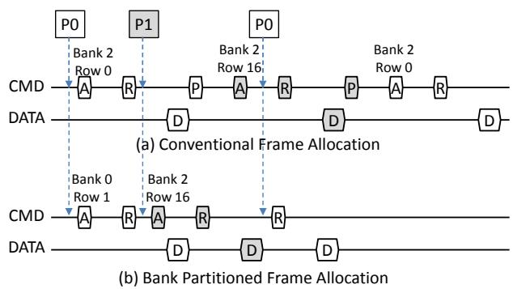

# Balancing DRAM Locality and Parallelism in Shared Memory CMP Systems 论文解析

## 0. 论文基本信息

**作者 (Authors)**: Min Kyu Jeong, Doe Hyun Yoon, Dam Sunwoo, et al.

**发表期刊/会议 (Journal/Conference)**: unknown

**发表年份 (Publication Year)**: 2012

**研究机构 (Affiliations)**: Dept. of Electrical and Computer Engineering, The University of Texas at Austin, Intelligent Infrastructure Lab, Hewlett-Packard Labs, ARM Inc.

---

## 1. 摘要

**目的**
- 解决共享内存多核处理器（CMP）系统中，多线程访问流交错导致的 **DRAM 行缓冲（row-buffer）** 局部性显著下降问题。传统地址映射使不同线程共享 **bank**，引发频繁行冲突，降低带宽利用率和能效。
- 在保护局部性的同时，需避免因 **bank** 分区而过度减少每线程可用的 **bank** 级并行性，从而平衡 **locality** 与 **parallelism** 的冲突需求。

**方法**
- **Bank 分区（bank partitioning）**：扩展操作系统物理帧分配算法，利用 **page coloring** 技术，将属于同一 **bank** 的物理帧专一分配给单个线程或核心。通过控制虚拟地址到物理地址的映射，使不同线程的访问流被隔离到不相交的 **bank** 集合，从根源消除 **row-buffer** 干扰。
  - 为避免 **XOR-permuted bank indexing** 破坏分区，采用 **cache set index permutation** 替代，确保同一 **color** 仍映射到预定 **bank** 集合。
- **内存子秩（sub-ranking）**：将标准 64-bit 宽 **rank** 分割为多个更窄的 **sub-rank**（本文采用 32-bit），使每个 **sub-rank** 可独立控制并打开不同 **row**。此举在不增加物理 **bank** 数量的前提下，有效增加每线程可访问的独立 **bank** 数量，补偿分区导致的并行性损失。
- **组合策略（bpart+sr）**：同时应用 **bank partitioning** 与 **sub-ranking**，在实现局部性隔离的同时恢复并行性。

**结果**
- **行缓冲命中率**：在大多数密集型负载中，**bank partitioning** 使 **row-buffer hit rate** 显著回升，如 **libquantum** 恢复一半因干扰丢失的局部性；部分负载（如 **lbm**）因可用 **bank** 减少而轻微下降，但 **sub-ranking** 可缓解。
- **系统吞吐量（Weighted Speedup）**：组合策略平均提升：
  - **HIGH** 组（高空间局部性）：9.8%
  - **MIX** 组（混合局部性）：7.4%
  - **LOW** 组（低空间局部性）：4.2%
  - **LOW_BW** 组（非内存密集型）：2.4%
  - 单独使用 **bank partitioning** 在 **LOW** 组反而提升 5%，表明负载均衡作用。
- **公平性（Minimum Speedup）**：**bank partitioning** 单独使用时，低局部性应用（如 **mcf**、**omnetpp**）的最小加速比严重下降；添加 **sub-ranking** 后，最小加速比平均恢复 15%，实现更公平的性能分配。
- **能效**
  - **DRAM 功耗**：组合方案平均降低 **21.4%**，主要来自减少 **activate** 操作及 **sub-ranking** 部分激活特性。
  - **系统能效（Throughput/Watt）**：在 **MIX** 组提升 9%，在 **bank** 受限系统（单 **rank**）中提升达 18%-25%。
  - **DRAM 能效**：最高提升 **45%**（双 **rank** 系统）及更高（单 **rank** 系统）。
- **与单独技术对比**：**bank partitioning** 单独在局部性强的负载中表现良好，但损害并行性；**sub-ranking** 单独可增加并行性但略增延迟；两者结合在所有评价指标上均优于任一单项。

**结论**
- **bank partitioning** 与 **sub-ranking** 的组合能够从根本上解决多核内存系统局部性与并行性的矛盾，同时提升性能、公平性和能效，且开销低（仅需操作系统页分配策略调整和 DRAM 模块级修改）。
- 该方案在核心数增长快于 **bank** 数增长的未来 **bank** 受限系统中将更加重要，因为 **sub-ranking** 提供了一种成本有效的“虚拟 **bank**”扩展途径。
- 与现有内存调度策略（如 FR-FCFS、ATLAS）正交，可进一步叠加优化。

---

## 2. 背景知识与核心贡献

**研究背景**

- 现代DRAM内存系统通过利用**空间局部性**来提供高带宽并降低功耗。具体机制包括：**row-buffer**（页模式）允许对同一行地址的后续请求只发送列地址，从而降低延迟和能耗。
- 然而，在**共享内存CMP**系统中，随着核心数增加，多个独立线程的访问流在内存控制器处**交错**，导致不同线程频繁访问同一**bank**的同一行缓存，造成**row-buffer**冲突。图1以lbm为例说明：单实例时**row-buffer hit rate**达98%，4个lbm实例一同运行时降至50%，再混入mcf时进一步降至35%。
- 传统的**FR-FCFS**等内存访问调度策略虽能部分恢复局部性，但受限于有限的调度缓冲区大小和请求到达间隔的增大，效果有限。

**研究动机**

- 根本问题在于：现有地址映射机制将线程的物理页面均匀分布到所有bank上，导致线程间在bank层面直接竞争，从而破坏**row-buffer**局部性。
- 随着核心数增长快于bank数增长（特别是嵌入式及众核系统），线程可用的**bank-level parallelism**变得稀缺。单纯增加rank、channel或内部bank面临成本、引脚、信号完整性等限制。
- 需要一种方法，既能消除干扰（保持局部性），又能补偿因隔离而减少的单线程可用bank数量（维持并行性）。

**核心贡献**

- 提出**bank partitioning**：通过操作系统**物理帧分配算法**（基于页着色）将物理页面映射到互不重叠的DRAM bank集合，使不同线程的访问流完全隔离，从而消除**row-buffer**干扰。此方法无需修改内存控制器地址解码逻辑。
- 提出**memory sub-ranking**（32-bit sub-rank）：将传统64-bit rank拆分为两个独立的32-bit sub-rank，每个sub-rank内的bank可独立操作，从而有效增加系统中的独立bank数量。这在不增加DRAM芯片数量或引脚的前提下，弥补了bank partitioning造成的每线程可用bank数减少。
- **组合方案的核心思想**：利用**bank partitioning**隔离干扰以提升局部性，利用**sub-ranking**恢复并行性，两者协同工作，同时提升**吞吐量**、**公平性**（minimum speedup）和**能效**（throughput per Watt）。
- 实验表明：
  - 在混合工作负载（MIX组）中，组合方案相比单独使用任一技术，能获得更优的加权加速比和最小加速比。
  - DRAM功耗平均降低**21.4%**，系统能效（throughput per system power）平均提升**9%**（MIX组）。
  - 在bank受限系统（单rank）中，组合方案的优势更为显著，系统能效提升可达**18-25%**。

---

## 3. 核心技术和实现细节

### 0. 技术架构概览

**整体技术架构概述**

本文提出一种**软硬件协同**的内存系统架构，旨在从根本上解决多核系统中因线程间访问交错导致的 **DRAM row-buffer 局部性损失**问题。核心思想是同时管理**空间局部性**与**bank级并行性**这两个相互矛盾的需求，通过两项关键技术及其联合应用实现性能与能效的双重提升。

---

**核心组成部分**

- **OS级 DRAM Bank 分区 (Bank Partitioning)**
  - 基于**物理页着色 (page coloring)** 技术，由操作系统在虚拟地址到物理地址的映射阶段，将不同线程的物理页强制分配到不相交的 **DRAM bank** 集合中。
  - 如图 3 所示，物理地址中的某一位（如 bit 14）用于标记“颜色”，核心 0 与核心 1 拥有不同的颜色，从而保证其访问的 bank 不重叠，彻底消除 bank 级别的访问干扰。
  - 与常规的 XOR 基 bank 索引不同，本方案**置换 cache set 索引**而非 bank 索引，从而在保持分区效果的同时避免破坏 cache 行内的 bank 分布均匀性。
  - 该机制无需修改内存控制器中的地址解码逻辑，完全由 OS 的物理帧分配算法实现，具有低实现成本和高灵活性。

- **DRAM Sub-Ranking**
  - 硬件层面将每个传统 **64-bit wide rank** 拆分为多个更窄的独立 **sub-rank**（本文采用 **32-bit sub-rank**）。
  - 每个 sub-rank 对应一组 DRAM chip，拥有独立的 row-buffer 和命令控制能力。这使得系统中有效 bank 数量成倍增加（例如 2 sub-ranks/rank 使 bank 数翻倍），且不依赖添加更多 DIMM 或 rank。
  - Sub-ranking 原本是为降低激活功耗而设计，本文则利用其**提高每个线程可用的 bank 级并行性**，以补偿 bank 分区带来的 bank 数减少。
  - 选择 32-bit 宽度以平衡并行性增益与额外访问延迟（相比 16-bit 或 8-bit sub-rank，延迟增加较小，且不增加地址总线压力）。

---

**组件交互与工作流程**

1. **问题识别**：多核系统中，不同线程的访问流在共享 bank 上交错，导致 row-buffer 频繁切换，局部性显著下降（如图 1 所示，lbm 的 row-buffer hit rate 从 98% 降至 35%）。
2. **局部性保护**：通过 **bank 分区**强制隔离访问流，确保每个线程的请求只命中其专属 bank。这使 row-buffer hit rate 大幅回升（如图 6 所示，libquantum 恢复超过一半损失的空间局部性）。
3. **并行性补偿**：分区后每个线程可用 bank 数减少（如 8 线程平分 16 bank，每线程仅 2 bank），可能损害低局部性应用的性能。**Sub-ranking** 将每个 rank 拆分成两个独立 sub-rank，使系统有效 bank 总数翻倍（如从 32 增至 64），从而每个线程获得更多并行度，隐藏行冲突延迟。
4. **协同作用**：两技术同时部署时，`bpart` 消除局部性干扰，`sr` 提供额外并行性，两者互为补充。实验证明，单独使用 `bpart` 对低局部性应用不公平（最小加速比下降），单独使用 `sr` 无法解决局部性干扰，而 **bpart+sr 组合** 同时在吞吐量、公平性和能效上优于任一单独方案（如图 7、9、10 所示）。

---

**关键设计决策与创新**

- **无需硬件修改**：bank 分区完全由 OS 控制，sub-ranking 依赖现有模块侧控制器（如 MC-DIMM 或 Mini-Rank），整体方案对 DRAM controller 和 DRAM 芯片无额外要求。
- **静态分区与动态鲁棒性**：使用核间均分颜色的静态分区策略，避免运行时 profile 开销，对工作负载变化天然健壮。
- **缓存索引置换**：在保留 XOR 基 bank 索引优点的同时，通过置换 cache set 索引而非 bank 索引，确保分区效果不被消解。
- **联合调优**：通过两个独立的调节旋钮（partitioning 控制局部性，sub-ranking 控制并行性），达成性能/功耗/公平性的帕累托最优。

---

**系统架构图示例**（基于图 3 与图 4）

 *Figure 3: Address mapping scheme that partitions banks between processes. Figure 4: Benefits of bank partitioning. The upper diagram corresponds to Figure 2(c), and the lower diagram corresponds to Figure 3(c). A, R, P, and D stand for activate, read, precharge, and data, respectively. The row-buffer is initially empty.*
*图 4 展示了 bank 分区前后的命令序列对比：分区后消除了跨线程的 precharge 和重复 activate，从而提升吞吐量与能效。*

---

**总结**

整体技术架构可抽象为两层：**OS 层的访问隔离层**（通过着色实现 bank 级独占） + **硬件层的并行度增强层**（通过 sub-ranking 倍增有效 bank 数）。两层协同解决多核内存系统的根本矛盾——空间局部性与 bank 级并行性的冲突，为未来核数持续增长的 CMP 系统提供了一种低开销、高效率的解决方案。

### 1. Bank Partitioning via OS Physical Frame Allocation

**核心技术原理**  
- **目标**：消除多核共享内存系统中不同线程对 **row-buffer** 的干扰，即阻止多个线程的访问流交错到同一 **bank**。  
- **实现途径**：在操作系统物理帧分配（Physical Frame Allocation）阶段加入 **bank 着色（bank coloring）** 逻辑。物理帧的 **Frame Number** 中包含若干位（如 Figure 3(a) 中的 **CIDP** 位），这些位直接对应 DRAM 地址中的 **bank** 字段。OS 为每个核心（或线程）维护一个专属的物理帧池，池中帧的 **bank ID** 位被约束在特定的子集内。例如，4-bank 系统中，Core 0 只能分配 bank {0,1} 对应的帧，Core 1 只能分配 bank {2,3} 对应的帧。  
- **关键依赖**：物理帧与 DRAM 地址的映射关系保持不变（即 DRAM 地址解码逻辑无需修改），仅通过 OS 的帧分配策略实现隔离。  

**算法流程与参数设置**  
- **帧着色码（Color Code）定义**：  
  - 从物理地址中抽取若干比特作为 **color identifier**（例如 Figure 3(a) 中的 bit 14）。  
  - 每个 color 对应一个 **bank 组**，组内 bank 数量为总 bank 数除以颜色数（等分）。  
- **OS 分配流程**：  
  1. 当线程请求物理帧时，OS 根据其核心 ID（或进程 ID）选择对应的 **color**。  
  2. 从该 color 对应的空闲帧列表中分配一个帧。若列表为空，则允许跨 color 分配（牺牲隔离性）。  
  3. 修改页表，将虚拟页映射到该物理帧。  
- **参数设置**：  
  - **Color 数量**：等于核心数（或更精细的按需分区）。论文评估中使用静态等分，每个核心获得相同数量的 bank。  
  - **Bank 组划分**：需要保证同一组内的 bank 在物理 DRAM 中分布在不同的 rank 和 channel 上以维持并行度（但论文中采用连续 bank 划分，如 Figure 3(a) 的简单示例）。  
- **补充机制**：  
  - 必须禁用 **XOR-permuted bank indexing**（一种常见的 bank 混淆技术），否则颜色会被破坏。替代方案：将 XOR 移到 **cache set index** 上，保持 bank 颜色不变。  

**输入输出关系**  
- **输入**：  
  - 虚拟地址（含 Virtual Page Number）。  
  - 当前线程的核心 ID（或调度上下文）。  
- **输出**：  
  - 物理帧号，其中包含 color 信息，该信息直接决定了帧所在的 DRAM bank。  
  - 更新后的页表（映射虚拟页->物理帧）。  
- **整体作用**：  
  - **隔离性**：不同线程的访问流必然落在不同的 bank 组，从而避免行缓冲冲突。如 Figure 4 所示，bank 划分后，P0 和 P1 对同一 bank 的交替访问被消除，节省了不必要的 **activate** 和 **precharge** 命令。  
  - **副作用**：每个线程可用的 bank 数减少，可能导致 bank 级并行度下降（尤其对低空间局部性应用）。论文通过结合 **sub-ranking**（有效增加 bank 数）来补偿。  
  - **性能与功耗**：提升行缓冲命中率（如 Figure 6 中 libquantum 的命中率恢复近半），降低激活能耗，同时通过减少等待提高系统吞吐量（Weighted Speedup 提升 4-12%）。  

**与整体系统架构的关联**  
- 当与 **sub-ranking** 联合使用时，bank 划分的缺陷（并行度不足）被弥补，形成“隔离+并行”的双重优化。  
- 方案仅需修改 OS 内存分配器和页表管理，不涉及硬件改动，部署成本低。  
- 对现有内存控制器调度策略透明（如 FR-FCFS 仍可使用），并可与其正交叠加。  
- 图示可参考 Figure 3(c)（虚拟页布局）和 Figure 4（命令时序对比）。其中 Figure 4 证实了 bank 划分能消除多余的 **precharge** 和 **activate** 命令：  
   *Figure 3: Address mapping scheme that partitions banks between processes. Figure 4: Benefits of bank partitioning. The upper diagram corresponds to Figure 2(c), and the lower diagram corresponds to Figure 3(c). A, R, P, and D stand for activate, read, precharge, and data, respectively. The row-buffer is initially empty.*

### 2. DRAM Sub-Ranking to Increase Effective Banks

**核心观点**  
DRAM Sub-Ranking 的核心思想是将传统 64-bit 宽的 **rank** 拆分为多个更窄且独立的 **sub-rank**（例如 32-bit），从而在**不增加物理设备（如 DIMM 或内部 bank）**的前提下，有效提升系统可用的独立 bank 数量。该技术旨在补偿 **bank partitioning** 所带来的每线程 bank 并行度下降，同时降低 DRAM 激活功耗。

---

**实现原理**

- **传统 rank 的组织**：一个 rank 内的所有 DRAM **chip** 共享地址/命令总线，并同步工作。它们在同一时刻访问同一行（activation），导致所有 bank 的 **row-buffer** 内容一致，无法独立处理不同行。
- **Sub-Ranking 拆分**：通过独立的 **chip-enable** 信号，将一个宽 rank 拆分为若干窄 **sub-rank**。例如，将 64-bit 的 rank 拆分为两个 32-bit 的 sub-rank，每个 sub-rank 由一半数量的 chip 组成。
- **独立控制**：每个 sub-rank 可以独立接收 activation 命令，因此不同 sub-rank 可以保持不同的 **row-buffer** 内容。这使得原本一个 rank 内“同组”的 bank（例如 8 个 bank）现在可以被进一步细分：每个 sub-rank 内部仍保留原有数量的内部 bank，但整体 bank 的独立控制粒度变细。
- **地址映射调整**：物理地址到 DRAM 地址的映射需将 sub-rank 索引嵌入到地址位中，通常位于 bank 索引之上或与之交织，以保证请求均匀分布到各个 sub-rank。

**参数设置**

- 文档选择 **32-bit sub-rank**（即每个 sub-rank 数据宽度为 32-bit，原 64-bit rank 拆成 2 个）。
- 理由如下项列举：
  - **平衡延迟与并行度**：32-bit sub-rank 引入的额外读延迟较小（约 4 CPU 周期），而 16-bit 和 8-bit sub-rank 会引入 40 和 80 个 CPU 周期，显著增加访问延迟。
  - **地址总线压力**：更窄的 sub-rank 需要更频繁地发送命令以完成相同数据量的传输，可能冲击地址总线带宽。32-bit 可避免额外总线变更。
  - **硬件开销最小**：只需增加芯片使能信号，无需修改 DRAM 内部结构或增加引脚。

**输入输出关系及整体作用**

- **输入**：来自内存控制器的物理地址请求序列。
- **输出**：每个 sub-rank 内部独立执行 activation/precharge/CAS 操作，形成更多独立的请求并行处理路径。
- **在整体架构中的作用**：
  - **补偿并行度损失**：当采用 bank partitioning 将不同线程隔离至不同 bank 时，每线程可用的 bank 数减少。Sub-ranking 通过增加有效 bank 计数（每个 rank 内可独立操作的行数翻倍）来恢复并行度。
  - **降低功耗**：每次访问只激活一个 sub-rank 内的部分 chip，而非整个 rank，从而减少激活功率（activate power）。文档数据显示，sub-ranking 与 bank partitioning 结合可使 DRAM 功耗平均降低 **21.4%**。
  - **协同提升公平性**：对低空间局部性线程（如 mcf、omnetpp），sub-ranking 能提供更多并行 bank，避免其在 bank partitioning 下性能大幅下降，从而改善最小加速比（minimum speedup）。

**算法/机制流程**

1. **地址解码**：内存控制器根据物理地址（经 OS 页分配和 cache 组索引置换后）解析出 **channel**、**rank**、**sub-rank**、**bank**、**row**、**column**。
2. **请求调度**：FR-FCFS 调度器在排序队列中同时考虑 sub-rank 状态。若某 sub-rank 当前 row-buffer 命中则优先服务；否则可切到同一 sub-rank 的另一 bank 或不同 sub-rank。
3. **命令发出**：对目标 sub-rank 发送独立的 **activate** 命令，随后发送 **CAS** 读取写入。由于 sub-rank 间互不干扰，多个线程可同时在不同 sub-rank 上执行行激活。
4. **功率优化**：每个请求只激活其所属 sub-rank 内的 chip，其余 sub-rank 的 chip 处于空闲（precharge power-down）状态，从而节省静态与动态功率。

**输入与输出的关系示例**

假设一个系统有 1 个 channel、1 个 rank（8 个内部 bank）和 32-bit sub-ranking（2 个 sub-rank）。传统配置中，最多可同时有 8 个行缓冲命中？但 sub-ranking 后，每个 sub-rank 内部的 8 个 bank 可以独立保持行，因此理论上可同时保持 **2 × 8 = 16** 个行（但实际受限于请求调度和时序）。输入请求的地址中 sub-rank 位将决定哪个子集 chip 参与，使得并行度翻倍。

**与 bank partitioning 的协同关系**

- **Bank partitioning** 负责在虚拟页分配阶段将不同线程的物理页限制在特定 bank 集合（颜色），消除行缓冲干扰。
- **Sub-ranking** 负责在物理层面为每个线程提供更多独立的行缓冲槽（通过子等级拆分），弥补 bank partitioning 导致的并行度损失。
- 两者配合可同时实现：高**行缓冲命中率**（来自隔离）和高**并行度**（来自子等级），并显著降低功耗。

### 3. Combined Bank Partitioning and Sub-Ranking

---

**实现原理与核心逻辑**

Combined Bank Partitioning and Sub-Ranking 的核心思想是 **将冲突的线程调度到不同的 DRAM bank 集合中**，同时通过 **细粒度的 sub-rank 控制**来弥补因分区而损失的 bank 级并行性。其根本动机在于：现代 CMP 系统中，多线程的访问流在共享 bank 上被交插，导致 row-buffer 命中率急剧下降（如图1中 lbm 的命中率从 98% 降至 35%）。传统的地址映射将所有线程的物理帧均匀散布在所有 bank 上，造成连续的 row-hit 被其他线程的 row-conflict 破坏。Bank Partitioning 从根本上切断这种干扰，而 Sub-Ranking 则利用更细的 rank 内部分区，有效增加系统可用的独立 bank 数量，从而满足低局部性线程对并行性的需求。

**算法流程与参数设置**

- **Bank Partitioning 层 (OS 侧)**:
  - **输入**：虚拟地址，进程 ID (core ID)。
  - **操作**：修改物理帧分配算法，在物理地址中嵌入一个“颜色 (color)”位域（如图3a/b中的 CIDP 或 Colors 字段）。该位域直接映射到 DRAM 地址中的 bank 索引。每个 core 被分配一组互斥的颜色，因此其所有物理页只会落入对应的 bank 集合。
  - **关键参数**：颜色数量等于**可并行的线程数**。为确保公平，每个核心获得相同数量的颜色（即等量 bank）。当某核心耗尽自己的颜色帧时，OS 可溢出到其他颜色，但会牺牲隔离性。
  - **输出**：物理帧的 DRAM 地址被约束到特定的 bank 子集，不同线程的访问流不再共享同一个 bank（如图3c）。

- **Sub-Ranking 层 (硬件侧)**:
  - **输入**：来自 memory controller 的行/列地址与 chip select 信号。
  - **操作**：将传统 64-bit 宽的 rank 拆分为多个 32-bit 宽的 sub-rank（论文选择32-bit，避免过大的地址总线压力和延迟）。每个 sub-rank 拥有独立的 **activate（激活）与 precharge（预充电）** 路径，即它们可以同时保持不同的 open row。
  - **关键参数**：sub-rank 宽度（32-bit）和数量（例如，一个 rank 被拆成2个 sub-rank，每 sub-rank 控制4个内部 bank）。
  - **输出**：系统有效 bank 数翻倍（因为原先一个 rank 内所有 bank 共用 row-buffer 状态，现在每个 sub-rank 内部可保持独立的 row）。对采用 bank partition 的线程而言，虽然其可访问的 bank 总数减半，但 sub-ranking 使每个 rank 内的独立行缓存单元数量增加，从而部分恢复并行性。

**输入输出关系及整体作用**

- **输入**：多个线程的 LLC miss 生成的 memory request stream，这些 stream 原本在共享 bank 上被任意交插。
- **处理**：
  1. OS 分配物理帧时确保同一线程的请求落地到一组固定的 bank（例如 Core0 → bank0, bank1；Core1 → bank2, bank3）。
  2. 内存控制器按 FR-FCFS 或类似策略调度，但由于 bank 已分区，调度队列中的请求不会因不同线程的 row 冲突而频繁触发 **activate/precharge** 切换。
  3. 当某个线程因分区导致可用 bank 减少，使得并发请求无法充分并行时，sub-ranking 发挥补偿作用：在同一个 rank 内，两个不同的 sub-rank 可以同时服务该线程的不同 bank 请求，有效隐藏 tRCD + tRP 延迟。
- **输出**：
  - **性能**：如图7，对于高局部性负载 (HIGH 组)，bpart+sr 比 baseline 提升 9.8% 加权加速比；对于混合负载 (MIX 组) 提升 7.4%；对于低局部性负载 (LOW 组) 仍提升 4.2%。
  - **公平性**：如图9，bank partitioning 单独使用时，mcf/omnetpp 等低局部性应用的 min speedup 显著下降；加入 sub-ranking 后，min speedup 恢复甚至超过 baseline，表明两种技术互补。
  - **功耗**：如图10，DRAM 功耗降低 21.4%，主要来自 **activate 命令数减少**（bank partitioning 提高 row-hit 率）和 **每次激活只涉及部分子 rank 的芯片**（sub-ranking 减少参与芯片数）。系统效率（Throughput/Watt）在 bank-limited 系统中提升达 18-25%（如图12）。

**为何不能只用一种技术？**

- **仅有 Bank Partitioning**：低局部性线程（如 mcf）因可用 bank 减少而加剧 bank 队列拥塞，进而退化性能（图7 LOW 组中 bpart 效果微弱甚至负收益）。同时，如图8显示，低局部性负载的请求排队延迟因分区而变高。
- **仅有 Sub-Ranking**：sub-ranking 本身会增加访问延迟（每笔读请求需多占用 data bus 周期数），且 row-buffer 命中率因 burst 减小而略有下降（图6）。对于高局部性线程，额外延迟抵消了并行性收益，导致性能提升有限（图7 HIGH 组 sr 几乎无改善）。

只有当两者结合时，**bank partitioning 提供了局部性保障，而 sub-ranking 提供了并行性补偿**，二者协同在性能、公平性和能效上实现帕累托改进。论文的核心贡献正是揭示了这种平衡策略，并通过图2和图3的映射对比、图4的时序对比、以及图6-12的量化结果验证了其有效性。

### 4. Cache Set Index Permutation to Preserve Bank Partitioning

**核心观点**
Cache Set Index Permutation 是一种在软件层面（OS 页着色）与硬件层面（XOR 置换）之间达成折中的关键技术。它解决了 **XOR-permuted bank indexing** 会破坏基于 **color** 的 **bank** 分区这一根本矛盾，使得 **bank partitioning** 能够在现代处理器中同时保留 **cache bank conflict** 缓解能力。

---

**实现原理与算法流程**

- **传统 XOR-permuted bank indexing**  
  - 物理地址中的 **bank index** 位通常会与 **cache tag** 的一部分进行 XOR 运算，从而将同一 **cache set** 中的不同 **cache line** 分布到多个 **bank**。  
  - 这种做法的目的是避免因 **cache conflict miss** 和 **write-back** 集中在同一个 **bank** 上而产生 **row-conflict**，提升 **row-buffer** 利用率和吞吐量。  
  - 然而，**XOR 置换作用于 bank index** 会破坏基于 **color** 的 **bank** 分区：因为 **color** 的定义通常依赖物理地址中固定的 **bank** 位（如 `bit[14]` 表示 core ID），而 XOR 打乱了这些位，导致同一 **color** 的内存帧被随机映射到所有 **bank**，隔离性失效。

- **Cache Set Index Permutation 的核心替换**  
  - 不篡改 DRAM 地址映射中的 **bank index** 位（保持物理帧到 DRAM 的映射不变，即 **color** 依然能直接对应到一组固定的 **bank**）。  
  - 取而代之的是，对 **cache set index** 的位进行 XOR 置换。  
  - 具体做法：将物理地址中原本用于 **cache set index** 的位与 **cache tag** 的某些位进行 XOR，生成新的 **set index**。  
  - 由于 **DRAM bank index** 不受影响，**color** 所对应的内存帧仍然全部落在预设的 **bank** 集合内，从而维持了 **bank partitioning** 的隔离效果。

- **算法输入输出关系**  
  - **输入**：原始物理地址，包含：  
    - **Cache tag**（高地址位）  
    - **Cache set index**（中间位）  
    - **Block offset**（低位）  
    - **DRAM bank index**（通常位于 **set index** 的某些位，或被 XOR 作用于 **set index** 的区域）  
  - **处理**：  
    1. 从物理地址中提取 **cache set index** 的原始值（记为 `set_original`）和 **cache tag** 的部分位（记为 `tag_subset`）。  
    2. 计算 `set_permuted = (set_original) XOR (tag_subset)  // 或更复杂的置换函数`。  
    3. 将 `set_permuted` 替换掉原始的 **set index**，用于 **cache tag** 比较和 **cache set** 选择。  
  - **输出**：  
    - **缓存索引**：`set_permuted`（用于访问 **cache tag/data array**）。  
    - **DRAM bank index**：保持不变（仍由物理地址中未置换的位决定）。  
  - **效果**：  
    - 同一 **cache set** 中的多个 **cache line** 在物理地址中仍可能被映射到不同的 **DRAM bank**（因为它们的物理地址不同，对应的原始 **set index** 不同，经过置换后仍然可能落在不同的 **bank**）。  
    - 但所有属于同一 **color** 的物理帧始终只出现在固定的 **bank** 子集内，因为 **bank index** 未被扰乱。

---

**参数设置与硬件/软件协力**

- **参数设计**  
  - **置换函数选择**：通常使用 XOR，但也可采用更复杂的哈希（如位混洗），以尽量均匀地分散 **cache conflict** 对应的 **bank** 索引。  
  - **参与 XOR 的 tag 位范围**：需要保证置换后的 **set index** 能覆盖所有 **cache set**，且 **tag_subset** 的选择应避免与 **bank index** 位重叠，以免间接影响 **bank** 映射。  
  - **页着色接口**：OS 在分配物理帧时仍使用基于 **color** 的策略，物理地址的 **bank index** 位（如 `bit[14:13]`）被固定为特定值。该机制与 **cache set permutation** 完全解耦。

- **在整体系统中的角色**  
  - **保持 thread 隔离**：不同 **core** 的 **bank** 集互不重叠，消除 **row-buffer** 干扰（如 lbm 的高命中率不会因 mcf 的随机访问而下降）。  
  - **防止 bank 热点**：同一 **cache set** 内的不同 **line** 即使发生冲突，也会被分散到多个 **bank**，避免单个 **bank** 上的 **row-conflict** 压力。  
  - **与 sub-ranking 协同**：当 **bank** 数量因分区而减少时，**sub-ranking** 提供更多有效 **bank**，而 **cache set permutation** 则确保这些 **bank** 得到均衡利用。  
  - **代价**：需要修改缓存控制器（或硬件）中的 **address decoding** 逻辑；OS 的页着色算法不变，仅物理帧分配策略需与 **color** 定义一致。

---

**表格：三种方案对比**

| 方案 | 对 **bank index** 的影响 | 对 **bank partitioning** 的影响 | **cache set** 内分布 | 主要缺点 |
|------|------------------------|-------------------------------|----------------------|----------|
| 无置换（默认） | 固定 | 天然支持（但可能导致同一 **set** 的所有 **line** 映射到单个 **bank**） | 集中，易引发 **bank conflict** | 缓存冲突导致大量 **row-conflict** |
| XOR-permuted bank indexing | 被置换 | 破坏（**color** 失去意义） | 分散，缓解 **bank conflict** | 使 **bank partitioning** 失效 |
| Cache Set Index Permutation | 不变 | 保留（**color** 有效） | 分散（通过置换 **set index** 间接实现） | 需要硬件支持置换逻辑；**set index** 位宽可能有限，置换效果受限于 **set** 数目 |

---

**图片引用说明**  
本文中未提供直接展示 **cache set permutation** 的示意图。图 3 展示了 **bank partitioning** 的地址映射，但其核心是物理帧分配与 **bank** 位的关系。**Cache Set Index Permutation** 的作用在于保证图 3 中的 **color** 映射不被传统的 XOR 置换破坏，而是通过对 **set index** 的置换实现类似效果。可参考文档中图 2、图 3 的对比来理解该机制的上下文。

---

## 4. 实验方法与实验结果

**实验设置**

- 使用Zesto进行cycle-level x86 out-of-order处理器模拟，结合内部DRAM模拟器。物理帧分配逻辑被扩展以实现**bank partitioning**（每个核分配到互斥的bank集合）。DRAM模拟器支持**sub-ranking**，建模命令总线、数据总线竞争和所有DDR3时序约束。
- 系统参数：8核，4GHz，4-wide out-of-order；L1私有多级缓存，L2私有多级，L3 8MB共享；内存控制器采用FR-FCFS调度、open row policy，64-entry读写队列；主存配置为2 channel、2 rank/channel、8 bank/rank，使用8x8 DDR3-1600 chips/rank。
- 对比四种配置：**shared**（基线共享bank）、**bpart**（bank partition，每个核获得连续bank）、**sr**（每rank拆分为两个独立sub-rank）、**bpart+sr**（两者结合）。
- 功耗模型：DRAM使用Micron功耗模型，处理器使用基于IPC的动态功耗（TDP 125W，50%静态、50%动态正比于IPC）。
- 工作负载：多程序SPEC CPU2006，通过SimPoint提取200M指令代表点。按memory intensity和row-buffer locality分为HIGH（高空间局部性）、MIX（混合）、LOW（低空间局部性）、LOW_BW（非内存密集型）。每个workload复制到8个核。
- 主要指标：Weighted Speedup (WS)衡量系统吞吐量，Minimum Speedup衡量公平性，系统效率为WS/系统功耗。

**结果数据分析**

- **Row-buffer Hit Rate（图6）**：bank partitioning普遍提升大多数benchmark的row-buffer hit rate，如libquantum恢复一半丢失的局部性。但lbm的hit rate下降，因为其空间局部性对bank数量敏感。sub-ranking单独应用会降低hit rate（因sub-rank间粒度变细，最初两次64B访问无法保持打开行）。结合bpart+sr时，hit rate略低于bpart单独应用。
- **系统吞吐量（图7）**：HIGH组：bpart显著提升（恢复局部性），sr贡献不大，bpart+sr因增加额外延迟反而略低于bpart。MIX组：bpart+sr产生协同增益（多数workload提升），个别例外（M1只有一个低局部性应用受益于sr；M4含lbm受影响）。LOW组：bpart反而提升5%性能（因缓解bank负载不均衡，降低排队延迟，图8）。LOW_BW组趋势类似，但LB4因lbm和mcf受bpart负面影响而下降7.6%，sr可恢复部分性能。总体平均WS提升：HIGH 9.8%，MIX 7.4%，LOW 4.2%，LOW_BW 2.4%。
- **公平性（Minimum Speedup，图9）**：bpart单独在MIX和部分LOW_BW中导致低局部性benchmark（mcf、omnetpp）显著减速（最小加速比下降）。bpart+sr可恢复公平性，同时提升系统吞吐量。
- **功耗与系统效率（图10, 11）**：bpart降低DRAM功耗（减少activation），sr通过只激活部分chip进一步降低。bpart+sr将DRAM功耗平均降低21.4%。系统效率（WS/系统功耗）在MIX组中bpart+sr最佳（平均提升9%），而bpart或sr单独仅6%或4%。若仅考虑DRAM功耗，bpart+sr提升达45%（图11b）。在bank受限系统（1 rank/channel，图12）中，bpart+sr系统效率提升更显著（HIGH 18%，MIX 19%，LOW 25%，LOW_BW 7%）。

**消融实验**

- 通过对比四种配置（shared、bpart、sr、bpart+sr）构成完整消融。没有单独做“去除bpart仅保留sr”变体，但已有sr组。此外，评估了不同核心数（8核）和bank受限配置（单rank）作为敏感性分析。
- 关键发现：bpart提升局部性但损失parallelism；sr提升parallelism但增加延迟；bpart+sr互补，在混合工作负载中最佳，对低局部性workload也改善公平性。单独应用任一种都会在特定场景下性能或公平性退化。

---

