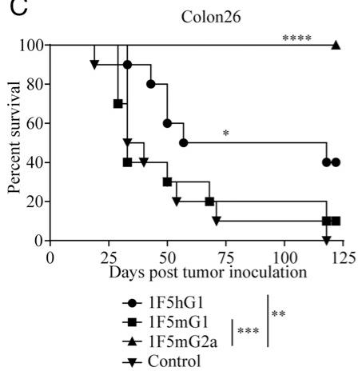
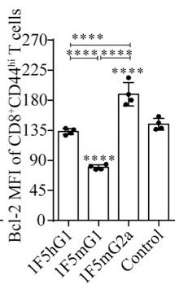
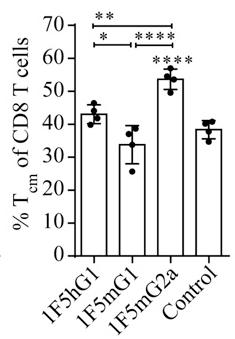

# CD27-Mediated Regulatory T Cell Depletion and Effector T Cell Costimulation Both Contribute to Antitumor Efficacy 通俗讲解

### 0. 整体创新点通俗解读

**痛点直击 (The "Why")**
- 这篇论文要解决的核心问题，不是“CD27靶点有没有用”，而是“**同一个抗体药物（varlilumab），它的抗肿瘤效果到底是怎么来的？**” 之前的认知很模糊，只知道它能激活T细胞（agonism），但临床和动物实验的效果在不同肿瘤模型上差异很大，让人摸不着头脑。
- 具体的“难受”之处在于：如果只把它当成一个单纯的“激动剂”（gas pedal），那么在某些皮下实体瘤模型里效果很差；但如果只把它当成一个“清除剂”（depleter），又无法解释它在血液瘤模型里的惊人疗效。这种**机制上的二元性**让药物的优化和临床应用策略变得非常困难。

**通俗比方 (The Analogy)**
- 想象你手里有一把多功能瑞士军刀（varlilumab抗体），它有两个主要功能：一把小刀（**costimulation/激动**）和一把剪刀（**depletion/清除**）。以前大家只知道这把刀好用，但不知道什么时候该用刀刃切东西，什么时候该用剪刀剪东西。
- 这篇论文的作者做了一件非常聪明的事：他们没有去造两把新刀，而是**把这把瑞士军刀拆开，单独测试了小刀和剪刀的功能**。他们通过更换抗体的“手柄”（即 **IgG isotype**），制造了两个特化版本：
  - **1F5mIgG1**：相当于给小刀配了一个超长的手柄，让它在特定环境（如脾脏）里能发挥出最强的切割（激动）能力，但用完就钝了（导致T细胞耗竭）。
  - **1F5mIgG2a**：相当于给剪刀配了一个强力弹簧，让它能高效地剪断（清除）特定的目标（**Treg细胞**），从而为其他免疫细胞扫清障碍。
- 论文的核心洞见就是：**这把瑞士军刀的真正威力，在于根据战场（肿瘤类型）的不同，灵活运用它的两种功能，甚至同时运用。**

**关键一招 (The "How")**
- 作者并没有从头设计新药，而是巧妙地利用了抗体工程中一个已知但常被忽视的原理：**抗体的Fc段（手柄）决定了它与免疫系统其他细胞（如NK细胞、巨噬细胞）的互动方式**。
- 他们通过**精确替换varlilumab的Fc段**，人为地将一个具有双重潜力的抗体，分离成两个功能偏向极端的工具：
  - **1F5mIgG1** 主要结合 **inhibitory FcγRIIB**，这促进了抗体在B细胞等表面的交联，从而最大化其对T细胞的**激动信号**。这在BCL1淋巴瘤（主要在脾脏生长）中效果拔群，因为脾脏富含B细胞，提供了完美的交联平台。但过强的信号导致效应T细胞迅速**terminal differentiation, exhaustion, and apoptosis**，后劲不足。
  - **1F5mIgG2a** 主要结合 **activating FcγRs**，这招募了NK细胞等效应细胞，通过ADCC/ADCP机制**选择性地清除了高表达CD27的Treg细胞**。更妙的是，被清除后剩下的Treg细胞**suppressive activity**也变弱了。这种“数量+质量”的双重打击，在多种皮下实体瘤模型中产生了持久的抗肿瘤免疫和治愈效果。
- 最终，他们证明了临床上使用的 **varlilumab (1F5hIgG1)** 本身就兼具这两种特性，只是程度适中。通过**调整剂量**，可以在一定程度上调控这两种效应的平衡，从而在更广泛的肿瘤类型中都展现出疗效。

### 1. FcγR-Dependent Isotype Engineering

**痛点直击**
- 传统的激动型抗体（agonistic antibody）疗法面临一个根本性矛盾：你既想让它强力激活T细胞（“踩油门”），又怕它把免疫系统“烧过头”导致T细胞耗竭甚至死亡。更麻烦的是，很多这类靶点（比如CD27）不仅在效应T细胞上表达，在**调节性T细胞**（Treg）上也高表达。Treg是肿瘤的“帮凶”，会抑制免疫反应。所以，一个理想的疗法需要能同时处理这两个问题，但单一机制的抗体很难做到。
- 过去的做法往往是“一刀切”，要么只追求强激动（可能导致短期有效但长期失效），要么只追求清除（可能误伤友军）。缺乏一种**可调控的、一石二鸟**的策略。

**通俗比方**
- 想象你要管理一个团队来完成一个艰巨任务（消灭肿瘤）。团队里有冲锋陷阵的战士（效应T细胞），也有专门拖后腿的内鬼（Treg）。
- **FcγR-Dependent Isotype Engineering** 就像是给你的指令（抗体）换上不同的“信使”（IgG亚型）。
    - 如果你派一个**温和的信使**（mIgG1），他主要去找团队里的“协调员”（**inhibitory FcγRIIB**，大量存在于B细胞上）。这个协调员会把你的指令（激动信号）精准地传达给周围的战士，让他们士气大振、战斗力飙升。但他对内鬼没什么办法。
    - 如果你派一个**强硬的信使**（mIgG2a），他会直接调动“清道夫部队”（**activating FcγRs**，存在于NK细胞、巨噬细胞上）。这些清道夫看到信使带来的指令，就会把所有贴了标签（表达CD27）的人，尤其是那些最显眼的内鬼（**CD27-hi Treg**），统统抓起来清除掉。同时，这个指令本身也能温和地激励剩下的战士。
- 所以，通过简单地更换“信使”（抗体的Fc段），你就从“单纯鼓舞士气”切换到了“清除内鬼+适度激励”的双重模式。

**关键一招**
- 作者并没有发明一种全新的药物，而是巧妙地利用了免疫系统固有的**Fc受体**（FcγR）识别机制。
- 他们保留了抗CD27抗体（1F5）的Fab段（负责精准识别CD27靶点），但将其Fc段分别替换为**mouse IgG1 **(mIgG1) 和 **mouse IgG2a **(mIgG2a)。
- 这个替换直接决定了抗体的命运：
    - **1F5-mIgG1**: 其Fc段优先结合**inhibitory FcγRIIB**。这种结合方式不会触发细胞杀伤，反而在B细胞等表面形成了一个稳定的“平台”，让抗体能高效地**交联**（cross-link）T细胞上的CD27，从而产生极强的**激动信号**（agonism），导致T细胞剧烈活化、增殖，但也快速走向耗竭和凋亡（AICD）。这在BCL1淋巴瘤模型中效果拔群，因为肿瘤就在脾脏，B细胞丰富，平台稳固。
        
    - **1F5-mIgG2a**: 其Fc段强力结合**activating FcγRs**（如FcγRIV）。这直接招募了NK细胞和巨噬细胞等效应细胞，通过**ADCC/ADCP**机制，选择性地**清除**了高表达CD27的细胞，特别是**Treg**。同时，它也能提供一定的激动信号，但强度适中，避免了T细胞的过度耗竭。这种“清除抑制+温和激励”的组合拳，在皮下实体瘤（如E.G7, Colon26）中效果最佳。
        
- 最终，临床候选药物**varlilumab **(1F5-hIgG1) 展现了两种特性的平衡，其效果介于两者之间，但在多种模型中都表现出稳健的抗肿瘤活性，证明了这种工程化策略的成功。

### 2. Dual Mechanism of Action (Agonism vs. Depletion)

**痛点直击**
- 以前开发靶向免疫受体（如CD27）的抗体药物时，大家常常陷入一个非此即彼的困境：要么把它做成一个强力的“油门”（agonist），猛踩T细胞激活；要么把它做成一把精准的“剪刀”（depleting Ab），专门剪掉抑制免疫的Treg细胞。
- 这种单一思路的问题在于，**肿瘤微环境极其复杂且异质**。在某些模型里（比如BCL1淋巴瘤），猛踩油门确实能快速清剿肿瘤；但在另一些实体瘤模型里（比如E.G7），这种强力激活反而会把T细胞“烧干”，导致它们迅速**耗竭 (exhaustion)** 和 **凋亡 (apoptosis)**，治标不治本。
- 反过来，如果只专注于剪掉Treg，虽然能解除免疫抑制，但如果对效应T细胞的激活不够，也可能无法形成足够强大的抗肿瘤火力。

**通俗比方**
- 想象你要清理一个顽固的杂草花园（肿瘤）。一种策略是给所有植物（包括你的花和杂草）都施加超强肥料（mIgG1 agonism）。你的花（效应T细胞）会疯长，短期内压倒杂草（肿瘤细胞），但很快就会因为过度生长而枯萎死亡，而且杂草（Treg）可能也跟着一起疯长了。
- 另一种策略是精准地只拔掉杂草（mIgG2a depletion），让你的花能自由生长。但如果土壤本身贫瘠（免疫原性弱），光拔掉杂草，花也长不好。
- 这篇论文的核心洞见是：**最好的园丁懂得“施肥”和“除草”要结合起来用，并且根据花园的具体情况（肿瘤类型）调整侧重点**。CD27这个靶点本身就具备这两种潜力，关键在于如何通过抗体的Fc段（可以理解为工具的手柄）来选择使用哪种功能。

**关键一招**
- 作者并没有发明两种全新的药物，而是巧妙地利用了**抗体Fc段与不同Fcγ受体（FcγR）的天然亲和力差异**，对同一个抗体（1F5）进行了“改装”。
- **对于mIgG1变体**：它的Fc段主要结合**抑制性受体FcγRIIB**（大量存在于B细胞上）。这种结合方式不能触发杀伤功能，但能像“脚手架”一样，高效地将抗体分子聚集起来（cross-linking），从而对CD27产生极强的**激动信号 (agonism)**，猛烈激活T细胞。
- **对于mIgG2a变体**：它的Fc段则主要结合**激活性受体FcγRI/III/IV**（存在于NK细胞、巨噬细胞等效应细胞上）。这种结合会触发**抗体依赖性细胞介导的细胞毒性（ADCC）** 等效应功能，从而**优先清除那些高表达CD27的细胞**。恰好，功能性最强的**Treg细胞**就是CD27的高表达者，因此被选择性地清除了。
- 最妙的是，他们发现临床上正在使用的**varlilumab (hIgG1)** 天然就兼具这两种特性：低剂量时偏向于激动，高剂量时偏向于清除。这解释了它为何能在更广泛的肿瘤模型中都表现出疗效。

为了清晰展示这两种机制在不同肿瘤模型中的主导地位，我们可以总结如下：

| 抗体变体 | 主导机制 | 对T细胞的影响 | 对Treg的影响 | 在BCL1模型效果 | 在E.G7模型效果 |
| :--- | :--- | :--- | :--- | :--- | :--- |
| **1F5-mIgG1** | **强效激动 (Agonism)** | 剧烈增殖、活化，但迅速走向**终末分化、耗竭和凋亡** | 影响甚微 | **+++ (最佳)** | **+ (较差)** |
| **1F5-mIgG2a** | **选择性清除 (Depletion)** | 中度活化 | **显著减少数量，且残余Treg抑制功能大幅减弱** | **- (无效)** | **+++ (最佳)** |
| **1F5-hIgG1 (Varlilumab)** | **双重机制平衡** | 中度活化，无明显耗竭迹象 | 中度减少 | **++** | **++** |

### 3. Model-Dependent Therapeutic Efficacy

**痛点直击**
- 以前搞肿瘤免疫治疗，大家总想找到一个“万能钥匙”——一种抗体，能通吃所有癌症。但现实很骨感，同一个药在不同肿瘤模型里效果天差地别，有时甚至完全无效。这让人很难受，因为这意味着你无法预测一个疗法在临床上到底对哪种病人有效。
- 具体来说，针对CD27这个靶点，如果只强调**T细胞共刺激**（agonism），在像BCL1这种系统性淋巴瘤里效果拔群，但在皮下实体瘤（如E.G7）里却收效甚微。反过来，如果只强调**调节性T细胞耗竭**（depletion），在实体瘤里战果辉煌，却对BCL1淋巴瘤毫无作用。问题的核心在于，**肿瘤的生长微环境和位置决定了哪种免疫机制才是关键**。

---
**通俗比方**
- 这就像打仗，面对两种完全不同的敌人，你需要完全不同的战术。
    - **BCL1淋巴瘤**好比是一支盘踞在**大本营**（脾脏，富含B细胞）里的敌军。你的最佳策略是就地取材，用大本营里现成的资源（B细胞上的FcγRIIB受体）作为“炮架”，把你的“信号弹”（mIgG1抗体）精准发射，瞬间点燃整个大本营的免疫士兵（T细胞），发起一场迅猛的总攻。这场战斗追求的是**瞬间的、压倒性的火力**。
    - **皮下实体瘤**（如E.G7）则像是一座**坚固的堡垒**，周围布满了“内奸”（Treg细胞），不断瓦解我军士气。这时候，再猛烈的总攻也会被内奸化解。你的首要任务不是强攻，而是先派特种部队（mIgG2a抗体）潜入，精准清除这些内奸（耗竭Treg），并削弱他们的破坏力。一旦内奸被清理，堡垒自然不攻自破，而且还能形成长久的防御（免疫记忆）。

---
**关键一招**
作者没有试图去发明一种全新的“超级抗体”，而是巧妙地利用了**抗体Fc段与不同Fc受体结合的天然特性**，通过更换抗体的**isotype**（同种型），在同一套“弹头”（抗CD27的Fab段）上，实现了两种截然不同的作战模式。

- **对于系统性淋巴瘤（BCL1）**：
    - 使用 **mIgG1 isotype**。它主要结合**抑制性受体FcγRIIB**，而这个受体在脾脏B细胞上大量存在。
    - 这相当于把抗体“锚定”在B细胞上，形成了一个高效的**信号放大平台**，极大地增强了CD27的共刺激信号，从而在脾脏这个主战场引爆了强大的、但短暂的T细胞反应，一举歼灭肿瘤。
    -  数据显示，1F5mIgG1处理后，脾脏中CD8 T细胞数量、功能（GzmB+ IFN-γ+）和效应细胞比例都显著提升。

- **对于皮下实体瘤（E.G7, Colon26）**：
    - 使用 **mIgG2a isotype**。它主要结合**激活性受体**（如FcγRIV），这些受体在巨噬细胞、NK细胞等效应细胞上表达。
    - 这激活了**抗体依赖的细胞介导的细胞毒性**（ADCC）等效应功能，优先清除了高表达CD27的**Treg细胞**。
    - 更妙的是，被清除后剩下的Treg细胞**抑制功能也变弱了**，这比单纯减少数量效果更好。
    -  的数据显示，1F5mIgG2a处理后的Treg在体外抑制实验中效果大打折扣。

最终，临床候选药物**varlilumab **(hIgG1) 展现了**平衡之道**：它兼具一定的共刺激和耗竭能力，因此在多种肿瘤模型中都表现出稳健的疗效，其效果可以通过调整剂量来偏向其中一种机制。

### 4. Functional Impairment of Residual Tregs

**痛点直击**
- 传统的 **Treg**（调节性T细胞）清除策略，比如用 **anti-CD25** 抗体 **PC.61**，虽然能减少 Treg 的数量，但剩下的 Treg 往往是“精英中的精英”——它们的**抑制功能反而更强了**。这就像大浪淘沙，冲走了弱的，留下了最顽固、最难对付的。
- 这导致了一个尴尬的局面：肿瘤微环境里的“刹车”（Treg）虽然少了点，但剩下的每一个都踩得更狠，严重限制了效应T细胞的抗肿瘤能力，最终**抗肿瘤效果有限**。

**通俗比方**
- 想象你要清理一个由不同等级保安组成的安保团队。**PC.61** 的做法是，只认准佩戴“CD25”徽章的保安进行驱逐。结果发现，那些没被驱逐的保安里，很多是高级主管，他们虽然没戴那个特定徽章，但权力更大、控制力更强。
- 而 **1F5mIgG2a** 的做法则聪明得多。它瞄准的是“CD27”这个标记，而这个标记恰好在**功能最强、最活跃的那批Treg上表达得最高**。所以，它的清除不是随机的，而是**精准地优先干掉了团队里最有威胁的“王牌保安”**。剩下的保安要么是新手，要么是文员，根本无力维持原有的严格管控。

**关键一招**
- 作者发现，**CD27** 的表达水平与 Treg 的**抑制功能强度正相关**。因此，使用能结合激活型 **FcγR** 的 **1F5mIgG2a** 抗体，不仅能通过 **ADCC/ADCP** 机制清除 Treg，更重要的是，这种清除是**有选择性的**。
- 它优先清除了 **CD27hi** 的、功能强大的 Treg 亚群。残余的 Treg 主要是 **CD27lo** 或阴性的，这些细胞本身就**抑制能力较弱**。
- 这个逻辑转换的关键在于：**不单纯追求清除数量，而是追求清除“质量”**——把最具功能活性的抑制细胞作为首要打击目标。这直接导致了肿瘤微环境中免疫抑制的实质性瓦解，从而释放出更强的抗肿瘤免疫反应。

上图 **(Figure 9A, B)** 直观地展示了这种策略的优势：在 **E.G7** 和 **CT26** 肿瘤模型中，**1F5mIgG2a** 的治疗效果显著优于传统的 **PC.61**，甚至两者联用能达到近乎完全治愈的效果。这背后的核心原因，正是其对 Treg 功能的精准削弱，而非简单的数量减少。

### 5. Dose-Modulated Activity of Clinical Antibody Varlilumab

**痛点直击**
- 传统的免疫疗法往往只聚焦于单一机制：要么是纯粹的 **agonist**（激动剂），通过激活效应T细胞来攻击肿瘤；要么是纯粹的 **depleting agent**（耗竭剂），通过清除抑制性的 **Treg** 细胞来解除免疫刹车。
- 这种“非此即彼”的策略在现实中很“难受”：纯激动剂（如论文中的1F5mIgG1）虽然能强力激活T细胞，但容易导致T细胞 **terminal differentiation**（终末分化）、**exhaustion**（耗竭）甚至 **apoptosis**（凋亡），效果短暂且无法形成记忆，在实体瘤中效果有限。而纯耗竭剂可能无法提供足够的共刺激信号来启动强大的抗肿瘤反应。
- 理想的情况是能有一种疗法，既能 **costimulation**（共刺激）激活效应T细胞，又能 **deplete Tregs**（耗竭调节性T细胞），但如何用一个分子实现这种双重功能，并且能根据需要灵活调控？

**通俗比方**
- 想象 varlilumab (1F5hIgG1) 不是一个简单的“开关”，而是一个 **智能调光旋钮**。
- 在 **低亮度档位**（低剂量）时，它主要扮演“教练”的角色，通过与 **inhibitory FcγRIIB** 的相互作用，有效地 **cross-linking**（交联）CD27受体，给T细胞提供温和而持续的 **costimulatory signal**（共刺激信号），帮助它们增殖、分化并保持战斗力，而不至于“用力过猛”把自己练废。
- 当你把旋钮拧到 **高亮度档位**（高剂量）时，它就切换成“清道夫”模式。此时，抗体浓度足够高，开始大量结合 **activating FcγRs**（激活型Fc受体），招募NK细胞、巨噬细胞等效应细胞，对高表达CD27的 **Treg** 细胞进行精准 **depletion**（耗竭），从而移除肿瘤微环境中的主要免疫抑制力量。
- 这个“旋钮”的精妙之处在于，它利用了 **human IgG1** 这个特定 **isotype**（同种型）的独特性质——它既能与抑制性Fc受体结合以实现激动功能，也能与激活型Fc受体结合以实现耗竭功能，只是这两种功能被 **dose**（剂量）所调控。

**关键一招**
- 作者的核心洞察是，varlilumab 的 **dual functionality**（双重功能）并非固定不变，而是可以通过 **dose modulation**（剂量调节）来动态平衡的。
- **关键的逻辑转换在于**：他们没有将 varlilumab 视为一个具有固定MOA（作用机制）的药物，而是揭示了其MOA会随剂量变化而 **shift**（偏移）。
- 具体来说：
  - 在 **低剂量** 下，抗体分子数量相对较少，优先与广泛存在于B细胞等抗原呈递细胞上的 **inhibitory FcγRIIB** 结合。这种结合方式非常有利于抗体在其靶细胞（T细胞）表面进行有效的 **cross-linking**，从而最大化其 **agonistic activity**（激动活性），促进T细胞活化。
  - 在 **高剂量** 下，抗体饱和了抑制性受体后，多余的抗体分子开始与表达在NK细胞、巨噬细胞等效应细胞上的 **activating FcγRs**（如 FcγRI, FcγRIV）结合。这种结合触发了 **ADCC/ADCP**（抗体依赖的细胞介导的细胞毒性/吞噬作用），由于 **Treg** 细胞通常 **highly express CD27**（高表达CD27），它们便成为了这种耗竭机制的主要目标。
- 因此，通过简单地调整给药剂量，临床医生就可以在同一个药物上，选择性地“拨动”其 **agonist** 或 **depleting** 的属性，使其在不同肿瘤模型或不同治疗阶段都能展现出 **broad antitumor efficacy**（广泛的抗肿瘤疗效）。
