# CD27-Mediated Regulatory T Cell Depletion and Effector T Cell Costimulation Both Contribute to Antitumor Efficacy 论文解析

## 0. 论文基本信息

**作者 (Authors)**: Anna Wasiuk, James Testa, Jeff Weidlick, et al.

**发表期刊/会议 (Journal/Conference)**: J Immunol

**发表年份 (Publication Year)**: 2017

**研究机构 (Affiliations)**: Celldex Therapeutics, Inc.

---

## 1. 摘要

**目的**
- 阐明靶向 **CD27** 的免疫治疗抗体（如 varlilumab）发挥抗肿瘤疗效的双重作用机制，即 **效应T细胞（effector T cell）的共刺激** 与 **调节性T细胞（regulatory T cell, Treg）的耗竭**。
- 探究通过改变抗体 **Fc段的同种型（isotype）** 来分别调控这两种机制，并评估其在不同肿瘤模型中的疗效差异。

**方法**
- 基于临床候选药物 **varlilumab (1F5hIgG1)**，构建了两种小鼠同种型变体：**1F5mIgG1**（主要结合抑制性 FcγRIIB，增强共刺激）和 **1F5mIgG2a**（主要结合激活性 FcγRs，介导细胞耗竭）。
- 在表达人源 CD27 的转基因小鼠（hCD27-Tg）中，利用多种同源肿瘤模型（包括 **BCL1 淋巴瘤** 和 **E.G7、Colon26、CT26 等皮下实体瘤**）评估各抗体变体的抗肿瘤活性。
- 通过流式细胞术、功能实验（如 Treg 抑制实验）和免疫相关性分析，系统性地比较了不同抗体对 **T细胞活化、分化、耗竭、凋亡** 以及 **Treg 数量和功能** 的影响。

**结果**
- **模型依赖的疗效差异**：
  - **1F5mIgG1** 在 **BCL1 淋巴瘤** 模型中疗效最佳，能强力激活 T 细胞，但导致效应 T 细胞发生 **终末分化、耗竭（exhaustion）和活化诱导的细胞死亡（AICD）**，限制了其在皮下实体瘤中的效果。
  - **1F5mIgG2a** 在 **E.G7、Colon26 和 CT26 皮下实体瘤** 模型中表现出卓越的治愈能力，其核心机制是 **选择性耗竭高表达 CD27 的 Treg**，且残留的 Treg **抑制功能显著受损**。
  - **Varlilumab (1F5hIgG1)** 兼具中等程度的共刺激和耗竭活性，在所有测试的肿瘤模型中均显示出良好的广谱抗肿瘤活性。
- **Treg 耗竭的优越性**：
  - 与常用的抗 **CD25** 抗体 **PC.61** 相比，**1F5mIgG2a** 介导的 Treg 耗竭不仅效率相当，而且残留 Treg 的抑制功能更弱，从而带来 **更强的抗肿瘤效果**。
  - 联合使用 **1F5mIgG2a** 和 **PC.61** 可进一步提升疗效。
- **免疫记忆的形成**：
  - 经 **1F5mIgG2a** 或 **1F5hIgG1** 治愈的小鼠能有效抵抗肿瘤的二次攻击，表明形成了 **持久的抗肿瘤免疫记忆**。

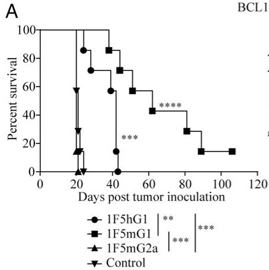
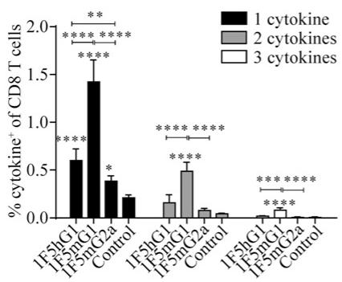
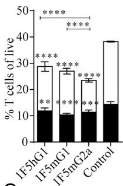
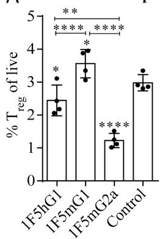
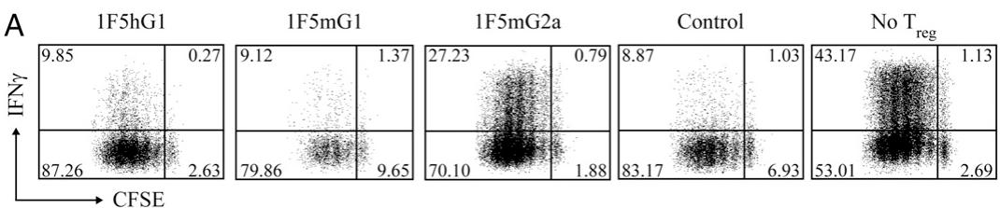
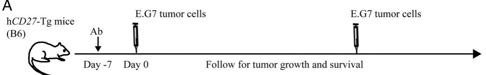 *A*
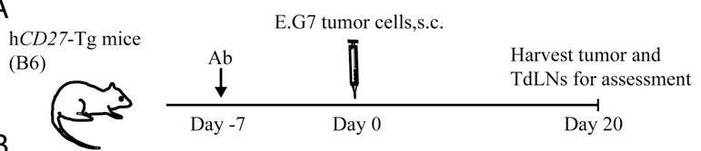
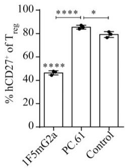

**结论**
- 靶向 CD27 的免疫治疗通过 **共刺激效应T细胞** 和 **耗竭功能性Treg** 这两种互补机制共同贡献其抗肿瘤疗效。
- **最强的共刺激信号并不总能带来最佳的治疗效果**，因其可能导致 T 细胞过度活化后的耗竭和凋亡。
- **选择性耗竭并削弱 Treg 功能**，同时辅以适度的共刺激，是一种在多种肿瘤模型中更为有效的策略。
- 在临床应用中，可以通过 **调整 varlilumab 的剂量和给药方案** 来平衡其共刺激与耗竭活性，从而优化治疗效果。

---

## 2. 背景知识与核心贡献

**研究背景与动机**
- **免疫检查点阻断**（如 CTLA-4, PD-1/PD-L1）疗法已取得显著成功，而靶向 **TNFR 超家族**（TNFRSF）成员（如 CD27, OX40, 4-1BB）以提供 **T 细胞共刺激信号**是另一条有前景的癌症免疫治疗路径。
- **CD27** 是一个关键的 TNFRSF 成员，在大多数 T 细胞上组成型表达，其与其配体 **CD70** 的相互作用对 T 细胞的启动、效应分化和记忆形成至关重要。
- 靶向 TNFRSF 的抗体药物存在两种潜在的 **作用机制 **(MOA)：一是作为 **激动剂 **(agonist) 提供共刺激信号；二是通过 Fc 段介导的效应功能（如 ADCC/ADCP）**耗竭 **(deplete) 靶细胞。这两种机制的相对贡献尚不清楚。
- 临床在研的人源 IgG1 抗 CD27 抗体 **varlilumab **(clone 1F5) 已显示出初步疗效，但其确切的抗肿瘤 MOA 需要进一步阐明，以指导临床用药策略。

**核心贡献**
- 本研究通过构建 **1F5 抗体的不同鼠源 IgG 亚型变体**（1F5mIgG1 和 1F5mIgG2a），在 **人源 CD27 转基因小鼠模型**（hCD27-Tg）中，成功地将 **激动活性** 和 **耗竭活性** 这两种 MOA 分离开来，并系统评估了它们在不同肿瘤模型中的贡献。
- 研究发现，**激动活性** 和 **耗竭活性** 均能贡献于抗肿瘤疗效，但其优势取决于 **肿瘤模型**：
  - **1F5mIgG1**（主要结合抑制性 FcγRIIB）表现出最强的 **激动活性**，能强力激活效应 T 细胞，但在静脉注射的 **BCL1 淋巴瘤模型** 中效果最佳。然而，这种强效激动会导致效应 T 细胞发生 **终末分化、耗竭 **(exhaustion)，从而限制了其在皮下实体瘤模型中的疗效。
  - **1F5mIgG2a**（主要结合激活性 FcγRs）表现出显著的 **调节性 T 细胞 **(Treg)。更重要的是，残留的 Treg **抑制功能受损**，这使其在多种 **皮下肿瘤模型**（如 E.G7, Colon26, CT26）中表现出卓越的治愈效果。
- 研究还揭示了 **varlilumab **(1F5hIgG1) 兼具适度的激动和耗竭活性，因此在所有测试的肿瘤模型中均表现出良好的广谱抗肿瘤活性。其作用模式可通过 **调整剂量** 来调控：低剂量偏向激动，高剂量偏向耗竭。
- 该研究首次明确证明，对于 CD27 靶向治疗，**Treg 耗竭** 与 **效应 T 细胞共刺激** 同样重要，甚至在某些情况下更为关键。这为优化 CD27 靶向免疫疗法的临床设计（如剂量、给药方案）提供了重要的理论依据。

---

## 3. 核心技术和实现细节

### 0. 技术架构概览

**整体技术架构**

本文并非提出一种新型计算或AI模型，而是一项**机制性研究 (mechanistic study)**，旨在解析靶向 **CD27** 的免疫疗法（以抗体 **varlilumab/1F5** 为代表）发挥抗肿瘤作用的双重机制。其核心架构围绕一个中心假设展开：通过改变抗体的 **Fc段同种型 (IgG isotype)**，可以分别增强其 **激动 (agonistic)** 或 **耗竭 (depleting)** 活性，从而解构并验证这两种机制在不同肿瘤模型中的贡献。

- **核心工具与模型**:
    - **人源化小鼠模型**: 使用表达人 **CD27** 的转基因小鼠 (**hCD27-Tg mice**)，使其免疫系统能对人源抗体产生反应。
    - **同种型变体抗体**: 基于临床候选药物 **varlilumab (1F5hIgG1)**，构建了两种小鼠同种型变体：
        - **1F5mIgG1**: 主要结合 **抑制性 FcγRIIB**，用于最大化 **T细胞共刺激 (costimulation)** 效应。
        - **1F5mIgG2a**: 主要结合 **激活性 FcγRs (FcγRI/III/IV)**，用于介导 **抗体依赖性细胞介导的细胞毒性 (ADCC)** 和 **抗体依赖性细胞介导的吞噬作用 (ADCP)**，从而实现靶细胞耗竭。
    - **多种同源肿瘤模型**: 在包括 **BCL1 (淋巴瘤)**、**E.G7**、**Colon26**、**CT26 (结肠癌)** 和 **B16-MUC1 (黑色素瘤)** 在内的多个皮下或静脉注射肿瘤模型中评估疗效，以揭示模型依赖性。

- **关键机制探究路径**:
    - **免疫激活表征**: 通过流式细胞术、ELISPOT 和细胞内染色等方法，在脾脏、外周淋巴结 (**pLNs**)、肿瘤引流淋巴结 (**TdLNs**) 和肿瘤浸润淋巴细胞 (**TILs**) 中，全面分析 **效应T细胞 (effector T cells)** 的活化、增殖、分化、耗竭和凋亡状态。
    - **调节性T细胞 (Treg) 分析**: 重点评估不同抗体变体对 **Treg** 数量、表型和**抑制功能 (suppressive activity)** 的影响，并与经典的 **CD25** 耗竭抗体 **PC.61** 进行对比。
    - **功能验证实验**: 包括 **Treg抑制功能测定**、**肿瘤再挑战实验**（验证免疫记忆）以及**治疗时机实验**（预处理 vs. 后处理），以确认观察到的免疫学变化与抗肿瘤疗效之间的因果关系。

---
**核心发现与结论**

研究最终证实，靶向CD27的抗肿瘤疗效由两种互补机制共同驱动，且其主导地位取决于肿瘤微环境和抗体的Fc特性。

- **激动机制 (Agonism)**:
    - **1F5mIgG1** 诱导了最强烈的 **T细胞活化与扩增**，但随之而来的是 **终末分化 (terminal differentiation)**、**耗竭 (exhaustion)** 和 **活化诱导的细胞死亡 (AICD)**。
    - 这种“强效但短暂”的免疫反应在 **BCL1淋巴瘤**（主要在脾脏生长）模型中非常有效，但在需要持久免疫应答的**皮下实体瘤**模型中效果有限。

- **耗竭机制 (Depletion)**:
    - **1F5mIgG2a** 能**选择性地耗竭高表达CD27的调节性T细胞 (Treg)**。
    - 更重要的是，残留的 **Treg** 表现出**显著降低的抑制功能**，这可能是其优于单纯数量耗竭的 **PC.61** 抗体的关键原因。
    - 这种解除免疫抑制的机制在 **E.G7**、**Colon26** 等皮下肿瘤模型中效果显著，并能诱导**长效的抗肿瘤免疫记忆**。

- **临床候选药物 varlilumab (1F5hIgG1) 的平衡特性**:
    - **varlilumab** 同时具备**中等程度的激动和耗竭活性**。
    - 其活性可通过**剂量调节**：低剂量偏向激动，高剂量偏向耗竭。
    - 这种双重且可调的特性使其在**所有测试的肿瘤模型中均表现出良好的广谱抗肿瘤活性**，为临床应用提供了重要的理论依据。

### 1. FcγR-Dependent Isotype Engineering

**FcγR-Dependent Isotype Engineering 的实现原理与机制**

该研究的核心策略是通过 **isotype switching**（同种型转换）来精确调控抗体的功能，使其偏向于 **costimulatory agonism**（共刺激激动）或 **cell depletion**（细胞耗竭）。其根本原理在于不同 IgG 同种型与 **Fcγ receptors **(FcγRs) 具有截然不同的亲和力谱。

- **基础分子工具**：研究者以人源抗 CD27 抗体 **varlilumab **(clone 1F5, hIgG1) 为模板，通过基因工程手段，将其恒定区替换为小鼠的 **IgG1 **(mIgG1) 或 **IgG2a **(mIgG2a) 恒定区，从而生成 **1F5mIgG1** 和 **1F5mIgG2a** 变体。
- **FcγR 结合特性差异**：
  - **1F5mIgG1**：主要与 **inhibitory FcγRIIB** 结合。FcγRIIB 在 B 细胞等抗原呈递细胞上高表达，其结合不会触发 ADCC/ADCP 等效应功能，但能提供高效的 **cross-linking**（交联）平台，这对于 TNFR 超家族成员（如 CD27）的激动活性至关重要。
  - **1F5mIgG2a**：主要与 **activating FcγRs**（包括 FcγRI、FcγRIII 和 FcγRIV）结合。这些受体在 NK 细胞、巨噬细胞和中性粒细胞上表达，其结合能有效触发 **antibody-dependent cellular cytotoxicity **(ADCC) 和 **antibody-dependent cellular phagocytosis **(ADCP)，导致靶细胞被清除。
- **关键验证实验**：通过 **surface plasmon resonance **(SPR) 分析确认了各变体与小鼠 FcγRs 的结合谱符合预期（补充图 1B）。同时，引入 **D265A 突变**（位于 Fc 区）的 1F5mIgG1 变体完全丧失了与所有 FcγRs 的结合能力，并在体内失去了抗肿瘤活性，这直接证明了 **FcγR engagement is essential for the in vivo efficacy**。

**算法流程与参数设置（实验操作层面）**

该“工程”的“算法”体现在严谨的实验设计和剂量控制上。

- **抗体生产与质控**：
  - 使用标准的 **transfectoma**（转染瘤）技术和层析纯化技术生产抗体。
  - 严格控制内毒素水平（< 1.0 EU/mg），确保体内实验结果不受污染影响。
  - 通过 **functional ELISA** 和 **flow cytometry** 验证所有变体均保留了与人 CD27 的结合能力。
- **体内给药方案**：
  - 在多种同系肿瘤模型（如 BCL1, E.G7, Colon26, CT26, B16-MUC1）中进行测试。
  - 给药剂量范围为 **10–250 μg**，通常在 **100–200 μg** 进行疗效评估。
  - 给药途径为 **intraperitoneal **(i.p.)。
  - 给药时间点根据模型不同而变化，包括预防性给药（肿瘤接种前 7 天）和治疗性给药（肿瘤接种后数天）。

**输入输出关系及在整体研究中的作用**

该工程技术的输入是抗体的 **Fc 恒定区结构**，输出是抗体在体内的 **主导生物学功能**（激动 vs. 耗竭），从而揭示 CD27 靶向治疗的不同作用机制。

- **输入**：特定的 IgG 同种型（mIgG1 或 mIgG2a）。
- **核心输出**：
  - **1F5mIgG1 输入 → 强效 T 细胞激动输出**：导致广泛的 T 细胞、NK 细胞和 DC 激活，但伴随 **terminal differentiation**（终末分化）、**exhaustion**（耗竭）和 **apoptosis**（凋亡），产生强大但短暂的免疫反应。
  - **1F5mIgG2a 输入 → 选择性 Treg 耗竭输出**：显著减少 **regulatory T cells **(Tregs) 的数量，并且残余的 Tregs **suppressive activity**（抑制活性）大幅降低，从而解除免疫抑制。
- **在整体研究中的作用**：
  - **解耦机制 **(Decoupling Mechanisms)：这是本研究最关键的贡献。通过这种工程化手段，成功地将 CD27 抗体的 **agonistic activity** 和 **depleting activity** 分离开来，证明了二者都是抗肿瘤疗效的独立贡献者。
  - **解释模型依赖性疗效**：阐明了为何 **1F5mIgG1** 对主要在脾脏生长的 **BCL1 lymphoma** 最有效（脾脏富含 FcγRIIB+ B 细胞，利于交联激动），而 **1F5mIgG2a** 对皮下实体瘤（如 E.G7, Colon26）更有效（通过耗竭 Tregs 改变肿瘤微环境）。
  - **指导临床开发**：为临床候选药物 **varlilumab **(1F5hIgG1) 的作用机制提供了深刻见解。Varlilumab 表现出 **balanced agonistic and depleting activities**（平衡的激动与耗竭活性），其具体偏向可通过 **dose and regimen**（剂量和方案）进行调节（低剂量偏向激动，高剂量偏向耗竭），这为优化临床用药策略提供了理论依据。

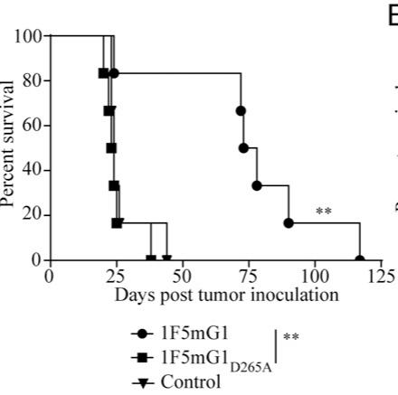

**不同抗体变体的功能特性对比**

| 抗体变体 | 主要结合的 FcγR | 主导功能 | 对 T 细胞的影响 | 对 Treg 的影响 | 在 BCL1 模型中的疗效 | 在 E.G7 模型中的疗效 |
| :--- | :--- | :--- | :--- | :--- | :--- | :--- |
| **1F5mIgG1** | **Inhibitory FcγRIIB** | **强效共刺激激动** | 强烈激活、增殖，但导致终末分化、耗竭和凋亡 | 影响甚微 | **+++ **(最优) | **+ **(较差) |
| **1F5mIgG2a** | **Activating FcγRs** | **选择性细胞耗竭** | 中度激活 | **显著耗竭，且残余 Treg 抑制功能受损** | **- **(无效) | **+++ **(最优) |
| **1F5hIgG1 **(Varlilumab) | Activating FcγRs (亲和力中等) | **平衡的激动与耗竭** | 中度激活，无明显耗竭迹象 | 中度耗竭 | **++** | **++** |

---
**与 CD25 靶向耗竭的比较优势**

研究进一步将 **1F5mIgG2a** 介导的 Treg 耗竭与经典的抗 CD25 抗体 **PC.61** 进行了比较，凸显了靶向 CD27 的优越性。

- **耗竭质量差异**：
  - **PC.61 耗竭后**：残余的 Tregs **CD27 表达水平反而升高**，并且其 **suppressive activity is more potent**（抑制活性更强）。
  - **1F5mIgG2a 耗竭后**：残余的 Tregs **suppressive activity is significantly impaired**（抑制活性显著受损）。
- **抗肿瘤疗效差异**：在 E.G7 和 CT26 肿瘤模型中，**1F5mIgG2a 的治愈率显著高于 PC.61**。甚至二者联用可产生 **synergistic effect**（协同效应），达到 95% 的治愈率。
- **根本原因推测**：CD27 的表达水平与 Treg 的抑制功能正相关。1F5mIgG2a 优先清除了 **CD27hi** 的、最具抑制功能的 Treg 亚群，而 PC.61 的耗竭可能不够精准，甚至可能富集了更具功能的 Treg。

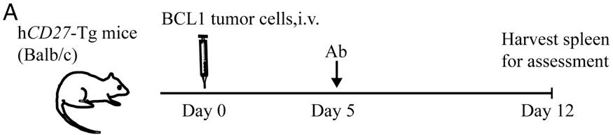
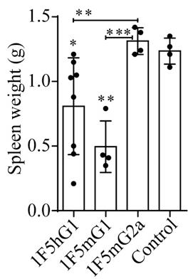

### 2. Dual Mechanism of Action (Agonism vs. Depletion)

**核心机制：CD27抗体的双重作用模式**

该研究通过改造抗人CD27抗体1F5（即varlilumab）的Fc段，系统性地解耦了其两种关键的抗肿瘤机制：**T细胞共刺激激活**（Agonism）与**调节性T细胞**（Treg）。不同IgG亚型通过与不同类型的**Fcγ受体**（FcγR）相互作用，主导了其中一种机制。

- **mIgG1亚型**（1F5mIgG1）
  - **FcγR结合特性**：主要与**抑制性FcγRIIB**结合，该受体在B细胞上高表达。
  - **作用原理**：FcγRIIB作为“锚点”，能高效地将抗体交联（cross-linking），从而强烈激活CD27信号通路。这种交联模拟了其天然配体CD70的作用，但强度和持续时间更强。
  - **免疫效应**：
    - 引发**极其强烈的、广泛的免疫激活**，包括CD8+ T细胞、CD4+ T细胞、NK细胞和树突状细胞（DCs）。
    - 显著扩增抗原特异性CD8+ T细胞，并促进其产生多种细胞因子（如IFN-γ, TNF-α, IL-2）。
  - **负面后果**：过度的激活导致效应T细胞发生**终端分化**（Terminal differentiation）、**耗竭**（Exhaustion）和**活化诱导的细胞死亡**（AICD）。
    - 表现为短寿命效应细胞（SLECs）比例剧增，而中央记忆T细胞（Tcm）减少。
    - 耗竭标志物（PD-1, Tim-3, Lag-3）共表达水平升高。
    - 凋亡相关分子（Fas, active Caspase-3）上调，抗凋亡分子（Bcl-2）下调。
  - **抗肿瘤效果**：在**BCL1淋巴瘤模型**（主要在脾脏生长）中效果最佳，因为脾脏富含表达FcγRIIB的B细胞，为抗体交联提供了理想微环境。但在皮下实体瘤模型中效果有限，因其引发的免疫反应短暂且无法形成有效记忆。

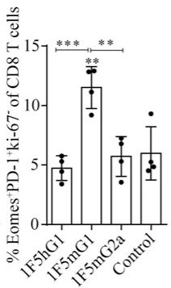

- **mIgG2a亚型**（1F5mIgG2a）
  - **FcγR结合特性**：主要与**激活性FcγRs**（如FcγRI, FcγRIII, FcγRIV）结合，这些受体在NK细胞、巨噬细胞等效应细胞上表达。
  - **作用原理**：通过ADCC（抗体依赖性细胞介导的细胞毒性）和ADCP（抗体依赖性细胞介导的吞噬作用）等效应功能，**选择性地清除高表达CD27的细胞**。
  - **免疫效应**：
    - **优先耗竭调节性T细胞**（Tregs），因为Tregs表面CD27表达水平显著高于其他T细胞亚群（如常规CD4+ T细胞和CD8+ T细胞）。
    - 残留的Tregs**抑制功能显著受损**，这可能是由于最具抑制活性的Treg亚群被优先清除。
    - 同时提供**适度的共刺激信号**，增强效应T细胞的功能，但强度远低于mIgG1，因此避免了严重的耗竭和凋亡。
  - **抗肿瘤效果**：在**E.G7、Colon26等皮下实体瘤模型**中表现出卓越的疗效，能够实现长期治愈。其机制在于解除Treg介导的免疫抑制，同时维持一个功能健全的效应T细胞池。

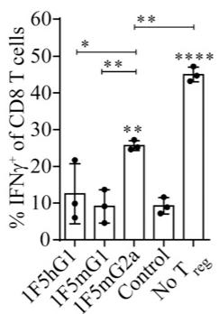

---
**人源IgG1亚型**（1F5hIgG1 / varlilumab）

临床使用的varlilumab（hIgG1）展现出一种**平衡的双重特性**，兼具上述两种机制。

- **剂量依赖性效应**：
  - **低剂量**时，主要发挥**共刺激**（agonistic）作用。
  - **高剂量**时，**耗竭**（depleting）作用更为显著。
- **FcγR结合特性**：对激活性FcγRs（FcγRI, FcγRIV）有亲和力，但低于mIgG2a；基本不结合抑制性FcγRIIB。
- **作用原理**：其共刺激活性可能源于与激活性FcγRs的低水平结合，足以介导抗体交联但不足以触发强烈的效应细胞功能。随着剂量增加，效应细胞功能被充分激活，导致细胞耗竭。
- **抗肿瘤效果**：在所有测试的肿瘤模型中均表现出**良好的、广谱的抗肿瘤活性**，这得益于其既能适度激活效应T细胞，又能有效削弱Treg的抑制功能。

---
**机制对比与关键数据**

下表总结了三种抗体亚型的关键特性及其在不同肿瘤模型中的表现：

| 特性 | 1F5mIgG1 | 1F5mIgG2a | 1F5hIgG1 (Varlilumab) |
| :--- | :--- | :--- | :--- |
| **主导FcγR** | **FcγRIIB **(抑制性) | **激活性FcγRs** | **激活性FcγRs **(中等亲和力) |
| **核心机制** | **强效共刺激/激活** | **选择性Treg耗竭** | **平衡的共刺激与耗竭** |
| **T细胞状态** | 终端分化、耗竭、AICD | 功能健全、适度激活 | 中度激活、较少耗竭 |
| **Treg影响** | 数量变化不大，功能完整 | **数量显著减少，功能严重受损** | 数量中度减少，功能减弱 |
| **BCL1淋巴瘤** | **+++ **(最优) | - (无效) | ++ |
| **E.G7/Colon26实体瘤** | + (效果差) | **+++ **(最优) | ++ |

---
**输入-输出关系及整体作用**

- **输入**：不同Fc亚型的抗CD27抗体（1F5）。
- **处理/转换**：抗体通过其Fab段结合T细胞（尤其是Tregs）表面的CD27，同时其Fc段与宿主免疫细胞上的特定FcγR结合。这一结合事件决定了后续的信号传导方向——是走向强烈的共刺激激活，还是走向效应细胞介导的靶向清除。
- **输出**：
  - **免疫层面**：塑造了截然不同的肿瘤免疫微环境（TIME）。mIgG1创造了一个高度激活但短暂且充满耗竭细胞的环境；mIgG2a则创造了一个Treg被清除、效应T细胞功能得以释放的环境。
  - **治疗层面**：产生了**模型依赖性的抗肿瘤疗效**。该发现揭示了CD27靶向治疗的复杂性，并为临床策略（如抗体工程、剂量优化、联合用药）提供了关键理论依据。例如，在Treg浸润为主的肿瘤中，应优先考虑具有强耗竭能力的抗体或高剂量方案。

### 3. Model-Dependent Therapeutic Efficacy

**核心机制：肿瘤模型依赖的疗效差异**

该研究通过改造抗CD27抗体varlilumab (clone 1F5) 的Fc段，生成了具有不同免疫调节功能的小鼠IgG1 (mIgG1) 和IgG2a (mIgG2a) 同种型变体，并在多种同源肿瘤模型中评估其抗肿瘤效果。结果揭示了一个关键现象：**最优治疗机制高度依赖于肿瘤模型的特性**，特别是其生长位置（系统性 vs. 皮下）和组织微环境。

- **mIgG1同种型 (1F5mIgG1)**：
  - **作用机制**：主要与表达于B细胞等上的**抑制性FcγRIIB**结合。这种结合不触发ADCC/ADCP等效应功能，但能高效地**交联**（cross-link）抗体，从而最大化其**激动活性**（agonistic activity），强烈共刺激T细胞。
  - **疗效表现**：在**系统性BCL1淋巴瘤模型**中效果最佳。BCL1主要在脾脏生长，而脾脏富含高表达FcγRIIB的B细胞，为抗体交联提供了理想环境。
  - **免疫学后果**：诱导了极其**强大而广泛的免疫激活**，包括CD8+ T细胞、NK细胞和树突状细胞（DCs）的显著扩增与活化。
    - 
    - 
  - **负面效应**：强烈的CD27信号导致效应T细胞发生**终末分化**（terminal differentiation）、**耗竭**（exhaustion）和**活化诱导的细胞死亡**（AICD）。
    - 表现为短寿命效应细胞（SLECs）比例剧增，而中央记忆T细胞（Tcm）减少。
    - 耗竭标志物（PD-1, Tim-3, Lag-3）共表达上调，凋亡分子（Fas, active Caspase-3）水平升高，抗凋亡分子（Bcl-2）水平下降。
    - 
    - 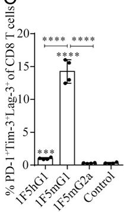
  - **最终结果**：虽然能快速清除BCL1肿瘤，但由于T细胞过早耗竭和凋亡，**无法形成有效的长期免疫记忆**，因此在需要持久免疫应答的**皮下实体瘤模型**（如E.G7, Colon26）中效果有限。

- **mIgG2a同种型 (1F5mIgG2a)**：
  - **作用机制**：主要与表达于NK细胞、巨噬细胞等上的**激活性FcγRs**（如FcγRIV）结合，从而介导强大的**抗体依赖性细胞介导的细胞毒性**（ADCC）和**吞噬作用**（ADCP），导致靶细胞**耗竭**（depleting activity）。
  - **疗效表现**：在**皮下实体瘤模型**（如E.G7胸腺瘤、Colon26结肠癌）中效果卓越，能实现长期生存甚至治愈。
  - **关键靶点**：该同种型能**选择性地耗竭高表达CD27的调节性T细胞**（Treg）。由于Treg通常比效应T细胞表达更高水平的CD27，因此成为优先被清除的目标。
    - 
  - **双重优势**：
    - **数量减少**：显著降低了Treg的绝对数量。
    - **功能削弱**：残余的Treg**抑制活性**（suppressive activity）显著降低，这可能是由于最具抑制功能的Treg亚群被优先清除。
    - 
  - **最终结果**：通过解除Treg介导的免疫抑制，并辅以适度的共刺激作用，在肿瘤微环境中营造了有利于效应T细胞发挥功能的环境，从而有效控制并清除皮下肿瘤。

---
**疗效对比数据总结**

下表总结了不同1F5同种型变体在关键肿瘤模型中的抗肿瘤疗效：

| 肿瘤模型 | 生长方式 | 最佳同种型 | 疗效表现 | 主导机制 |
| :--- | :--- | :--- | :--- | :--- |
| **BCL1** | 静脉注射，系统性（脾脏） | **1F5mIgG1** | 显著延长生存期，高效清除肿瘤 | **强效激动**（T细胞强力激活） |
| **E.G7** | 皮下接种 | **1F5mIgG2a** | 肿瘤消退，高比例长期治愈 | **Treg耗竭**（解除免疫抑制） |
| **Colon26** | 皮下接种 | **1F5mIgG2a** | 肿瘤消退，高比例长期治愈 | **Treg耗竭**（解除免疫抑制） |
| **CT26 / B16-MUC1** | 皮下接种 | **1F5hIgG1** (varlilumab) | 部分有效 | **激动与耗竭的平衡** |

- 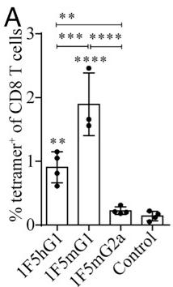

---
**人源IgG1同种型 (Varlilumab, 1F5hIgG1) 的平衡作用**

临床候选药物varlilumab (1F5hIgG1) 的行为介于上述两种小鼠同种型之间，兼具**中等程度的激动活性和耗竭活性**。

- **剂量依赖性**：其主导机制可通过剂量调节。**低剂量**时，激动活性更突出；**高剂量**时，耗竭活性（尤其是对Treg）更为显著。
- **广谱疗效**：得益于这种双重机制的平衡，varlilumab在所有测试的肿瘤模型中均表现出**良好且显著的抗肿瘤活性**，展现了更广泛的治疗潜力。
- **临床相关性**：这一发现解释了为何varlilumab在临床试验中既能观察到T细胞激活的证据，又能看到循环Treg数量的显著减少。

### 4. Functional Impairment of Residual Tregs

**核心发现：CD27介导的Treg耗竭不仅减少其数量，更关键的是损害了残余Treg的功能**

- 研究通过比较两种不同的Treg耗竭策略——靶向**CD27**的耗竭型抗体 **1F5mIgG2a** 与经典的靶向**CD25**的抗体 **PC.61**——揭示了功能损伤是决定抗肿瘤疗效的关键因素。
- 尽管两种抗体在脾脏和外周淋巴结（pLNs）中对**Foxp3+ Treg**的**耗竭效率**相似，但它们对残余Treg的**抑制功能 (suppressive activity)** 产生了截然相反的影响。

**Treg抑制功能测定实验流程与结果**

- **实验设计**：
  - 从经 **1F5mIgG2a**、**PC.61** 或对照IgG处理的小鼠脾脏中分离出Treg（定义为CD4+ CD25+）。
  - 将这些Treg与来自未处理小鼠的、经**CFSE**标记的**CD8 T细胞**（或CD4 Th细胞）以1:1比例共培养。
  - 在包被了**CD3抗体**的96孔板中进行刺激，并加入可溶性**CD28抗体**提供共刺激信号。
  - 培养72小时后，通过流式细胞术分析**CFSE稀释**（衡量增殖）和**IFN-γ**产生（衡量活化）来评估Treg的抑制能力。
- **关键结果**：
  - 对照组Treg表现出强大的抑制能力，对CD8 T细胞的增殖和IFN-γ产生的抑制率分别高达**77%**和**79%**。
  - **1F5mIgG2a**处理后分离的残余Treg，其抑制能力**显著受损**，对增殖和IFN-γ产生的抑制率分别降至**34%**和**43%**。
  - 相反，**PC.61**处理后的残余Treg，其抑制能力**不仅未减弱，反而更强**，超过了对照组Treg的抑制水平。
- 这一发现直接解释了为何**1F5mIgG2a**在E.G7和CT26肿瘤模型中展现出比**PC.61**更优越的抗肿瘤效果。

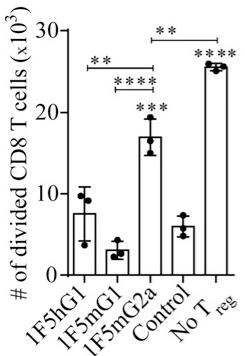

**功能损伤的潜在机制与表型关联**

- 研究推测，**1F5mIgG2a**的功能损伤效应源于其**选择性耗竭**了**CD27高表达 (CD27hi)** 的Treg亚群。
- 文献支持**CD27**的表达水平与Treg的**抑制功能强度**正相关。因此，抗体优先清除了最具抑制活性的Treg，而留下的残余Treg可能是功能较弱的亚群。
- 这一推测得到了表型数据的支持：经**1F5mIgG2a**处理后，残余Treg上的**CD27**表达水平显著降低。
- 与此形成鲜明对比的是，**PC.61**（抗CD25）处理后，残余Treg上的**CD27**表达水平**反而显著升高**，这可能反映了一个代偿性上调或选择了更具抑制性的CD27hi亚群，从而解释了其增强的抑制功能。

**整体作用与意义**

- **输入**：耗竭型抗CD27抗体（1F5mIgG2a）。
- **输出**：数量减少且**功能受损**的Treg群体。
- **在整体免疫应答中的作用**：
  - 通过双重机制——**数量耗竭**和**功能损伤**——极大地削弱了肿瘤微环境中的免疫抑制屏障。
  - 解除了对效应T细胞（如CD8+ T细胞）的抑制，使其能够更有效地增殖、活化并执行抗肿瘤功能，如产生**IFN-γ**和**Granzyme B**。
  - 这种对免疫抑制网络的深度破坏，是**1F5mIgG2a**在皮下实体瘤模型中实现高效肿瘤清除和长期免疫记忆的核心机制之一，也凸显了靶向**CD27**相较于传统靶点**CD25**的独特优势。

### 5. Dose-Modulated Activity of Clinical Antibody Varlilumab

**Varlilumab (1F5hIgG1) 的双重作用机制与剂量调控原理**

- Varlilumab 是一种处于临床开发阶段的 **human IgG1 (hIgG1)** 抗体，靶向 **CD27**。
- 其核心特性在于同时具备 **agonistic (激动/共刺激)** 和 **depleting (耗竭)** 两种免疫调节活性。
- 这种双重活性并非固定不变，而是可以通过 **dose (剂量)** 进行有效调控。

**剂量依赖性活性转换的实现原理**

- **FcγR 结合亲和力是关键**：Varlilumab 的 hIgG1 Fc 段能够与多种 Fcγ 受体结合，但其亲和力谱介于小鼠 IgG1 (mIgG1) 和小鼠 IgG2a (mIgG2a) 之间。
  - 它优先结合 **activating FcγRs (激活性 FcγR)**，如 **FcγRI** 和 **FcγRIV**，但亲和力低于 mIgG2a。
  - 这种中等强度的结合能力是其剂量可调性的结构基础。
- **低剂量机制 (偏向共刺激)**：
  - 在 **较低剂量** 下，抗体浓度不足以有效触发 **effector cell functions (效应细胞功能)**，如 **ADCC (Antibody-Dependent Cell-mediated Cytotoxicity)** 和 **ADCP (Antibody-Dependent Cellular Phagocytosis)**。
  - 然而，该浓度足以通过与表达 FcγR 的细胞（如抗原呈递细胞）发生 **cross-linking (交联)**，从而为 T 细胞提供有效的 **costimulatory signal (共刺激信号)**。
  - 此过程主要增强 **effector T cell (效应T细胞)** 的活化与功能。
- **高剂量机制 (偏向耗竭)**：
  - 在 **较高剂量** 下，抗体浓度显著提升，使其与 **activating FcγRs** 的结合达到或超过触发 **ADCC/ADCP** 的阈值。
  - 由于 **regulatory T cells (Tregs)** 表面 **CD27 表达水平 (CD27hi)** 显著高于其他 T 细胞亚群，它们成为抗体介导的细胞毒性作用的 **preferential target (优先靶标)**。
  - 结果导致 **Treg 数量** 和 **Treg suppressive activity (抑制活性)** 的显著下降。

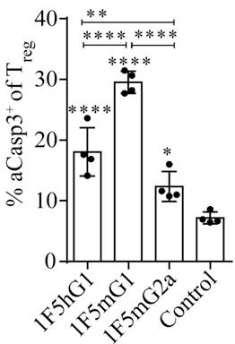

**输入输出关系及在整体研究中的作用**

- **输入**：不同剂量的 Varlilumab (1F5hIgG1) 抗体。
- **输出**：
  - **低剂量输入** → **输出**：以 **T cell activation (T细胞活化)** 和 **enhanced effector function (增强的效应功能)** 为主的免疫反应。
  - **高剂量输入** → **输出**：以 **Treg depletion (Treg耗竭)** 和 **reduced immunosuppression (免疫抑制减弱)** 为主的免疫反应。
- **在整体研究中的作用**：
  - Varlilumab 作为 **临床相关参照物**，其行为验证了在 **human CD27-transgenic (hCD27-Tg) 小鼠模型** 中观察到的机制（即激动与耗竭的双重性）具有临床转化意义。
  - 它展示了如何通过 **简单的 dose and regimen (剂量和给药方案)** 调整，来 **modulate (调控)** 患者体内的免疫反应平衡，从而适应不同的肿瘤微环境和治疗需求。
  - 其 **balanced (平衡)** 的特性解释了为何它在 **所有测试的肿瘤模型** 中均表现出 **good antitumor activity (良好的抗肿瘤活性)**，而极端偏向激动 (1F5mIgG1) 或耗竭 (1F5mIgG2a) 的变体则表现出 **model-dependent efficacy (模型依赖性疗效)**。

---

## 4. 实验方法与实验结果

**实验设置**

- 本研究旨在阐明靶向 **CD27** 的抗体（Ab）发挥抗肿瘤疗效的双重机制：**效应T细胞（effector T cell）的共刺激**与**调节性T细胞（regulatory T cell, Treg）的耗竭**。
- 研究者基于临床候选药物 **varlilumab (1F5hIgG1)**，在 **人源化CD27转基因小鼠 (hCD27-Tg mice)** 模型中，构建了两种鼠源同种型变体：
  - **1F5mIgG1**: 主要结合 **抑制性FcγRIIB**，预期增强 **共刺激活性**。
  - **1F5mIgG2a**: 主要结合 **激活性FcγRs (FcγRI/III/IV)**，预期增强 **细胞耗竭活性**。
- 实验在多种同源肿瘤模型中进行评估，包括：
  - **BCL1淋巴瘤**（静脉注射，主要在脾脏生长）。
  - **E.G7、Colon26、CT26、B16-MUC1**（皮下注射，s.c. tumors）。
- 设置了多种对照组，包括同型对照IgG、盐水、以及用于Treg耗竭的抗CD25抗体 **PC.61**。

**结果数据分析**

- **不同同种型抗体展现出模型依赖性的抗肿瘤疗效**：
  - 在 **BCL1淋巴瘤模型** 中，**1F5mIgG1** 效果最佳，而 **1F5mIgG2a** 完全无效。这表明在该模型中，强烈的共刺激信号是关键。
    
  - 在 **皮下肿瘤模型（如E.G7, Colon26）** 中，**1F5mIgG2a** 表现出卓越的治愈效果，而 **1F5mIgG1** 效果不佳。这表明在这些模型中，Treg耗竭是主导机制。
    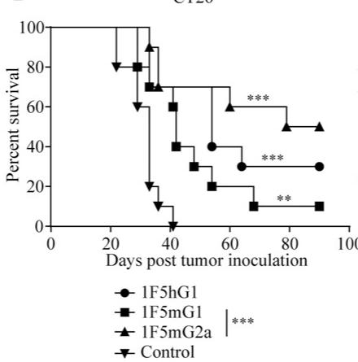
    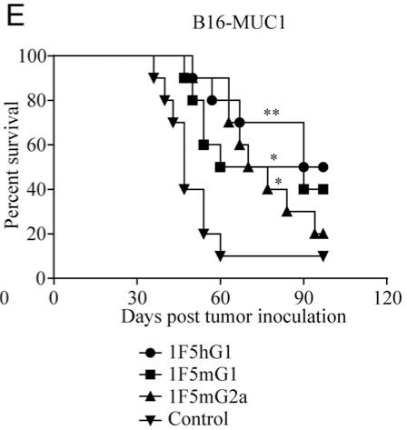
- **1F5mIgG1诱导强烈的免疫激活但伴随T细胞耗竭**：
  - **1F5mIgG1** 能最有效地扩增抗原特异性CD8+ T细胞，并激活NK细胞和树突状细胞（DCs）。
    
  - 然而，这种强烈的激活导致CD8+ T细胞发生 **终末分化 (SLECs增加)**、**耗竭 (PD-1, Tim-3, Lag-3共表达)** 和 **凋亡 (Fas, aCasp3上调; Bcl-2下调)**，从而限制了其在需要持久免疫应答的皮下肿瘤模型中的疗效。
    
- **1F5mIgG2a通过选择性耗竭功能性Treg发挥作用**：
  - **1F5mIgG2a** 能显著降低Treg的数量，尤其是在外周淋巴结（pLNs）和肿瘤微环境中。
    
  - 更重要的是，残留的Treg **抑制功能显著受损**，这与仅减少Treg数量的PC.61抗体形成鲜明对比。
    
- **Varlilumab (1F5hIgG1) 兼具双重活性**：
  - 在较低剂量下，主要表现为 **共刺激活性**；在较高剂量下，**耗竭活性**更为显著。
  - 这种平衡的特性使其在所有测试的肿瘤模型中均表现出良好的广谱抗肿瘤活性。

**消融实验分析**

- **Fc受体结合能力的消融**：
  - 引入 **D265A突变** 的 **1F5mIgG1_D265A** 完全丧失了与所有FcγR的结合能力。
  - 在BCL1模型中，该突变体 **完全失去了抗肿瘤疗效**，证明FcγR介导的交联对于1F5mIgG1的共刺激活性至关重要。
    
- **治疗时机的消融（预处理 vs. 后处理）**：
  - 在E.G7模型中，**1F5mIgG2a** 无论是在肿瘤接种前（预处理）还是接种后（后处理）给药，均能产生相似的治愈效果。
  - 这表明其核心机制（Treg耗竭）不依赖于已存在的肿瘤抗原，而是通过解除免疫抑制来允许后续的抗肿瘤免疫应答发生。
     *A*
- **与PC.61的对比消融**：
  - **1F5mIgG2a** 的抗肿瘤效果 **优于** 传统的Treg耗竭抗体 **PC.61**。
  - 两者联合使用甚至能产生 **协同效应**，达到95%的治愈率。
  - 这一“消融”实验凸显了 **CD27靶向耗竭Treg的独特优势**：不仅减少数量，更关键的是削弱了残留Treg的功能，而PC.61处理后的残留Treg反而更具抑制性。
    

---

