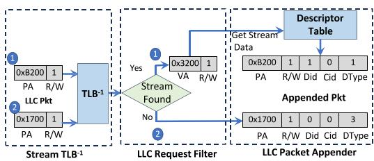
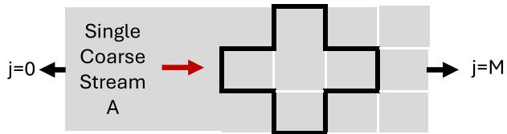
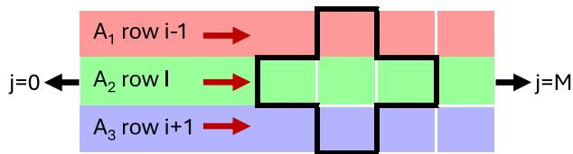
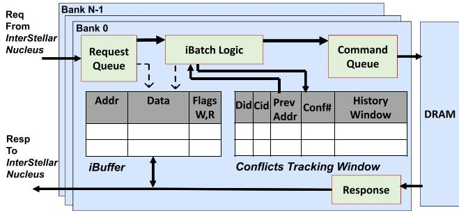
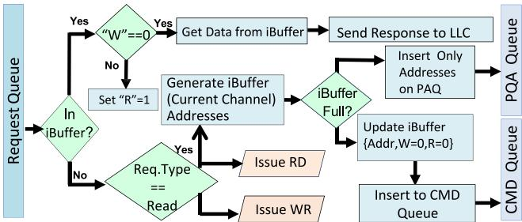

# InterStellar 2.0: Fine-grained stream–guided HW/SW co-design for multi-channel DRAM performance steering 论文解析

[📄 下载论文原文 (PDF)](original.pdf){:download="interstellar20.pdf"} &nbsp;|&nbsp; [🔗 在线阅读](original.pdf){:target="_blank"} &nbsp;|&nbsp; [DOI: 10.1016/j.sysarc.2025.103832](https://doi.org/10.1016/j.sysarc.2025.103832){:target="_blank"}

## 0. 论文基本信息

**作者 (Authors)**: Abdelrhman Mohamed Abotaleb, Maziar Goudarzi, Tomasz Czajkowski, Reza Azimi, Mohamed Hassan

**发表期刊/会议 (Journal/Conference)**: unknown

**发表年份 (Publication Year)**: 2025

**研究机构 (Affiliations)**: McMaster University, Huawei Technologies

---

## 1. 摘要

**目的**

- 突破多通道DRAM系统中处理器速度与内存延迟之间的性能瓶颈。
- 扩展流感知软硬件协同设计以支持高带宽多通道平台，允许各通道独立运行，无需跨通道协调。
- 引入细粒度流描述符，使软件能区分同一数据结构内的不同访问模式，改善DRAM局部性管理。

**方法**

- **硬件/软件协同设计框架**：编译器识别规则访问模式并生成紧凑的流描述符（循环、直接流、间接流、链接变量），通过现有CSR机制传递至硬件，无需ISA或OS变更。
- **Nucleus引擎**：位于LLC出口，将描述符与运行时信息结合，通过逆向Stream TLB匹配物理地址，为每个LLC缺失附加流/子流标识。
- **智能分页策略（iPP）**：为每个直接流维护每bank行命中计数器，当达到最大命中预算时主动预充电；为间接流使用滑动冲突窗口与双阈值规则决定行保留/关闭，避免跨流局部性污染。
- **确定性批处理（iBatch）**：对直接流，在行激活后主动预取未来行命中行，存入每bank iBuffer；引入Pending ACT Queue (PAQ)解耦逻辑批深度与瞬时发布容量。
- **多通道分段扩展**：Nucleus根据地址映射（Row/Bank/BankGroup/Column/Channel）将流的未来访问按通道分割，每个通道独立扩展、调度、缓冲其局部批段，完全消除跨通道同步。
- **细粒度子流跟踪**：编译器将多行/多面访问（如2D/3D模板）拆解为多个子流描述符，每个子流在硬件中独立维护局部性状态，避免不同切片的干扰。

**结果**

- 在8核RISC-V系统上，DRAM配置从1通道到32通道：
  - **性能提升**最高达2.92×（较商用COTS控制器）。
  - **内存带宽提升**最高达2.83×。
- 仅启用细粒度子流跟踪（不变更通道数）即可带来最高1.35×的性能增益。
- 在32通道配置下，iBatch深度超过64行后性能跃升明显；使用8 kB iBuffer/PAQ与合理深度即可获得大部分收益。
- 在16核、16 MB LLC的大规模系统中，LINPACK类内核在1至32通道下仍保持近线性带宽扩展。
- DRAM能量平均降低24%，最高可达60%。

**结论**

- InterStellar 2.0表明流感知的软硬件协同设计在多通道DRAM系统中是**实用、兼容且可扩展**的。
- 无需ISA扩展、无需操作系统变更、无需通道间通信，即可显著提升性能、带宽和能效。
- 它为未来高带宽DDR类及异构内存系统提供了架构无关、可复用的基础，兼顾效率与设计简洁性。

---

## 2. 背景知识与核心贡献

**研究背景**
- 处理器速度与内存延迟的差距持续扩大，成为多核/众核系统性能的根本限制因素，尤其在数据密集型、AI和科学计算工作负载（如稀疏核、张量运算、图分析）中，内存带宽和**Memory-Level Parallelism（MLP）** 效率成为关键瓶颈。
- 现代DRAM子系统（如DDR5、多通道组织）通过增加通道数和并发度来提高聚合带宽，但地址交织使得单个软件流被碎片化到多个物理通道，每个内存控制器（MC）只能看到部分流，导致传统控制器无法有效利用流局部性。
- 商用的COTS内存控制器依赖纯硬件启发式策略（如FR-FCFS、自适应页策略）和硬件预取器，但其缺乏对访问来源（哪个循环、数据结构）的感知，导致行缓冲区冲突增多、有效带宽下降。

**动机**
- 先前工作InterStellar通过HW/SW协同设计，让编译器识别并传递流描述符（base, stride, loop bounds等）给硬件，使MC能实现智能页策略（iPP）和确定性批处理（iBatch），在单通道上显著减少行冲突、提升性能（最高2.72×）。
- 两个关键伸缩性挑战未被解决：
    - **多通道内存系统**：现代高带宽平台使用多通道（及DDR5子通道）交织，单流的访问被分散到多个独立控制器。InterStellar的单通道批处理无法直接扩展，需要无全局耦合的跨通道协调机制。
    - **复杂循环内的细粒度流结构**：科学计算/AI中的多维stencil、结构化网格更新等，同一循环体可能包含多个逻辑上独立的访问模式（如相邻行、平面）。将它们当作单一粗粒度流会混淆局部性信号，导致iPP决策错误、行冲突增加。

**核心贡献**
- **多通道感知的流分段批处理**：InterStellar 2.0在Nucleus中增加通道感知分段调度器，为每个DRAM通道生成独立的批次种子。每个通道的MC仅处理其本地的流段，独立执行iPP和iBatch，无需跨通道通信，消除了全局瓶颈，实现了近乎线性的带宽扩展（1→32通道评估中，性能提升高达2.92×，带宽提升2.83×）。
- **细粒度子流描述**：扩展HW/SW接口，允许编译器为同一个数据结构生成多个独立的子流描述符（例如，stencil中每行对应一个子流）。每个子流在硬件中有独立的行命中/冲突计数器，避免了跨切片污染，提高了页决策精度（单独启用细粒度追踪可带来最高1.35×的性能提升）。
- **完整的多通道控制器机制**：包含每子流的iPP（直接流采用行命中计数器，间接流采用冲突滑动窗口）和每子流的iBatch（通过每bank的iBuffer和Pending ACT Queue (PAQ)解耦逻辑批次深度与即时发射能力），所有机制在每bank、每通道内独立执行，保持低硬件复杂度。
- **兼容性与可扩展性验证**：在8核RISC-V平台上，覆盖1-32个DRAM通道，与COTS控制器、PARBS、BLISS及多种硬件预取器对比，表明InterStellar 2.0在不改变ISA、OS或编程模型的前提下，实现了显著且可扩展的性能提升，并减少了DRAM能耗（平均降低24%）。

---

## 3. 核心技术和实现细节

### 0. 技术架构概览

**整体技术架构**

InterStellar 2.0 是一个 **HW/SW 协同设计** 系统，旨在通过向内存控制器暴露程序级流信息，提升多通道 DRAM 系统的性能。其核心结构可抽象为三层：**软件层（编译器）** → **硬件接口层（Nucleus）** → **执行层（多通道内存控制器）**，三者紧密配合却保持独立，无需 ISA 修改或 OS 参与。

**软件层：编译器流提取**
*   编译器在编译时分析循环和内存访问模式，识别出两类关键流：**直接流（Direct Stream）**（地址由基址和固定步长确定）和**间接流（Indirect Stream）**（地址通过索引数组间接确定）。
*   编译器将流信息编码为紧凑的**描述符（Descriptors）**，包括循环描述符、直接/间接流描述符和链接变量描述符。这些描述符不依赖特殊指令集，而是通过 RISC-V 的 **CSR** 寄存器或保留的内存地址空间传递给硬件。
*   针对复杂循环（如多维模版），编译器可进一步生成**细粒度子流描述符（Fine-grained Sub-stream Descriptors）**，将原本单一的粗粒度流分解为多个独立逻辑访问路径，避免不同访问切片间的局部性信号污染。

**硬件接口层：Nucleus**
*   Nucleus 是中央引擎，位置在**最后一级缓存（LLC）** 旁，负责连接软件元数据与硬件执行。
*   **功能**：接收并解析编译器下发的流描述符，动态重建流元数据（基址、步长、子流ID等）。对于每个 LLC Miss，Nucleus 通过**LLC请求过滤器**判断该地址是否属于某个活跃流，若匹配则通过 LLC 数据包附加器为请求打上流/子流 ID 等元数据标签。
*   **地址翻译**：利用一个小型反向翻译结构（Stream TLB^-1），桥接描述符的虚拟地址和 LLC Miss 的物理地址，无需 OS 介入。
*   **多通道感知**：关键扩展。Nucleus 基于物理地址映射（如 RoBaBgColRaCh），将每个流未来的可预测访问地址按通道进行**分段**。它只向每个通道的内存控制器发送该通道对应的**批次种子**（第一个地址和步长），而非全局批次。这消除了跨通道协调的需求。

**执行层：智能多通道内存控制器**
*   每个 **DRAM 通道** 拥有独立的控制器实例，包含两个核心协同单元：**iPP（智能页策略）** 和 **iBatch（智能批处理）**。每个通道的控制器完全独立执行，不存在全局同步。

*   **iPP（智能页策略）**：实现基于流的**行缓冲区管理**，替代传统的基于存储体的自适应策略。
    *   **直接流**：为每个活跃子流在每存储体中维护一个**行命中计数器**，预估当前行剩余可命中的次数。当计数器达到预计算的最大命中预算 `MaxHit_stream` 时，iPP 会触发预充电，在流切换行前关闭当前行，从而将未来的**行冲突**转化为成本更低的**行缺失**。
    *   **间接流**：使用**冲突跟踪窗口**。为每个活跃间接流在每存储体中记录最近访问的行地址和冲突次数。当冲突次数超过可配置的高阈值（T_H）或处于边界条件时，iPP 决定关闭该行。此机制使得每个子流的局部性统计互不干扰。

*   **iBatch（智能批处理）**：实现**确定性预取**，将请求服务热点从 DRAM 行缓冲区转移到控制器本地。
    *   **本地扩展**：收到 Nucleus 的批次种子后，每个通道的控制器在本地扩展属于本通道的地址序列。该序列严格是行命中的，因为种子是基于当前打开的行的。
    *   **本地缓冲**：预发的读取请求返回的数据被暂存在该通道每存储体的 **iBuffer**（一个本地 SRAM 结构）中。后来的请求若命中 iBuffer，则直接从本地返回，延迟极低，避免了 DRAM 行开销。
    *   **PAQ（待处理激活队列）**：引入 PAQ 来解耦逻辑批深度与瞬时激发容量。当 iBatch 的预见深度超过 iBuffer 容量或 DRAM 时序限制时，溢出请求以地址形式保存在 PAQ 中，等待资源空闲时再处理，防止控制器流水线停顿。

**系统特性总结**
*   **无 ISA 修改**：所有软件与硬件的交互通过现有 CSR 或保留的 MMIO 区域完成。
*   **OS 透明**：软件仅负责生成描述符，操作系统无需任何改动。
*   **多通道可扩展**：核心设计确保每个 DRAM 通道的控制器完全自治。Nucleus 的流分段机制将单一逻辑流分散到多个通道，iPP 和 iBatch 在每个通道的每存储体内独立运行。这种**无全局背压**、**无跨通道通信**的架构，使系统带宽能随着通道数量线性扩展，同时保持高能效。

### 1. HW/SW Interface and Stream Descriptors

**核心观点：InterStellar 2.0 的 HW/SW 接口通过编译器生成的紧凑描述符（Descriptor），利用现有 CSR 写入机制（无需 ISA 修改），将程序级访问模式（流）传递给硬件，使得内存控制器能够做出感知流的行缓冲决策和预取调度。**

- **实现原理**：编译器在编译时识别循环中具有规律的内存访问模式（如连续或等步长访问、间接索引），并将其抽象为四种类型的描述符。这些描述符在运行时通过写入未使用的 CSR（或保留的 MMIO 区域）加载到硬件中。位于 LLC 端的 **Nucleus** 引擎接收并解析这些描述符，建立流与虚拟地址空间的映射。当 LLC miss 发生时，Nucleus 通过 LLC Request Filter 判断该 miss 地址是否属于某个活跃流，并将流 ID 等元数据附加到请求中发送给内存控制器。控制器据此实施智能页策略 (iPP) 和确定性批处理 (iBatch)。

- **描述符类型与参数设置**（参考图4格式，但文本中已有表格）：
    - **Loop Descriptor**: 定义循环的迭代空间，参数包括 Start、End、Step 以及父循环 ID（支持嵌套循环）。通过链路变量（Link Variable）支持运行时依赖的边界。
    - **Direct Stream Descriptor**: 描述仿射（步进）访问流，参数包含 Base Address、Stride、Loop ID 以及可选的链路变量（用于运行时基址）。这是核心：控制器可根据基址和步幅预测未来 cache-line 地址。
    - **Indirect Stream Descriptor**: 描述通过索引数组访问的间接流（如 A[B[i]]），参数包括 Base Address（索引数组地址）、Element Size、Stream Size（总元素数），以及可选的链路变量。硬件无法直接预测具体地址，但可推断冲突窗口大小。
    - **Link Variable Descriptor**: 提供运行时值（如动态循环边界或基址指针），通过注册 ID 和 Size 字段指向 CSR 或内存位置，使描述符能够适应动态参数。

- **输入输出关系**：
    - **输入**：应用程序二进制（含编译器嵌入的 CSR 写入指令）。运行时的硬件输入为 CSR 写入操作（初始化描述符）和 LLC miss 的物理地址。
    - **输出**（面向控制器）：每个 LLC miss 被 Nucleus 标记后，携带流 ID、子流 ID、描述符类型（直接/间接）等元数据。对于直接流，控制器还接收到基址和步幅（在流激活时一次性传输）。此输出驱动机器控制器应用 iPP（针对直接流的行命中计数器，针对间接流的冲突滑动窗口）和 iBatch（针对直接流提前发出行命中读请求）。

- **算法流程**（以图6为例）：
    1. 编译器生成 LoopDesc（如迭代0-511，步长1）和两个 DirectStreamDesc（A: 基址0x3000，步长4；B: 基址0x5000，步长4）。
    2. 运行时，这些描述符通过 CSR 写入填充到 Nucleus 的 Descriptor Table。表中存储描述符数据以及计算出的流结束地址（如 A 结束于0x4FFC）。
    3. 当 LLC miss 地址（物理地址）到来，Nucleus 利用 Stream TLB⁻¹ 将物理地址转换为虚拟地址，并与 Descriptor Table 中所有活跃流的虚拟地址范围（Start_VA ~ End_VA）并行比较。
    4. 若命中（如虚拟地址0x3200落在流A范围内），则 LLC Packet Appender 在请求上附加流ID=1、类型=Direct、核心/线程ID等元数据。
    5. 无匹配的请求（如0x1700）则标记为非流请求，仍按传统方式处理。
    6. 带元数据的请求被转发到内存控制器，控制器根据流ID查找相应的 iPP 计数器和 iBatch 状态，决定是否激活行、生成批处理并调度命令。

- **整体作用**：该接口将软件的高层访问语义（流身份、步幅、循环结构）注入到传统上只能根据物理地址和时序做出反应的内存控制器。其效果：
    - 使 **iPP** 能够为每个流（而非每个bank）维护独立的行命中/冲突计数器，从而在流转换到新行时精确预充，避免了跨流干扰。
    - 使 **iBatch** 能够根据流描述符提前显式计算并发出后续行命中请求，将多次冲突转换为一次性激活后的连续命中，大幅降低有效 DRAM 延迟。
    - 避免了对 ISA、OS 或应用编程模型的修改，仅依靠编译器和现有 CSR 机制，可部署性高。

### 2. Fine-grained Sub-stream Tracking

**核心动机**  
在二维或多维stencil（如Jacobi-2D、Seidel-2D）中，单次循环迭代会访问数组的多个非连续行/平面（例如 `A[i-1][*]`、`A[i][*]`、`A[i+1][*]`）。若将所有这些访问合并为一个粗粒度流描述符，其内部计数器会混合来自不同切片的访问历史，污染行命中/冲突统计信息。这导致**智能页策略（iPP）**误判：它可能在某个切片仍有用时提前关闭当前DRAM行，或在不该保持时留在打开状态，从而增加不必要的激活/预充电开销。**细粒度子流跟踪**正是为了消除这种跨切片干扰而设计。

**实现原理**  
- **编译器分解**：在LLVM中间端扩展中，对于每个数组引用，编译器识别出索引表达式是循环变量的独立仿射函数（如 `i-1`、`i`、`i+1`），将它们划分为多个逻辑上独立的访问路径。每个路径被生成为一个独立的**直接流描述符（Direct Stream Descriptor）**，格式与图4中的128位描述符完全相同，无需ISA扩展。  
- **描述符属性**：每个子流描述符包含：  
  - 基地址（Base Address，BA）——对应切片起始地址（如 `&A[i-1][0]`）  
  - 步长（Stride）——通常为元素大小（如8字节）  
  - 循环ID（Loop ID）——指向公共的外层循环描述符  
  - 运行时更新机制：当外循环推进时，编译器插入少量CSR写入（例如Jacobi-2D中每次时间步更新6个基地址），硬件自动根据新基地址继续生成子流。  
- **硬件独立跟踪**：Nucleus为每个子流维护独立的资源：  
  - 直连流：每子流每bank的行命中计数器（根据公式4计算最大命中数 `MaxHit_stream`）  
  - 间接流：每子流每bank的冲突跟踪窗口（使用双阈值`T_H`、`T_L`和滑动冲突计数器）  
  - iBatch触发：每个子流在行激活后独立扩展其批处理（iBatch），互不干扰。  

**算法流程与关键参数**  
1. **编译时分解**：对于stencil循环，编译器扫描所有内存访问，将属于同一数组且索引偏移不同的引用分组。每个分组生成一个子流描述符。例如，对于5点stencil中的数组A，分解为三个子流（A_i-1, A_i, A_i+1）。  
2. **运行时状态独立**：每个子流在硬件中维护：  
   - 当前行地址（tag）  
   - 已命中计数（用于达到`MaxHit`后预充电）  
   - 冲突历史（用于间接流双阈值决策）  
   - iBatch批处理深度（可配置，如64~128行）  
3. **参数设置**：  
   - `MaxHit_stream = DRAM页面大小 / max(缓存行大小, 步长)`：每个子流独立计算。  
   - 间接流阈值`T_H`（高阈值，通常在4~8冲突以上关闭）、`T_L`（低阈值，1~3）。  
   - 子流数量上限受CSR空间和硬件表项限制（实验中每数组最多3~5个子流）。  

**输入输出及系统作用**  
- **输入**：编译器生成的多个子流描述符（通过CSR写入Nucleus）以及来自最后一级缓存（LLC）的缺失请求。  
- **输出**：每个LLC miss被Nucleus标记为所属子流ID；内存控制器利用该ID查找对应子流的行状态，做出更精准的页面打开/关闭决策和批处理触发。  
- **整体作用**：细粒度子流跟踪主要提升**iPP的决策精度**，避免不同切片之间的行命中/冲突信息污染。在实验中（图26），对于stride=3的seidel-2d，性能提升高达**1.35×**，带宽收益更大；对于jacobi-2d提升约5%。该扩展与多通道分段批处理共同构成InterStellar 2.0的两大核心，使控制器能在复杂循环内维持局部性。

**示意图与效果**  
- 图5对比了粗粒度（单描述符混合多行）与细粒度（每行独立描述符）：  
   *(a) Coarse-grained stream. A single descriptor mixes accesses from multiple rows.*  
   *(b) Fine-grained sub-streams. The compiler emits separate sub-streams $( A _ { 1 } , A _ { 2 } , A _ { 3 } )$ corresponding to rows $i - 1 , ~ i ,$ and $i + 1$ Fig. 5. Coarse-grained vs. fine-grained stream decomposition for the Jacobi-2D stencil with stride $S = 3$ . (a) A single coarse stream interleaves accesses from multiple rows. (b) Fine-grained sub-streams isolate each row’s access sequence.*  
- 性能数据（图26）表明，在seidel-2d上细粒度子流相比粗粒度流实现了显著加速和带宽提升，验证了独立跟踪的有效性。

### 3. Multi-Channel Aware Segmented Batching

**核心机制与目的**  
Multi-Channel Aware Segmented Batching 是 InterStellar 2.0 为消除多 DRAM 通道场景下的跨控制器协调瓶颈而设计的核心机制。其核心思想是：**将单个逻辑内存流（由软件识别的 Direct Stream）的未来缓存行地址按照物理地址映射（如 Row/BNK/BG/CH/Column）动态分区，每个独立通道的内存控制器只接收并管理属于本通道的地址子集，然后独立执行 iBatch 与 iPP 决策，完全无需跨通道通信或全局批处理队列**。

**实现原理与算法流程**  

- **地址映射基础**  
  - 采用 **RoBaBgColRaCh** 映射（图7 `images/67bf67c4e0b50af2a58c503cdb35adf7d1f1f80c5e7f2a93e2a39bfb18a6a1c6.jpg` ？实际论文图7为“Deployed address mapping”，但文件名未给出。根据描述，地址映射将低位的 Burst 位和 CH 位放在最末，使得连续缓存行交替分布在不同通道中，同时保持行/列局部性在单一通道内。

- **Nucleus 的通道感知分段**  
  - 当 Nucleus 识别出一个 Direct Stream 后，它并不发起全局批处理，而是调用 **Channel-Aware iBatch-Seed Dispatcher**。该单元根据当前地址映射规则（从物理地址的 bits 中提取 CH 字段）**计算出该流接下来若干缓存行各自所属的通道**，并为每个通道生成一个**批处理段种子（Batch Segment Seed）**，通常只包含该通道内的首个地址和流的步长（Stride）信息。  
  - 示意图见图8（`images/327288484b1eb5a9f21177cb6a2e1fa56abbd6f107a8bd67e8164e4a7a7f3c5d.jpg`）。Nucleus 在 LLC 出口处为每个待发送的 LLC miss 附带通道 ID 信息，并将种子写入对应通道控制器的专用寄存器或 FIFO。

- **每个通道的本地批处理展开**  
  - 每个通道的 MC 内包含独立的 **Channel-Local Batch Expander** 逻辑。收到种子后，该展开器根据 Stride 和通道自己的地址范围，**预测该通道内所有未来命中同一行的地址**，生成 read 命令并插入到本通道的 per-bank iBuffer 或 Pending ACT Queue (PAQ) 中。  
  - 图9（`images/329e61eb0f50d06f43d02e6cac3ef0ea6010a3906b363739ce0c30235215f543.jpg`）以 4 通道、Stride=1 为例：流 R0-R15 被分配至 CH0-CH3，每个通道只处理本通道的 4 个请求（如 CH0 得到 R0、R4、R8、R12）。  
  - 若 Stride 较大（如 2 个缓存行），某些通道可能没有请求，那该通道的种子为空，控制器不启动批处理。  
- **独立执行与无跨通道协调**  
  - 每个通道独立完成自己的 iBatch 与 iPP 决策：  
    - 根据收到的种子展开本地请求，利用本通道 per-bank 的 iBuffer 和 PAQ 管理回流数据；  
    - iPP 根据本通道内观察到的子流行命中率决定何时关闭当前行；  
    - 所有操作均在本地进行，**不依赖其他通道的状态，不共享全局批处理队列**，因此避免了跨通道同步延迟和集中式背压瓶颈。  
  - 数据传输回核心时，各通道独立返回，核心侧通过地址标签合并。

**参数设置**  
- **批处理深度（Batch Depth）**：在单一通道内，每个 Direct Sub-stream 被展开的批处理请求数由系统配置的 iBatch Depth 决定（例如默认 64-128 行）。该深度与通道数无关，但每个通道实际服务的请求数是全局深度的 **1/通道数**（近似），因此可支持更深的逻辑批处理而不必同比例增大 iBuffer 容量。  
- **iBuffer 与 PAQ 容量**：每个通道每个 bank 拥有独立的 iBuffer（例如 8 kB）和 PAQ（例如 4 kB 可存 512 个地址）。PAQ 用于临时存放因 iBuffer 满或 DRAM 时序限制暂时无法发出的批处理请求，解耦逻辑深度与瞬时发射能力。  
- **地址映射格式**：由系统平台决定（如 Row/BNK/BG/CH/Column），Nucleus 需知道该格式以正确分段。论文使用 RoBaBgColRaCh，但机制通用。

**输入与输出**  
- **输入**：来自 Nucleus 的每个 Direct Stream 的**分段令牌**（segment seed），包含：目标通道 ID、该通道内流的基础物理地址、步长、剩余地址计数。该种子以单独的小包通过到内存控制器的专用路径传递。  
- **输出**：每个通道 MC 发出的 DRAM 命令序列（ACT, CAS, PRE），以及将预取数据写入本地 iBuffer。核心的后续 demand 请求若命中 iBuffer 则直接返回，否则触发普通 DRAM 访问。

**在整体架构中的作用**  
- **消除跨通道瓶颈**：通过将批处理分解为无依赖的独立段，内存带宽随通道数近乎线性扩展（见图24, 25 中的 InterStellar 2.0 曲线），而不会因全局队列或同步而饱和。  
- **保持行局部性**：每个通道只处理本通道内的连续行命中请求，避免了全局批处理中不同通道请求在同一个 bank 上造成的冲突。  
- **兼容现有映射**：无需修改地址映射策略，直接利用现有 DDR4/DDR5 的通道交织特性。  
- **降低实现复杂度**：每个通道的 MC 设计可复用单通道 InterStellar 的 iPP/iBatch 单元，仅需增加一个接收种子的接口和展开逻辑，无需跨通道互连或仲裁器。  
- **适应 DDR5 子通道**：机制抽象为“独立调度域”，同样适用于 DDR5 的子通道（sub-channel），可将每个子通道当作一个独立通道处理。

### 4. Intelligent Page Policy (iPP)

**核心原理与设计目标**

Intelligent Page Policy (iPP) 是 InterStellar 2.0 中负责**管理 DRAM 行缓冲驻留**的决策单元。其核心目标是将传统的、基于**bank 粒度**的 open/close 启发式策略，升级为基于**每 (sub-)stream 粒度**的确定性策略。通过利用软件提供的 (sub-)stream ID，iPP 能够明确知晓当前访问属于哪个流、属于直接流还是间接流，从而在**正确的时间**关闭行（避免冲突）或保持行开放（利用行命中），而非依赖硬件推测。

**算法流程与参数设置**

- **直接流 (Direct Stream) 的 Row-Hit 计数器机制**：
  - **原理**：对于具有 affine 基地址+步长的直接流，一旦某个行被激活，控制器便可精确计算出在该行内还有多少后续访问（即行命中次数）。iPP 为每个活跃的直接子流在每个 bank 中维护一个 **Row-Hit Counter**。
  - **决策公式**：最大可容忍行命中数量由以下公式确定：
    **MaxHit_stream_i = DRAM Page Size / max(Cache Line Size, Stride(stream_i))**
    - 分母取 **Cache Line Size** 与 **Stride** 的较大值，是为了保守估计该子流在该行上的访问密度。例如对于大步幅访问（如跳跃式扫描），即使 DRAM 行很大，实际能产生的行命中也会显著减少。
  - **执行流程**：每当该子流在一个 bank 中产生一次行命中，其对应计数器加 1。当计数器达到 **MaxHit_stream_i** 时，iPP 立即对该 bank 发出 **Precharge** 命令，关闭当前行。这确保了行只在“有用”期间保持开放，避免因长期打开而导致后续冲突。
  - **参数设置**：**MaxHit** 由硬件根据配置的 DRAM Page Size（例如 8KB）和当前流的 Stride（由 Stream Descriptor 提供）实时计算。无需软件手动调整，但可以设计为可配置（例如通过寄存器调节公式中的分母）。

- **间接流 (Indirect Stream) 的冲突追踪窗口 (Conflict-Tracking Window)**：
  - **原理**：间接流通过索引数组访问，地址不可预测。因此 iPP 采用**运行时分类器**，在每 bank 内为每个活跃的间接流维护一个小型追踪结构。
  - **数据结构**：一个 **冲突追踪窗口** 包含三个组件：
    - 最近访问的行地址（Previous Row 和 Current Row）。
    - 一个冲突计数器（Conflict Counter）。
    - 一个短期的滑动窗口寄存器，用于记录最近几次访问的结果（Hit/Conflict）。
  - **决策逻辑**：基于两个可编程阈值 **T_H**（高阈值）和 **T_L**（低阈值），采用两条决策规则：
    - 如果冲突计数器 > **T_H**，则直接关闭行（高冲突率）。
    - 如果 **T_L** ≤ 冲突计数器 ≤ **T_H**，则额外检查最近一次访问是否为 Conflict。如果是，则关闭行；否则保持行开放。这形成了“模糊边界”下的保守策略。
  - 该机制由 Fig. 10 清晰地展示：每个 bank 内有多个滑动窗口（每子流一个），通过比较当前行地址与前一行地址来更新冲突计数，最终输出关闭或保持行的信号。

**输入输出关系及在整体中的作用**

- **输入**：每个 LLC miss 请求在进入 Memory Controller 时，已被 Nucleus 附加了 (sub-)stream ID、流类型（Direct/Indirect）以及当前请求的物理地址。iPP 单元的输入正是这些元数据。
- **输出**：iPP 向 **Bank 命令调度器** 发出两种关键决策信号：
  - **Keep Row Open**：允许当前行保持激活，后续请求可尝试行命中。
  - **Precharge Now**：指示当前行应立即关闭，以避免即将到来的冲突。
- **与 iBatch 的协同**：iPP 的输出还作为 **iBatch** 的**停止信号**。当 iPP 判断当前行即将失去效用（直接流达到 MaxHit 或间接流冲突超过阈值）时，iBatch 会立即停止为该子流在该 bank 扩展新的批量请求，并将已发出的请求完成后关闭行。这种紧密耦合确保了批量操作不会浪费在即将被关闭的行上，从而最大化资源利用率。

通过这种细粒度的、基于流语义的决策，iPP 显著提升了行缓冲命中率，减少了因跨流交替访问导致的**行抖动 (Row Thrashing)**，并间接降低了激活/预充电的次数，从而同时改善了延迟、带宽和能耗。

### 5. Intelligent Batching (iBatch) with Pending ACT Queue (PAQ)

**核心原理与设计动机**

iBatch（Intelligent Batching）是InterStellar 2.0中与iPP协同的控制器级预取机制，专门针对直接（Direct）流。其核心思想是：**一旦DRAM行被激活（ACT），控制器利用流描述符中已知的基地址与步幅，立即推测性地发出该行内后续若干缓存行的读请求**，并将返回数据暂存在每个bank私有的iBuffer中。后续核心的demand请求如果落在iBuffer命中，则能以极低延迟（类似于行命中）返回，从而将原本可能因跨流交织导致的**行冲突**转化为**iBuffer命中**，大幅削减DRAM活跃周期。

**输入输出关系**

- **输入**：来自Nucleus的**batch segment seed**（多通道场景下为每个通道独立生成），包括该通道段的首地址、步幅、子流ID、所属bank信息；以及iPP提供的当前行是否仍可产生命中的信号（MaxHit预算或冲突窗口阈值）。
- **输出**：向DRAM发出的行命中读命令序列；返回数据写入**per-bank iBuffer**；更新iBuffer条目状态位（如`V`（有效）和`W`（等待数据））；最终服务于demand请求的iBuffer查找结果。

---

**算法流程与关键组件**

 *Fig. 13. iBatch organization (per each DRAM channel’s individual banks).*

- **触发条件**：当某个直接子流的demand请求引发某bank的行激活（ACT）时，iBatch逻辑立即启动。
- **地址扩展**：利用该子流的步幅（Stride），计算当前行内后续连续的行命中地址（地址落在同一DRAM page内）。扩展的地址数量由**iBatch深度**（lookahead window）控制。
- **命令发射**：将这些读请求优先于其他待处理请求发射到DRAM。发射时需遵守DRAM时序参数（如tCCD、tRAS等）。
- **iBuffer写入与状态管理**：返回数据存入对应bank的iBuffer，每项包含缓存行数据、地址tag、两个控制位：`V`表示数据已到达且可用，`W`表示读请求已发出但还未返回。后续demand请求查找iBuffer：
  - hit且`V=1`：立即返回数据。
  - hit且`W=1`：等待该条目变为`V=1`。
  - miss：照常向DRAM发送demand读。
- **停止条件**：当iPP判定当前行即将无更多命中（例如直接流已达`MaxHitstream`，或间接流的冲突计数超过阈值），iBatch立即停止扩展并允许iPP执行预充电。

---

**Pending ACT Queue (PAQ) 的作用与机制**

 *Fig. 14. Operational flow of channel aware iBatch.*

PAQ是InterStellar 2.0引入的关键扩展，用于**解耦逻辑预取深度与瞬时发射/缓冲容量**。

- **问题**：更大的iBatch深度能更好隐藏延迟，但可能超过iBuffer容量（iBuffer为固定微架构存储）或违反bank内时序约束（如tFAW、tRRD等）。若强行一次性发射所有预取请求，会导致前端阻塞或iBuffer溢出。
- **PAQ设计**：每个bank维护一个小型PAQ，仅存储**地址**（无数据），作为iBatch的溢出缓冲区。当iBuffer已满或DRAM时序不允许立即发射更多读命令时，iBatch扩展出的多余地址暂存于PAQ。
- **回填机制**：PAQ条目根据**先进先出（FIFO）** 原则或年龄策略，在iBuffer有可用空间且DRAM允许时逐个取出、发射读命令，并将返回数据插入iBuffer。这样逻辑预取深度可以设得很大（例如128行），而物理iBuffer只需容纳一个合理大小（如8KB）即可，PAQ充当延迟平滑器。

---

**参数设置与设计权衡**

| 参数 | 含义 | 典型值/设计考虑 |
|------|------|----------------|
| iBatch深度 (lookahead) | 每次行激活后扩展的后续行命中地址数量 | 文档中推荐>64行（32通道时），更深则收益递减。受DRAM时序和PAQ drain速率限制。 |
| iBuffer大小 (per-bank) | 存放预取数据的SRAM容量 | 默认4KB，敏感度实验显示8KB已足够。太大增加面积，太小限制命中率。 |
| PAQ深度 (per-bank) | 暂存溢出地址的条目数 | 由设计权衡决定：太小易导致背压，太大增加存储和潜在饿死风险。文档示例中4KB PAQ可存512个地址（64位物理地址）。 |
| 停止阈值 | iPP的MaxHit或冲突窗口阈值 | 直接流根据`DRAM Page Size / max(Cache Line Size, Stride)`计算；间接流使用`T_H`和`T_L`阈值。 |

---

**在整体架构中的作用**

iBatch是InterStellar 2.0高效利用DRAM行缓冲的核心手段之一，与iPP紧密耦合：

- **协同iPP**：iPP负责判断何时打开/关闭行，iBatch负责在行打开期间最大化行命中发射。两者通过**per-bank、per-sub-stream**的本地状态通信。iPP发出停止信号后，iBatch立即停止扩展并允许预充电。
- **多通道缩放**：在multi-channel系统中，Nucleus为每个通道生成独立的batch segment seed，每个通道的iBatch仅处理本通道段内的地址。这消除了跨通道协调，使得每个通道能独立、全速地执行本地批处理，实现带宽随通道数近线性增长（Fig. 24、25）。
- **与常规预取器关系**：iBatch是**控制器级确定性预取**，与L1/L2硬件预取器正交。iBatch不向缓存层次注入投机请求，而是将数据暂存在iBuffer中，避免了MSHR拥塞和缓存污染。实验表明iBatch+实际硬件预取器可叠加获得额外2.5×加速（Fig. 19、20）。

**总结**：iBatch with PAQ将软件提供的流信息转化为硬件可执行的确定性行命中突发，并通过PAQ吸收深度预取的瞬时过载，使得InterStellar 2.0能在多通道高带宽场景下持续输出高效的行命中访问模式，显著降低平均DRAM服务延迟。

---

## 4. 实验方法与实验结果

**实验设置 (Experimental Setup)**

- **仿真平台**：采用 **gem5** 与 **Ramulator** 整合的周期精确全系统模拟，模拟 **8 核 RISC-V out-of-order** 处理器，配置 8-issue superscalar、64-entry issue queue、32-entry load/store queues、192-entry ROB。缓存层次包括私有 L1-I/L1-D (64kB, 4-way, 3-cycle)、私有 L2 (512kB, 8-way, 10-cycle)、共享 LLC (2MB, 16-way, 30-cycle)。MSHR 容量按级别建模（如 L1 16 MSHRs, L2 32 MSHRs, LLC 64 MSHRs）。DRAM 使用 Micron DDR4 2400MHz 时序，FR-FCFS 调度 + 行命中优先，地址映射为 **RoBaBgColRaCh**（Row-Bank-BankGroup-Column-Rank-Channel）。硬件预取器包括 **AMPM, BOP, IMP, SlimAMPM, SPP, Stride** 等六种先进方案。

- **InterStellar 2.0 参数**：iBuffer 容量 **4 kB/bank**（默认），iPP 单元 **256 寄存器**。多通道配置中每个通道拥有独立的控制器、iPP 状态、iBuffer/PAQ 和批扩展逻辑。地址映射采用缓存线级跨通道交错。

- **基线对比控制器**：
  - **COTS 自适应页策略**（商用典型）
  - **Open-page**（永远开放页）
  - **PARBS**（并行感知批调度，用于公平/吞吐量）
  - **BLISS**（黑名单调度器，降低干扰）
  - **InterStellar 1.0**（单通道版本，仅用于基线对比）
  - **Stride/Stream 预取器**（额外对比）

- **工作负载**：共 **36 个内存密集型基准程序**，涵盖：
  - 直接流（小步长 DS、大步长 DL、混合 DM）
  - 混合直接+间接流（MX）
  - 多维 stencil（Jacobi-2D, Seidel-2D, FDTD, Heat-3D 等）
  - 稀疏/不规则（SpMV, KNN, histogram, srad 等）
  - 来自 PolyBench, LAPACK, BLAS, HPCG, Parboil, Rodinia, Phoenix 等套件。
  - 单核实验每个程序单独运行；多核实验包括 **同构 8 核**（相同程序复制）和 **异构 8 核混合（Z1-Z8）**（表3），其中不同核心执行不同程序以生成干扰。

- **评估指标**：
  - **归一化 E2E 加速比**：相对于 COTS 自适应策略的执行时间比值。
  - **归一化带宽**：总传输字节 / 总活跃 DRAM 周期，再相对于 COTS。
  - **归一化 DRAM 能量**：通过 DRAMPower 估算，相对于 COTS。
  - **DRAM 请求类型分解**：行命中、iBatch 命中、行缺失、行冲突的比例。

---

**结果数据 (Main Results)**

- **单核性能**（Fig. 15-16）：
  - InterStellar 2.0 相对于 COTS 平均实现 **1.44× E2E 加速** 和 **2.7× 带宽提升**。
  - 直接流（小步长）加速比达 **1.6×**，带宽提升 **3.3×**。
  - 大步长直接流中，iPP 将大多数行冲突转化为行缺失（避免冲突惩罚），加速比最高 **1.25×**。
  - 混合流中，iBatch 隔离直接流与间接流，防止间接流污染直接流的局部性计数器。

- **多核 8 核性能**（Fig. 17-18）：
  - InterStellar 2.0 实现 **最高 2.72× E2E 加速**（PolyBench 类），平均 **1.5×**。
  - PARBS 最高 **1.6×**，BLISS 最高 **1.2×**，均低于 InterStellar。
  - 核心原因：InterStellar 按 **流粒度** 而非核粒度进行批处理和页策略，消除同核内多流干扰。
  - 对于 needle 等复杂程序，需更大 iBuffer 才能发挥收益（小 iBuffer 下可能略降）。

- **预取器交互**（Fig. 19-20）：
  - InterStellar 单独运行（无硬件预取）即优于任何硬件预取+COTS 组合，最高 **3×** 加速。
  - InterStellar 叠加预取器后，额外提升达 **2.5×**（相对于预取器单独）。
  - 原因：InterStellar 的确定性批处理在控制器内部，不依赖预取器的投机注入，避免 MSHR/队列拥堵和缓存污染。

- **DRAM 能量**（Fig. 21）：
  - InterStellar 平均降低 DRAM 能量 **24%**（相对于 COTS 无预取），最高 **60%**（多流干扰强时）。
  - 对比 COTS+预取器，能量降低 **17%**。

- **多通道扩展（1→32 通道）**（Fig. 22-25）：
  - 32 通道下，InterStellar 2.0 实现 **最高 2.92× E2E 加速**，平均 **1.47×**。
  - 带宽提升最高 **2.83×**，接近线性扩展（每通道独立批处理，无跨通道同步）。
  - 通道数从 1 增至 32 时，InterStellar 2.0 的带宽几乎随通道数线性增长，而 COTS 因冲突限制导致扩展性差。

- **细粒度子流（stencil 实验）**（Fig. 26）：
  - Jacobi-2D (S=3)：细粒度（3 子流）相对于粗粒度（1 流）实现 E2E 提升约 **5%**。
  - Seidel-2D (S=3)：E2E 提升 **35%**（1.35×），带宽提升更显著。
  - 收益源于 iPP 按子流独立追踪行命中计数器，避免跨切片的历史混淆导致提前预充电。

- **iBatch 深度与 iBuffer 容量探索**（Fig. 27，32 通道）：
  - iBuffer 固定 8 kB/bank，使用 PAQ 解耦逻辑深度。
  - 深度 >64 行后 E2E 和带宽明显跃升；深度 96-128 行后效益递减（受 DRAM 时序和 PAQ 排放速率限制）。
  - 多通道下无需按比例增大 iBuffer，因每个通道只服务自身段。

---

**消融实验 (Ablation Analysis)**

- **iPP 与 iBatch 的单独贡献**：
  - 单核实验中，iPP 单独对大步长流贡献 **1.25×** 加速（通过消除冲突），iBatch 对小步长流贡献更大（通过批量行命中 fetch）。
  - 混合流中，两者协同：iBatch 为直接流预取，iPP 为间接流保留行，相互不干扰。

- **细粒度子流 vs. 粗粒度流**（图 26 已分析）：Seidel-2D 中细粒度带来 35% 提升，Jacob-2D 仅 5%（因 Jacobi 本身已暴露较少干扰）。消融确认：子流退化到粗流后，iPP 的准确性下降，行命中率下降。

- **iBatch 深度 vs. iBuffer 容量**（图 27）：固定 iBuffer 时，增加深度不会比例提升 iBuffer 占用，因 PAQ 吸收溢出。深度 64→128 行时收益增加约 10-15%，但超过 128 行后收益停滞。确认 PAQ 成功解耦了逻辑深度与物理缓冲。

- **PAQ 有效性**：无 PAQ 时，深度超过 iBuffer 容量会导致控制器停顿（丢失行命中窗口）。加入 PAQ 后，即使深度 256 行也能持续吞吐。消融显示 PAQ 是深度扩展的关键。

- **多通道独立性**：通过对比全局批调度（模拟虚拟）与分通道独立批调度，发现独立调度消除了跨通道同步延迟，带宽随通道数线性增长（而全局调度在 8 通道以上出现饱和）。消融确认了无共享批队列的设计必要性。

- **预取器融合**：在 InterStellar 上添加硬件预取器后，额外加速比约 **1.15-1.25×**（相对 InterStellar 单独），说明两者可叠加但 InterStellar 本身已捕捉大部分行局部性。移除预取器后，InterStellar 仍保持显著增益。

- **iBuffer 容量敏感性**（部分实验，如 needle）：4 kB/bank 下 needle 速度回退，增至 8 kB 后改善至 1.1×。表明容量需求取决于并发流数量和行间距。PAQ 可部分缓解但最终受限于 iBuffer 总容量。

- **动态循环参数支持**：文中强调 Link Variable Descriptor 可处理运行时可变的边界/步长，且仅需少量 CSR 写入，对性能无直接影响，但确保了实用性。未作消融对比，但理论分析表明软件开销可忽略。

---

