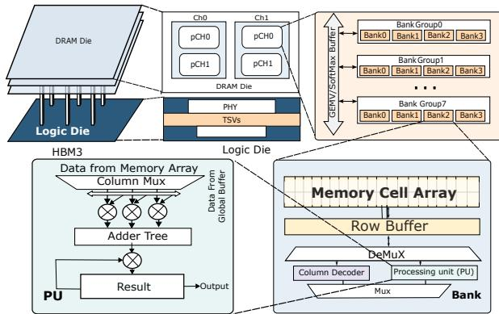
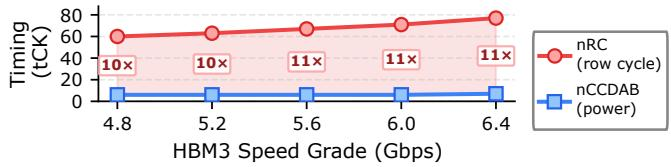
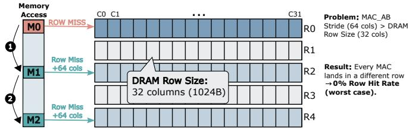
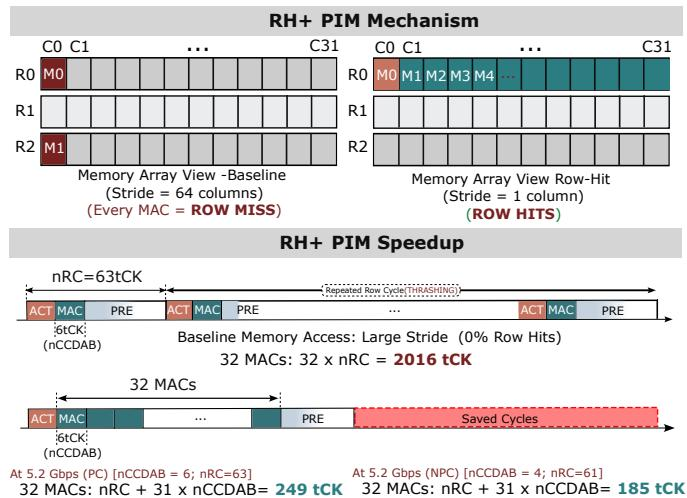
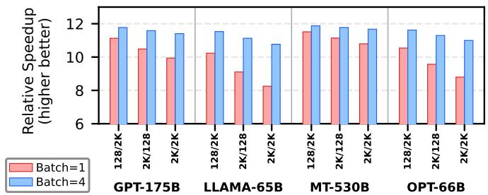
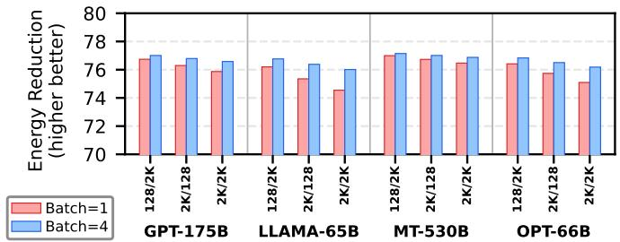
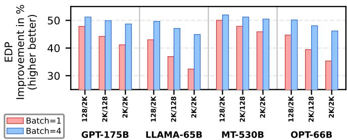
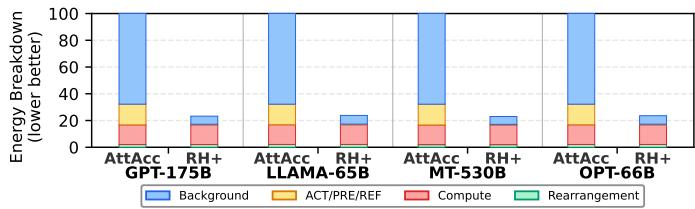

# RH+: Row-Hit-Optimized Scheduling for PIM-based LLM Inference 论文解析

[📄 下载论文原文 (PDF)](original.pdf){:download="rhplus_pim_llm.pdf"} &nbsp;|&nbsp; [🔗 在线阅读](original.pdf){:target="_blank"}

## 0. 论文基本信息

**作者 (Authors)**: Yongchan Jung, Shafayat Mowla Anik, Byeong Kil Lee, Jeeho Ryoo

**发表期刊/会议 (Journal/Conference)**: unknown

**发表年份 (Publication Year)**: 2024

**研究机构 (Affiliations)**: Fairleigh Dickinson University, University of Colorado Colorado Springs

---

## 1. 摘要

**目的**

- 揭示在PIM（processing-in-memory）架构的LLM推理中，**nRC（DRAM行周期时间）** 而非此前认为的 **nCCDAB（功率约束参数）** 才是GEMV操作的真实性能瓶颈。
- 指出基线地址交错策略（步长64列）导致每次全组MAC命令（MAC AB）落入不同行，造成0%行命中率，nRC完全掩盖了nCCDAB的影响。
- 提出 **RH+调度**，通过改变地址步长实现连续MAC操作的行命中，从而大幅提升性能并降低能耗。

**方法**

- **瓶颈分析**：基于HBM3规格，nRC（60–77 tCK）是nCCDAB（6–7 tCK）的10–11倍；且MAC AB命令在16个通道间轮转，自然间隙已超过nCCDAB，使功率约束完全无效。
- **RH+调度设计**：
  - 将MAC AB地址步长从64列改为**1列**，使每32个连续MAC操作映射到同一DRAM行内。
  - 仅需一次ACT（激活）和一次PRE（预充电）即可完成32个MAC，后续MAC以nCCDAB间隔连续执行。
  - 权重元素沿K维度进行一次性离线重排，零运行时开销。
- **仿真验证**：
  - 在 **AttAcc模拟器** 基础上集成 **Ramulator 2.0** 进行周期精确DRAM时序和能耗建模。
  - 评估4种LLM模型（GPT-175B、LLaMA-65B、MT-530B、OPT-66B），涵盖3种序列长度对和2种批次大小（1和4），共24个配置。
  - 使用HBM3 5.2 Gbps速度等级，对比基线与RH+调度。

**结果**

- **性能加速**：RH+实现 **8.25–11.88×** 端到端加速。加速比与模型隐藏维度K正相关（MT-530B最高），批次大小为4时加速更一致（10.77–11.88×）。
- **能耗降低**：总能耗降低 **74.5–77.1%**。背景能耗（IDD3N/IDD2N）因执行时间缩短约10倍而大幅下降，成为能耗降低的主要来源。
- **能效积（EDP）提升**：EDP改善 **32.4–52.0×**，其中MT-530B在batch=4时达到峰值52.0×，源于11.88×加速与77.1%能耗降低的复合效应。
- **能耗分解**：基线中背景能耗占67–68%，ACT/PRE/REF占15.5%；RH+后ACT/PRE/REF几乎消除，计算能耗成为最大占比。

**结论**

- nRC是PIM-based LLM推理中被忽视的主要瓶颈，nCCDAB完全被掩盖。
- RH+调度通过简单改变地址步长，将每32个MAC操作转化为行命中，消除了ACT-PRE开销。
- 实验证明，DRAM微架构感知优化能释放PIM的潜力，实现数量级的性能提升和能耗下降（**8–12×加速、74%以上节能、高达52× EDP改善**）。
- 未来方向：结合非功率约束（NPC）模式以进一步缩短nCCDAB间隔，使RH+收益最大化。

---

## 2. 背景知识与核心贡献

**研究背景**：大语言模型（LLM）的自回归解码阶段受限于内存带宽，每个token需读取整个权重矩阵，但仅执行一次矩阵-向量乘（GEMV）。处理-内存（PIM）架构通过在HBM3 DRAM银行内部署计算单元，避免了传统加速器的数据搬运开销。HBM3-PIM支持全银行乘加（MAC AB）操作，可同时激活全部1024个银行。

**动机**：先前工作将**功耗约束时序参数nCCDAB**（6-7 tCK）视为主要性能瓶颈并围绕其优化。然而，本文发现**DRAM行周期时间nRC**（60-77 tCK）比nCCDAB大10-11倍，完全掩盖了功耗约束。根本原因是继承自主机的地址交错策略（行内步长64列）导致每次MAC AB命令落入不同DRAM行，迫使每次操作都经历完整的**激活-预充电**周期，行命中率为0%。因此，即使消除nCCDAB，GEMV延迟依旧由nRC主导，先前的nCCDAB优化效果为零。

**核心贡献**：
- **瓶颈识别**：揭示nRC（而非nCCDAB）是HBM3-PIM推理中GEMV的主导瓶颈，功耗约束被完全掩盖。
- **RH+调度**：通过将MAC AB地址步长从64列改为1列，使连续32次MAC操作保留在同一DRAM行内，将每次行未命中转换为行命中。在5.2 Gbps下，32次MAC的延迟从32×nRC（2016 tCK）降至nRC+31×nCCDAB（249 tCK，PC模式），分析加速比8.1-10.8×。
- **全面验证**：基于Ramulator 2.0的周期精确仿真，在四种LLM模型（GPT-175B、LLaMA-65B、MT-530B、OPT-66B）和多种配置下，实现**8.25-11.88×加速**、**74.5-77.1%能耗降低**及**32.4-52.0× EDP改善**。背景能耗因执行时间缩短而线性下降，是节电主因（占基线总能耗67%）。

---

## 3. 核心技术和实现细节

### 0. 技术架构概览

**整体技术架构核心层次**

- **目标硬件平台**：HBM3-PIM（Processing-in-Memory）堆叠架构。每个堆栈包含16个通道，每个通道含2个伪通道及2个Rank，每Rank有4个Bank组×4个Bank，总计1024个Bank。每个Bank内部集成处理单元（PU），可执行乘加运算（MAC），并配备全局/共享缓冲区（GM/SM Buffer）。所有Bank可通过**MAC AB**（All-Bank MAC）命令并行激活，实现数据级并行。

- **工作负载特性**：
  - 驱动对象为大语言模型（LLM）的自回归解码阶段，其中**GEMV**（general matrix-vector multiplication）操作占每token前向计算延迟的95%以上。
  - 每个GEMV操作需将权重矩阵与激活向量相乘，矩阵维度由模型隐藏维度K决定，例如GPT-175B的K=12288，LLaMA-65B的K=8192。

- **核心瓶颈定位**：
  - 传统观点认为**nCCDAB**（功率约束参数，6~7 tCK）是性能瓶颈，但论文论证该参数在GEMV中被完全掩盖。
  - 实际瓶颈为**DRAM行周期时间nRC**（60~77 tCK，比nCCDAB大10~11倍）。因主机端地址交错策略（stride=64 columns）导致每次MAC AB命令都落在不同DRAM行，**0%行命中率**，每次触发完整ACT-PRE循环，行管理开销占主导。

- **RH+调度优化方案**：
  - **核心改变**：将MAC AB命令的地址步长从64 columns缩减为**1 column**。每个DRAM行包含32 columns，因此连续32次MAC AB命令均命中同一行，只需一次ACT和一次PRE，将nRC开销从32次摊销为1次。
  - **实现机制**：离线重排权重矩阵（按K维），使相邻列映射到同一行相邻columns，不改变计算顺序（累加可交换）。运行时无额外开销。
  - **效果**：分析模型下理论加速比8.1~10.8×，实际测量8.25~11.88×速度提升，背景能量因执行时间缩短而大幅降低（74.5%~77.1%能量减少），EDP改善32.4~52.0×。

- **仿真评估方法**：
  - 基于**AttAcc**模拟器扩展[5]，集成**Ramulator 2.0**[10]进行周期精确的DRAM时序与能量建模。
  - 能量模型采用DRAMPower方法论[2]，分解为**计算能量**（MAC AB）、**重排能量**（数据搬移命令如WR GB, MV SB等）、**ACT/PRE/REF能量**（行管理与刷新）、**背景能量**（待机电流IDD3N/IDD2N）。
  - 覆盖4种LLM模型（GPT-175B、LLaMA-65B、MT-530B、OPT-66B），在tp=8 tensor并行下使用5个HBM3堆栈，5.2 Gbps速率，24个配置（3种序列长度×2种batch size）。

**关键参数对比表**

| 指标项 | 基准（Stride-64） | RH+（Stride-1） | 改善倍数 |
|--------|-------------------|-----------------|----------|
| 每32次MAC命令周期（5.2 Gbps） | 2016 tCK（32×nRC） | 249 tCK（PC） / 185 tCK（NPC） | 8.1~10.9× |
| 端到端速度提升（batch=1） | 1× | 8.25~11.51× | 8~11.5× |
| 端到端能量减少 | - | 74.5%~77.1% | 3.9~4.4× |
| 能量延迟积（EDP）改善 | 1× | 32.4~52.0× | 32~52× |
| 背景能量占总能量比例（基准） | 67.3%~67.8% | 降至25%~31%（但绝对值缩小） | - |

**图片引用说明**
- **图1(a)**：HBM3-PIM bank架构（per-bank PU, GM/SM buffer） 
- **图1(b)**：nRC vs nCCDAB随速率等级变化 
- **图2**：基准Stride-64行寻址导致0%行命中 
- **图3**：RH+机制与时序加速（5.2 Gbps）  *Fig. 3. RH+ mechanism (top) and timing-level speedup (bottom) at the 5.2 Gbps speed grade.*
- **图4**：端到端加速比 
- **图5**：端到端能量减少 
- **图6**：EDP改善 
- **图7**：能量分解归一化 

### 1. nRC Bottleneck Identification

**核心观点**：在PIM-based LLM推理的GEMV操作中，真正的主导瓶颈是**DRAM行周期时间nRC**，而非此前广泛关注的**功率约束参数nCCDAB**。nRC比nCCDAB大10–11倍，完全掩盖了功率约束的影响，使得任何针对nCCDAB的调度优化在GEMV负载下无效。

**实现原理与根因分析**：

- 标准HBM3地址交错采用**64列（2048字节）的bank内步长**，这是为优化主机访问的memory bus利用率而设计的。但在PIM环境中，所有MAC AB命令直接对DRAM bank内部操作，不经过bus。
- 每个DRAM行仅包含**32列（1024字节）**。当MAC AB命令以64列步长连续发出时，每一条命令必然落在**不同的DRAM行**上（见图2）。结果：
  - 每条MAC AB都必须执行完整的**ACT（激活）→MAC计算→PRE（预充电）**序列。
  - 行命中率为**0%**。
  - 单个MAC的延迟由nRC主导，而nRC (60–77 tCK) 远大于nCCDAB (6–7 tCK PC / 4 tCK NPC)。
- 即使将nCCDAB降至0，每MAC仍需等待完整的nRC，延迟不变。因此**功率约束的nCCDAB对于GEMV完全无关紧要**。

**参数设置与影响量化**：

| 参数 | 数值范围（HBM3 4.8–6.4 Gbps） | 说明 |
|------|-------------------------------|------|
| **nRC** | 60–77 tCK | 同一bank内相邻ACT的最小间隔，决定行管理开销 |
| **nCCDAB (PC)** | 6–7 tCK | 功率约束模式下MAC AB命令间隔 |
| **nCCDAB (NPC)** | 4 tCK | 非功率约束模式下间隔 |
| 每行列数 | 32列（1024 B） | DRAM内部行容量，决定了连续行命中可能的MAC数量 |

**输入-输出关系与整体作用**：

- **输入**：DRAM地址映射策略（64列步长）、MAC AB命令序列、HBM3时序参数（nRC, nCCDAB）。
- **输出**：识别出nRC为瓶颈的结论，并提供定量证据（如5.2 Gbps下单MAC duty cycle仅6/63≈9.5%）。
- **整体作用**：
  - 从根本上否定了将nCCDAB作为主要优化目标的现有思路（如AttAcc [5]、NeuPIMs [3]）。
  - 为RH+调度（将步长改为1列，使32个MAC命中同一行）提供了直接动机和理论速度上限（8.1–10.8×）。
  - 解释了为何PC与NPC模式在基线GEMV下性能与能耗完全相同。

**数据验证**（来自论文）：
- 图1(b)展示了5个速度等级下nRC与nCCDAB的对比，nRC始终为nCCDAB的10–11倍。
- 以5.2 Gbps为例，nRC = 63 tCK，nCCDAB = 6 tCK (PC)，单MAC效率极低。
- 实测GPT-175B的QKV操作在PC和NPC下均为**221K周期**，证实nCCDAB的变动无影响。

**总结性表述**：nRC瓶颈的识别表明，PIM推理优化的关键不在命令间隔，而在于**DRAM行缓冲区的复用**。RH+正是基于此洞察，将每32个MAC归入同一行，从根本上消除了nRC的开销。

### 2. RH+ Scheduling with Stride Change

**核心观点**  
RH+ Scheduling 的核心是通过改变 MAC AB 地址步长（Stride）来解决 DRAM 行循环时间 **nRC** 对 GEMV 操作的瓶颈。原本的步长为 **64 列**，导致每个 MAC 命令都命中不同行，触发完整的 **ACT-PRE** 周期；RH+ 将步长改为 **1 列**，使得连续 **32 个 MAC** 访问同一行的相邻列，从而将行管理开销摊销到多个运算上，实现 **8–12× 加速**和超过 **74% 的能耗降低**。

---

**实现原理**  
- **问题根源**：HBM3-PIM 中，每个 DRAM 行包含 **32 列（1024 B）**。但由 host 侧地址交织（Bank-Rotation）产生的 per-bank 地址步长为 **64 列**，即连续两个 MAC AB 命令在同一个 bank 内相距 64 列，必然跳过整个行，落入不同行，导致 **0% row hit rate**。  
- **RH+ 改变**：将 MAC AB 的地址步长从 **64 列** 改为 **1 列**。这样连续 MAC 命令依次访问同一行内的 **列0、列1、...、列31**，恰好一个行能容纳 **32 个连续 MAC**。  
- **时序效果**：原本每个 MAC 需要 **ACT + MAC + PRE** 共 **nRC** 个 tCK（例如 5.2 Gbps 下 nRC=63）。RH+ 下仅第一次 MAC 执行 ACT，后续 31 个 MAC 以 **nCCDAB** 间隔（6 或 4 tCK）连续执行，最后一次 MAC 后执行 PRE。总时长从 **32 × nRC** 降为 **nRC + 31 × nCCDAB**。  

---

**算法流程**  
1. **离线权重重排**：在模型加载前，将每个行（Row）内的权重元素沿 **K-dimension** 重新排列，使得原本步长为 64 列的元素变为步长为 1 列，即连续 32 个权重映射到同一行的连续列。此操作为一次性，无运行时开销。  
2. **运行时调度**：  
   - 发出第一个 **MAC AB** 命令时，DRAM 控制器自动执行 **ACT**（激活目标行）。  
   - 后续 **31 个 MAC AB** 命令直接访问已激活行的后续列（行命中），每个命令间隔 **nCCDAB** tCK（受功率约束或非功率约束模式影响）。  
   - 第 32 个 MAC 完成后，控制器发出 **PRE** 命令关闭该行。  
3. **循环执行**：处理下一组 32 个 MAC 时，重复上述 ACT → 连续 32 个 MAC → PRE 的序列，直到该层权重全部处理完毕。  

---

**参数设置**  
| 参数 | Baseline (Stride=64) | RH+ (Stride=1) |
|------|----------------------|----------------|
| 地址步长（列） | 64 | 1 |
| 每行可容纳 MAC 数 | 1（强制行缺失） | 32 |
| Row hit rate | 0% | ≈96.9%（31/32 为行命中） |
| 每 32 个 MAC 所需 tCK（5.2 Gbps, PC模式） | 32 × 63 = 2016 | 63 + 31×6 = 249 |
| 每 32 个 MAC 所需 tCK（5.2 Gbps, NPC模式） | 2016（与PC相同，因nCCDAB被掩盖） | 63 + 31×4 = 187 |

注意：**nCCDAB** 在 PC 模式下为 6–7 tCK，NPC 模式为 4 tCK；**nRC** 在 5.2 Gbps 下为 63 tCK。

---

**输入输出关系**  
- **输入**：以 GEMV 运算所需的权重矩阵（尺寸为 **M×K**，例如 QKV projection）为例。每个 MAC AB 命令处理一个权重元素。Baseline 下，地址映射使得连续 K 维度元素跨行；RH+ 下，地址映射将每连续 32 个 K 维度元素安排在同一行内。  
- **输出**：经过 RH+ 调度后，MAC AB 命令序列的时序输出发生根本变化：原本每 63 tCK 完成一个 MAC，变为每 6–7 tCK（nCCDAB）完成一个行命中 MAC，仅在每 32 个 MAC 后出现一次 63 tCK 的 ACT-PRE 开销。  
- **在整体中的作用**：RH+ 直接消除了 DRAM 行管理开销对 GEMV 的拖累，使得 HBM3-PIM 的运算带宽更接近其理论峰值（受限于 nCCDAB）。由于 LLM 推理中 GEMV 占 >90% 的 decode 延迟，RH+ 显著提升整体 token 生成速度，同时背景能耗随执行时间线性缩减，带来大幅 EDP 改善（32–52×）。  

---

**与其他优化的关系**  
- RH+ 与先前聚焦于 **nCCDAB** 的调度优化（如 AttAcc）正交互补。  
- 在 RH+ 消除 nRC 瓶颈后，**nCCDAB** 成为新的限制因素，可进一步结合 NPC 模式或流水线重叠技术提升性能。  
- RH+ 不改变 MAC 的运算结果（累积顺序交换不影响最终输出），因此可无缝集成到现有 PIM 软件栈中。

### 3. Zero Row-Hit Rate in Baseline

**核心观点**: Baseline 的 **0% row-hit rate** 源自 HBM3-PIM 继承的传统 **host-centric address interleaving**，该设计为最大化主存总线利用率而优化，却与 PIM 的 all-bank MAC 工作负载完全冲突，导致每个 MAC AB 命令都强制触发完整的 **ACT-PRE 行周期**，将 nRC 暴露为 GEMV 性能的根本瓶颈。

---
**实现原理与地址映射机制**:
- **HBM3 地址交错的基础规则**：
  - 标准 HBM3 地址总线采用 **bank rotation** 策略：连续 cache-line 地址（通常 64 字节）被轮询映射到不同 bank，以分散访问冲突。
  - 对于 **相同 bank** 内的连续逻辑地址，其 **列地址 stride** 固定为 **64 columns**（即 2048 字节）。这一 stride 是由 cache line 大小与 bank 粒度共同决定的遗留设计，专为传统 host CPU 的连续内存访问模式服务。
- **DRAM 行组织**：
  - 每个 DRAM 行包含 **32 列**（C0–C31，共 1024 字节）。因此，一个行内的列地址范围为 0~31。
- **Baseline MAC AB 地址生成**：
  - PIM 引擎为每层 GEMV 生成连续的 MAC AB 地址，这些地址对应权重矩阵每一行的不同元素。
  - 由于地址 interleaving stride 为 64 columns，**第一个 MAC 访问列 Cx (位于行 R0)**，第二个 MAC 的地址偏移 64 列，直接跳过了 R0 行内剩余的列 (Cx+1 ~ C31) 以及整个 **R1 行**，落在 **R2 行** 的某列。
  - 以此类推，连续 N 个 MAC 连续跨越 **R0, R2, R4, ...** 等不相邻的行，**永远不会命中同一行**。

---
**算法流程与参数设置**:
- **输入**：连续生成的 MAC AB 地址序列（每层 GEMV 的列索引按 stride=64 递增）。
- **执行流程**（每一条 MAC AB 命令为例）：
  1. **ACT**：激活目标行（打开行缓冲器）。耗时 nRC 的一部分。
  2. **MAC**：执行乘累加运算。命令本身耗时 nCCDAB（通常 6 tCK）。
  3. **PRE**：预充电，关闭行。耗时 nRC 余下的部分。
  4. **下一步**：下一条 MAC 的地址指向不同行，必须再次完整的 ACT → MAC → PRE 循环。
- **参数设置**：
  - **nRC**：依据 HBM3 速度等级，在 60~77 tCK 之间（如 5.2 Gbps 时为 63 tCK）。
  - **nCCDAB**：电力约束模式下 6~7 tCK，非约束模式下 4 tCK。
  - **Stride**：固定 64 columns（2048 字节），由系统地址映射决定，**无法在运行时修改**。
- **输出**：每次 MAC 都经过完整的 nRC，**实际计算时间仅占 nCCDAB，效率为 6/63 ≈ 9.5%**。整层 GEMV 的总延迟 = 该层 MAC 数量 × nRC。

---
**在整体架构中的作用**:
- **与 GEMV 工作负载的交互**：
  - LLM 推理（特别是自回归解码阶段）中超过 **95% 的延迟** 来自 GEMV 操作。每个 GEMV 包含大量 MAC AB 命令（数量与隐藏维度 K 成正比）。
  - 由于 Baseline 的 0% row-hit rate，**这些 MAC 命令的延迟完全由 nRC 主导**，而非之前文献认为的 nCCDAB。
- **对性能的连锁影响**：
  - **行管理开销完全掩盖电力约束**：即使 nCCDAB 降至 0，每个 MAC 仍必需 nRC 长度的 ACT+PRE 周期，因此 **PC/NPC 模式对 baseline 性能无差别**。
  - **能量效率低下**：每次 ACT-PRE 消耗大量动态电流，且背景功率（IDD3N/IDD2N）因长时间等待而被拉伸。
  - **限制了 PIM 的真实潜力**：PIM 本应消除数据移动，但行级冲突引入了全新的延迟瓶颈，导致 HBM3 的高带宽特性在 GEMV 中完全无法发挥。

---
**总结**：Baseline 的 **0% row-hit rate** 是 LLM 推理在 HBM3-PIM 上的性能“隐形杀⼿”。它根植于不合理的历史设计（host-centric stride），使 PIM 中被寄予厚望的并行计算退化成了串行的行激活链。**RH+ 的核心创新正是在于识别并消除这一零点命中率，通过改变 stride 将 32 次 MAC 合并到同一行内，从而将 ACT-PRE 开销分摊到多个计算单元上**。

### 4. nCCDAB Irrelevance for GEMV

**核心观点**：在基线（stride-64）的HBM3-PIM GEMV操作中，**nCCDAB（Power Constraint）对延迟和能量完全无影响**，因为其被更大的行周期**nRC**完全掩盖。这一结论通过PC与NPC模式产生相同周期数得到严格验证。

**实现原理与根因分析**

- **DRAM行管理时序**：每次MAC AB命令执行前，必须先发送ACT命令将目标行复制到row buffer，完成后发送PRE命令关闭行。完整的ACT-MAC-PRE序列所需最小时间由nRC决定（60–77 tCK in HBM3）。任何MAC AB都无法绕过该时序，即使nCCDAB为0，延迟依然由nRC主导。  
- **nCCDAB的物理作用**：nCCDAB定义连续MAC AB命令之间的最小间隔（PC: 6–7 tCK, NPC: 4 tCK），仅限制MAC命令发射速率，不影响行管理开销。由于每个MAC AB独立占用一个完整行周期，MAC命令之间的实际间隔由nRC（而非nCCDAB）决定。
- **基线地址映射的致命影响**：Host-centric地址交织导致每bank的MAC AB stride为64列（2048B）。每行仅32列，因此**连续32个MAC AB均落在不同行**，触发32次独立的ACT-PRE周期。32 × nRC的延迟完全覆盖了nCCDAB的微小间距，使得MAC命令之间的“空闲”时间被行管理填充。
- **频道间自然间隔**：HBM3-PIM的16-channel架构中，MAC AB命令按循环顺序依次在16个频道上发射。每个频道返回间隔为16 tCK，远超nCCDAB（4–7 tCK）。因此即使降低nCCDAB，也无法迫使MAC AB命令以更密集方式注入同一频道。

**算法流程与参数设置**

- **输入**：连续的MAC AB命令流（对应GEMV矩阵的K维度权重列）。每个命令访问同一bank内的不同列地址，步长64列。  
- **过程（基线）**：  
  1. 对每个MAC AB：发送ACT → 等待nRCD（激活到读写延迟，但MAC执行需nCCDAB时间） → 执行MAC（nCCDAB tCK） → 发送PRE → 等待nRP（预充电延迟）。ACT到下一个ACT的最小间隔为nRC。  
  2. 由于每步地址跨越64列，下一MAC必须激活新行，形成重复的ACT-MAC-PRE循环。  
  3. PC与NPC模式仅在nCCDAB取值上不同，但每个MAC AB的完整时序中，nRC远大于nCCDAB，因此**总执行时间由32 × nRC决定**，与nCCDAB无关。  
- **输出**：完成一次GEMV（如GPT-175B QKV: M×K=4608×12288）共需**221,000个tCK**（PC与NPC相同）。能量分解中，ACT/PRE/REF占15.5%，背景待机占67.3–67.8%，nCCDAB相关功耗微乎其微。  

**在整体中的角色与意义**

- **揭示失效优化**：现有工作（如AttAcc、NeuPIMs）假设nCCDAB是主要瓶颈并围绕其设计调度策略。**nCCDAB Irrelevance**证明这些优化仅在GEMV操作中完全无效，必须将注意力转向行管理开销（nRC）的消除。  
- **触发新瓶颈转移**：在RH+优化消除nRC后，nCCDAB才成为新瓶颈。此时PC模式比NPC模式慢1.36×，为未来结合NPC-aware调度提供了明确优化方向。  
- **量化证据**：文中通过**相同周期数**（221K）以及**PC与NPC模式下能量完全相同**的测量，严格证明nCCDAB被完全掩盖。该结论对HBM3-PIM所有速度等级（4.8–6.4 Gbps）均成立，因为nRC/nCCDAB比值稳定在10–11倍。

**对比数据（HBM3 5.2 Gbps）**

| 指标 | 基线（PC） | 基线（NPC） | RH+（PC） | RH+（NPC） |
|------|------------|------------|-----------|------------|
| 每32-MAC块延迟（tCK）| 2,016 | 2,016 | 249 | 185 |
| GEMV总周期（GPT-175B QKV）| 221,000 | 221,000 | ~23,700 | ~17,600 |
| nCCDAB有效性 | 完全掩盖 | 完全掩盖 | 1.36×差距 | 基准 |

**结论**：nCCDAB在基线GEMV中的无关性是一个由DRAM微架构（nRC）和地址映射共同导致的**结构性失效**，而非功能错误。识别这一点是RH+优化的基石，并迫使PIM社区将关注焦点从电源限制转到行命中率优化。

---

## 4. 实验方法与实验结果

**实验设置分析**

该论文的实验方法论经过精心设计，以隔离并验证**nRC**瓶颈及**RH+**方案的效果。

- **模拟框架**：基于**AttAcc**模拟器 [5] 扩展，并集成了**Ramulator 2.0** [10] 进行DRAM时序与能耗的周期精确模拟。该组合确保了PIM命令调度的准确性（来自AttAcc）与底层DRAM时序（如nRC, nCCDAB）的精确性。
- **基准选择与对比**：
  - **基准 (Baseline)**：采用**AttAcc**中描述的原始调度策略，该策略继承主机导向的地址交错（stride-64），导致每一条MAC AB命令都触发一个独立的**ACT-PRE**周期（即0%的row hit率）。
  - **对比方案**：论文的**RH+**调度方案，其核心是改变地址步长为stride-1。
- **工作量负载 (Workload)**：
  - **模型**：选取了四个具有代表性的LLM模型：**GPT-175B**、**LLaMA-65B**、**MT-530B**和**OPT-66B**，覆盖了从65B到530B的参数量范围。
  - **推理配置**：采用**tensor parallelism (tp=8)** 跨5个HBM3堆栈。评估覆盖了3种输入/输出序列长度对（128/2048, 2048/128, 2048/2048）和2种batch size（1和4），合计***24***个配置。
- **DRAM规格**：所有实验统一使用**HBM3 5.2 Gbps**速率等级。此选择具有代表性，并提供了关键的时序参数（文中计算中提到nRC=63 tCK, nCCDAB=6 tCK）。
- **能量模型**：采用基于IDD的**DRAMPower**方法论 [2]，将总能耗分解为4个部分：**Compute** (MAC AB操作)、**Rearrangement** (数据移动命令)、**ACT/PRE/REF** (行管理与刷新) 和**Background** (待机电流)。这种分解对于理解**RH+**的节能机制至关重要。

**结果数据分析**

论文提供了性能、能耗和**EDP**的详尽全景图。

- **端到端性能 (Speedup)**：
  - **核心结果**：**RH+**在所有24个配置下均带来了**8.25×至11.88×**的显著加速。
  - **分析**：
    - **模型差异**：加速比与模型的隐藏维度*K*强相关。**MT-530B** (*K*=20480) 获得最高加速比（11.51× - 11.88×），因为它每层执行最多的MAC操作，使**RH+**的row-hit收益能被摊销更多次。**LLaMA-65B** (*K*=8192) 加速比较低（8.25× - 10.97×），因为其MAC操作较少，而**Attention**部分（不受RH+优化）的固定开销占比相对增大。
    - **Batch Size差异**：
      - **Batch=1**：加速比范围较宽（8.25× - 11.51×），因为**Attention**开销在不同时序长度下占比不同，对速度有显著影响。
      - **Batch=4**：加速比范围变窄且整体升高（10.77× - 11.88×）。这是因为多batch下，计算密集型（MAC-dominated）的GEMV操作占比急剧上升，进一步凸显了**RH+**的优势，而**Attention**的开销被多个batch分摊，影响减弱。此分析完美地诠释了“瓶颈转移”的动态效果。
- **端到端能耗 (Energy Reduction)**：
  - **核心结果**：能耗降低非常一致，在**74.5%至77.1%** 的狭窄范围内。
  - **分析**：这种惊人的稳定性来源于HBM3的功耗结构。**Background**能耗占基线总能耗约**67%**（见图7），它是与执行时间成正比的固定开销。**RH+**通过约10倍的加速，从根本上压缩了执行时间，从而成比例地消灭了这项主要的能耗来源。因此，无论模型大小如何，节能效果都几乎相同。**ACT/PRE/REF**能耗也被大幅削减，因为31/32的MAC操作无需全行周期。
- **端到端EDP (Energy-Delay Product)**：
  - **核心结果**：**EDP**实现了从**32.4×到52.0×**的超线性改进。
  - **分析**：**EDP**的倍增效果是对性能与能耗复合效应的直接体现。**EDP = Time × Energy**。由于**Background**能耗与时间成正比，当时间缩减为原来的1/10时，能量也缩减为原来的约1/4，导致**EDP**缩减为原来的约**1/(10 * 0.25) = 1/40**。峰值52.0×出现在**MT-530B** batch=4时，其同时取得了最高的加速比（11.88×）和最大的能耗降低（77.1%），直观验证了该复合效应。

**消融与效率分析**

论文通过分解能量组成和对比不同模式，有效地进行了一项“消融”分析，隔离了**RH+**在消除nRC瓶颈后的影响。

- **能量分解对比**：
  - **图7**清晰地展示了**RH+**如何改变能耗结构。在基线中，**Background**占主导（~67%），**ACT/PRE/REF**和**Compute**各占~15%。**RH+**后，**ACT/PRE/REF**几乎消失，**Background**的绝对能量同样骤降。
  - **结果**：在**RH+**的“新”能耗包络中，**Compute** (MAC AB) 成为最大的单一开销，占比升至**25-31%**。这一变化揭示了，在消除nRC瓶颈后，计算本身及其相关的功耗约束（nCCDAB）成为了新的限制因素。这为未来的优化指明了方向（如论文讨论部分提到的结合NPC模式）。
- **nCCDAB的有效性验证**：
  - 论文在§III-B明确指出，在基线中，**PC**和**NPC**模式产生完全一致的周期数和能耗（如GPT-175B QKV操作均为221K周期）。这有力地**消融**了nCCDAB作为瓶颈的假说，证明其完全被nRC掩盖。
  - 论文进一步指出（§VI），采用**RH+**后，nCCDAB成为新的限制因素，导致**PC**模式比**NPC**模式慢1.36倍。这个对比实际上是一个有效的“模式消融”：在移除nRC壁垒后，nCCDAB的效果才显现出来，从而反向证明了原论文论点“nCCDAB无关紧要”在特定上下文（基线GEMV）下的正确性。

**结论意义**

该论文的实验设计严谨，结果数据详实且具有说服力。它通过精心的模拟配置和全面的消融分析，定量证明了**DRAM行周期时间（nRC）**是现有HBM3-PIM架构处理GEMV任务时的**真正瓶颈**。提出的**RH+**方案以极低的成本（一次性的离线权重重排，零运行时开销）获得了巨大收益，其8-12倍的加速比和75%左右的能耗节省在计算系统领域具有极高的影响力。实验也清晰地揭示了新的瓶颈（nCCDAB）和未来工作的方向（结合非功率约束模式），展现了研究的深度和前瞻性。

---

