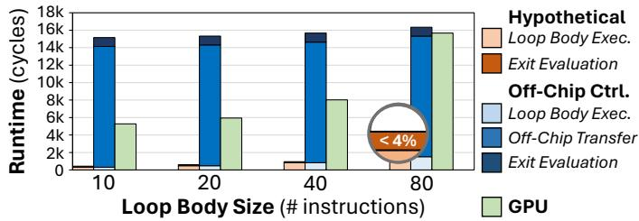
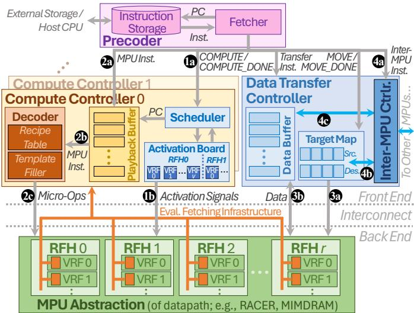

# The Memory Processing Unit: A Generalized Interface for End-to-End In-Memory Execution 通俗讲解

### 0. 整体创新点通俗解读

**痛点直击**
- 以前的 **Processing-in-Memory (PIM/PUM)** 研究就像一群各自为战的工匠，每个人都造出了功能强大的专用工具（比如 DRAM、ReRAM、SRAM 各自的 PUM 架构），但这些工具的操作方式完全不同。
- 这导致了三个致命问题：
  - **应用跑不完整**：PUM 芯片只能干“力气活”（大规模并行计算），一遇到“动脑子”的任务（比如 `if-else` 判断、循环、函数调用），就必须停下来，把数据搬回 CPU 处理。这个来回搬运的开销巨大，论文里提到甚至能让性能慢 **30-40倍**。
  - **程序员太痛苦**：写 PUM 程序必须对底层硬件细节了如指掌，代码完全无法在不同架构间复用。这严重阻碍了生态发展，没人愿意为一个可能明天就过时的硬件投入精力开发编译器和系统软件。
  - **生态建不起来**：因为没有统一的标准接口，整个 PUM 领域陷入了碎片化，无法形成像 CPU/GPU 那样成熟的软硬件协同生态。

**通俗比方**
想象一下，CPU/GPU 就像是一个配备了标准插座和通用操作系统的智能工厂。任何电器（应用程序）只要符合标准，插上就能用，操作系统会自动协调资源。

而之前的 PUM 架构，则像是在野外搭建的几个独立作坊。每个作坊（比如 RACER, MIMDRAM）都有自己独特的动力接口（电压/电流模式）和操作手册。如果你想让一个复杂的工艺品（端到端应用）在这里生产，你得先把它拆解成几个简单步骤，然后派信使（数据搬运）在作坊和你的中央指挥部（CPU）之间不停跑腿，告诉作坊下一步该做什么。这不仅效率极低，而且每个作坊的操作手册都不同，换一个作坊就得重写一遍指令。

这篇论文提出的 **Memory Processing Unit (MPU)**，就是要在所有这些作坊外面，统一加装一个**标准化的智能控制面板和调度中心**。这个面板对上提供一套清晰、通用的指令集（MPU ISA），让程序员可以像写普通程序一样描述任务；对下则能自动翻译成各个作坊听得懂的“方言”（micro-ops），并负责协调作坊内部的资源调度和作坊间的通信。这样一来，工艺品就可以完全在作坊集群内部完成，无需再依赖外部的中央指挥部。

 *Fig. 2. MPU overview. A VRF corresponds to one or more memory arrays.*

**关键一招**
作者的核心洞察是：PUM 的根本瓶颈不在于计算单元本身，而在于**缺乏一个统一、高效、能处理复杂逻辑的前端控制层**。因此，他们没有去设计新的 PUM 计算单元，而是巧妙地在现有各种 PUM 架构之上，抽象并实现了一个通用的控制平面。

- **抽象硬件差异**：通过引入 **Vector Register File (VRF)** 和 **Register File Holder (RFH)** 这两个抽象层，将底层五花八门的物理内存阵列（mat, tile, subarray）统一映射成程序员可见的逻辑单元。RFH 特别关键，它封装了特定硬件的约束（如热功耗限制、互连瓶颈），让程序员无需关心这些细节。
  
- **定义通用指令集 (MPU ISA)**：设计了一套包含**计算指令**、**数据移动指令**和**复杂控制流指令**（如 `JUMP_COND`, `SETMASK`）的 ISA。这套指令集足够通用，可以被编译到不同的后端 PUM 上，同时又足够强大，能支持完整的程序逻辑。

- **实现智能执行模型**：提出了 **Ensemble Execution Model**。程序员可以动态地将任意 VRF 组合成一个“工作组”（ensemble）来执行任务。MPU 的运行时系统会自动处理 RFH 约束、任务调度和跨工作组的同步，实现了真正的 **CPU-free execution**。

- **硬件化复杂控制**：为了高效执行控制流，MPU 控制路径硬件中加入了关键支持，比如 **per-lane masking**（通过 mask register 实现 SIMD gating）和 **Evaluation Fetching Infrastructure (EFI)**，使得在内存内部就能高效地处理数据驱动的循环和分支，彻底摆脱了对 CPU 的依赖。

最终，这个“标准化控制面板”（MPU）成功地将原本只能做“肌肉记忆”式简单重复劳动的 PUM，变成了一个能够独立思考、自主完成复杂任务的智能计算单元，从而打通了 PUM 技术走向广泛应用的最后一公里。

### 1. Memory Processing Unit (MPU) ISA

**痛点直击 (The "Why")**
- 以前的 PUM（Processing-Using-Memory）研究，虽然硬件上很酷，但软件接口做得像“一次性工具”。每个 PUM 设计（比如基于 DRAM 的 MIMDRAM、基于 ReRAM 的 RACER）都暴露自己独特的、类似 vector register 的底层接口。
- 这导致三个致命问题：
  - **应用无法端到端执行**：一旦遇到 `if-else` 或动态循环这种控制流，PUM 就得喊 CPU 来帮忙。论文里有个简单测算（），即使只有 1/80 的指令需要 CPU，整体性能也会暴跌 **10倍以上**。对于真实应用，这个惩罚可能是 **30-40倍**。
  - **程序员负担极重**：程序员必须成为硬件专家，手动管理数据在哪个 memory array 上、如何跨 array 通信、如何处理硬件约束（比如热限制）。想把一个程序从 RACER 移植到 MIMDRAM？基本等于重写。
  - **生态无法建立**：因为没有统一接口，没人愿意为 PUM 开发编译器、调试器等系统软件，形成了恶性循环。

**通俗比方 (The Analogy)**
- 想象一下，如果世界上每家工厂（PUM 微架构）都只接受一种特定格式的订单（指令集），而且订单还必须精确指定用哪台机器、哪个工人来干活。那么，任何想批量生产商品（运行复杂应用）的公司（程序员）都会疯掉。
- **MPU ISA 就像是一个通用的“工业标准订单格式”**。你只需要按这个标准下订单（写程序），工厂内部会有一个智能的“厂长”（MPU control path）负责把你的标准订单翻译成该工厂内部工人们能听懂的方言（micro-ops），并自动调度资源、处理突发状况（如机器过热），全程不需要你（CPU）操心。

**关键一招 (The "How")**
- 作者没有去重新发明 PUM 硬件，而是在所有现有 PUM 硬件之上，抽象出一个**微架构无关的软件执行层**。这个层的核心就是 MPU ISA，它通过几个精妙的设计解决了上述痛点：
  - **引入了“Ensemble”（工作组）概念**：程序员不再直接操作底层的 Vector Register Files (VRFs)，而是告诉系统“我需要一个由任意 VRF 组成的工作组来执行这段代码”。硬件和运行时负责将这个逻辑工作组映射到物理硬件上，并处理所有约束（如热限制、互连限制）。这极大地简化了编程模型。
  - **内置了强大的控制流原语**：这是让 PUM 能独立运行的关键。MPU ISA 直接提供了 `SETMASK`、`JUMP_COND`、`RETURN` 等指令。
    - `SETMASK` 允许程序根据数据计算结果，动态地生成一个 **lane mask**（位掩码），决定哪些数据通道（lane）参与后续计算。
    - `JUMP_COND` 则利用这个 mask 来实现**动态循环**。它会检查 mask 是否全为0（即所有 lane 都已退出循环），如果不是，就跳回去继续执行。这样，复杂的、数据依赖的循环就可以完全在 PUM 内部完成，无需 CPU 干预。
  - **设计了统一的数据移动和同步指令**：如 `MEMCPY`、`MPU_SYNC` 和 `SEND/RECV`，使得在不同 VRF 甚至不同 MPU 芯片之间进行高效、一致的数据传输和任务协调成为可能。

这套 ISA 的威力在于，它把 PUM 从一个只能执行简单、规则 kernel 的“协处理器”，变成了一个可以独立运行完整应用程序的“**自包含计算单元**”。正如论文展示的，在 LLMEncode、BlackScholes 等端到端应用上，MPU 架构相比依赖 CPU 的基线方案，性能提升高达 **2.5倍到545倍**，彻底摆脱了对主机 CPU 的依赖。

### 2. Ensemble Execution Model

**痛点直击**
- 以前的 PUM (Processing-Using-Memory) 编程就像在指挥一支纪律严明但极其死板的军队。程序员必须精确知道每个士兵（VRF）的位置、体力（热约束）和装备（硬件限制），然后手动为他们分配任务。
- 这导致三个“很难受”的问题：
  - **顾头不顾尾**：复杂的程序包含大量控制流（如 if-else, loops），而 PUM 擅长的是大规模并行计算。每次遇到控制流，程序就必须停下来，把任务交给外部 CPU 处理，处理完再切回来。这种频繁的上下文切换开销巨大，论文图1显示，即使只有 1/80 的指令需要 CPU，整体性能也会暴跌 **10.1倍**。
  - **编程负担重**：程序员被迫成为硬件专家，代码与特定 PUM 微架构（如 RACER, MIMDRAM）深度耦合，无法移植。写一个能在整个芯片上跑的程序，需要手动管理成千上万个 VRF 的激活和通信，工作量巨大。
  - **生态难以建立**：因为每个 PUM 设计都不同，系统软件开发者不愿意投入精力去构建通用的编译器、调试工具等，导致 PUM 生态停滞不前。

**通俗比方**
- **Ensemble Execution Model** 就像是给这支军队配备了一位智能的“团长”（Runtime）。
- 程序员不再需要直接指挥每一个士兵，而是告诉“团长”：“我需要一个由任意 1000 个士兵组成的突击队（Ensemble），去执行 A 任务”。至于这 1000 个士兵具体是谁、在哪里、能不能同时上场（受限于热密度或共享电路），都由“团长”根据战场实时情况（硬件约束）去动态调度和安排。
- 这个模型将程序员从繁琐的底层硬件细节中解放出来，让他们能像使用高级并行编程框架（如 OpenMP）一样，专注于任务本身的逻辑划分。 *Fig. 2. MPU overview. A VRF corresponds to one or more memory arrays.*

**关键一招**
- 作者的核心洞察是：PUM 的强大算力来自于海量 VRF 的并行，但其灵活性的缺失源于缺乏一个抽象层来解耦“任务逻辑”和“硬件执行”。
- 为此，他们在 ISA 和 Runtime 层面做了关键设计：
  - **引入 `COMPUTE` / `COMPUTE_DONE` 指令对**：程序员用这对指令显式地圈定一个“任务块”（即 Ensemble），并声明哪些 VRF 应该参与。这相当于向“团长”提交了一份任务申请单。
  - **运行时动态调度**：MPU 的控制路径硬件（特别是 Scheduler）会接收这份申请，并根据预设的 **RF Holder (RFH)** 约束（如图4所示，RFH 封装了热约束、共享控制器等硬件限制），将这个大的 Ensemble 分解成多个可以在物理上安全并发执行的小批次。
  - **无缝集成复杂控制流**：通过结合 per-lane masking（如图7d所示），Ensemble 模型甚至能支持数据驱动的动态循环和分支。当一个 Ensemble 中的部分 VRF 完成了任务（lane 被 mask 掉），运行时可以灵活地只调度剩下的 VRF 继续执行，而无需等待所有 VRF 同步。这从根本上解决了传统 SIMD 架构在处理不规则并行时的效率低下问题。

### 3. Register File Holder (RFH) Abstraction

**痛点直击 (The "Why")**
- 以前的 PUM（Processing-in-Memory）架构，虽然硬件上能并行执行海量操作，但程序员写代码时得像个“硬件工程师”一样操心各种物理限制。
- 具体来说，不同 PUM 设计有不同的“硬伤”：比如 **RACER** 因为功耗太高，不能让所有计算单元同时满载（热密度限制）；而 **Duality Cache** 则是因为共享了指令控制器，导致邻近的内存块没法跑不同的指令流。
- 这些约束是**物理层面**的，跟程序员想表达的算法逻辑**毫无关系**。但之前的编程模型强迫程序员在写代码时就必须把这些硬件细节硬编码进去，导致代码既难写又无法在不同 PUM 架构间移植。

**通俗比方 (The Analogy)**
想象你要组织一场大型音乐会，有成千上万个乐手（VRFs，向量寄存器文件）。你只想告诉他们“现在一起演奏贝多芬”，而不关心后台的复杂调度。

- **没有 RFH 的世界**：你必须亲自打电话给每个乐手，还要知道哪些乐手共用同一个空调（热限制），哪些乐手共用同一个谱架管理员（控制单元限制）。如果你不小心让太多共用空调的乐手同时演奏，场地就会过热停摆。
- **有了 RFH 的世界**：你面对的不再是单个乐手，而是“乐团经理”（RFH）。你只需要告诉经理：“我需要一个完整的弦乐组”。经理自己清楚手下有多少乐手、空调和谱架的限制，并会自动安排一个合规的、不会让场地宕机的演出阵容。你作为指挥（程序员），完全不用操心这些后勤细节。

这张图直观地展示了问题：随着激活的内存阵列增多，**Power Density**（功率密度）急剧上升，很快就会超过安全阈值。RFH 抽象就是为了防止这种情况发生。

**关键一招 (The "How")**
作者并没有改变底层硬件，而是在程序员和硬件之间巧妙地插入了一个**运行时调度层**，其核心就是 **Register File Holder (RFH)** 抽象。

- **抽象封装**：将具有相同物理约束的一组 VRFs（向量寄存器文件）打包成一个 **RFH**。例如，在 RACER 中，一个 RFH 对应一个 **cluster**（包含64个 pipeline/VRF），因为这个 cluster 受到统一的热限制；在 Duality Cache 中，一个 RFH 对应一个 **issue window**，因为它受限于共享的指令控制器。
- **运行时接管**：程序员在代码中通过 `COMPUTE` 指令声明他想要使用哪些 VRFs（逻辑资源）。MPU 的运行时系统会自动将这些 VRF 请求映射到对应的 RFH 上。
- **自动调度**：运行时调度器会严格遵守每个 RFH 的激活上限（比如 RACER 的 RFH 同一时间只能激活1个 VRF）。如果程序员请求的并行度超出了物理限制，调度器会自动将任务分批执行，确保永远不会违反热或控制单元的约束。

 *Fig. 2. MPU overview. A VRF corresponds to one or more memory arrays.*
这张图清晰地展示了 MPU 的层次结构：程序员看到的是逻辑上的 **Ensemble**（由 VRFs 组成），而 MPU 运行时则负责将其映射到受物理约束的 **RFH** 上，最终再落实到物理的 **Memory Arrays**。这个中间层正是实现硬件无关性和简化编程的关键。

### 4. MPU Control Path Hardware

**痛点直击 (The "Why")**
- 传统的PUM（Processing-Using-Memory）架构，虽然计算单元就在内存里，省了数据搬运，但它的“大脑”却在**外面**——也就是依赖一个**外部的CPU**来处理所有复杂的控制逻辑（比如if-else、循环、函数调用）。
- 这导致了一个非常难受的局面：一个程序执行时，需要在PUM和CPU之间**频繁来回切换**。哪怕只有1/80的指令需要CPU，整个程序也会被拖慢**10倍以上**（如图1所示）。对于更复杂的程序，这个开销更是灾难性的。
- 更糟糕的是，每个PUM设计（比如基于DRAM的MIMDRAM和基于ReRAM的RACER）都有自己的硬件约束（比如热功耗限制、物理连接限制），程序员必须对这些底层细节了如指掌才能写代码，这极大地阻碍了PUM的普及和软件生态的发展。

**通俗比方 (The Analogy)**
想象一下，你有一支由成千上万名工人（VRFs, Vector Register Files）组成的超级工程队，他们每个人都能同时完成相同的任务（数据并行）。但是，这支队伍没有自己的工头（foreman），每次遇到稍微复杂点的情况——比如“如果下雨就停工”或者“做完A部分再做B部分”——都得打电话给远在总部的项目经理（Host CPU）请示。

这个电话一打，不仅浪费时间（通信延迟），还让所有工人都得停下来干等（流水线停顿）。MPU的**Control Path Hardware**，就是给这支超级工程队**配了一个现场的、全能的智能工头**。这个工头不仅能理解项目经理下发的通用任务书（MPU ISA），还能根据现场情况（硬件约束、热功耗）灵活地调度工人，并且能自己处理所有复杂的现场决策（控制流），完全不需要再打电话回总部。

**关键一招 (The "How")**
作者并没有试图改变PUM底层的物理计算方式，而是在其之上构建了一套完整的、轻量级的“**片上操作系统内核**”。这套硬件的核心在于三个协同工作的部件：

- **Precoder (预解码器)**:
  - 它就像一个**任务分发中心**，把存储在片上的MPU二进制程序（ISA）读取出来。
  - 它能识别程序中的`COMPUTE`和`MOVE`等高层指令块，并将它们精准地派发给对应的控制器去执行。

- **Compute Controller (CC, 计算控制器)**:
  - 这是整个控制路径的**核心大脑**，负责执行计算任务。
  - 它内部有一个**Playback Buffer (回放缓冲区)**，用来暂存当前`COMPUTE`块里的指令序列。这使得它能够**反复重放**指令，以应对硬件约束（比如一次只能激活一部分工人）或处理动态循环。
  - 最关键的是它的**I2M (Instruction-to-Micro-op Decoder, 指令到微操作解码器)**。这是一个**通用翻译官**，它能把抽象的MPU ISA指令（比如`ADD`）实时翻译成特定PUM硬件所需的底层微操作序列（比如一系列`TRA`或`NOR`）。通过一个**Recipe Table (配方表)** 和 **Template Filler (模板填充器)** 的组合，它能高效地完成这种翻译，而无需为每种PUM架构重新设计编译器。
  - 为了支持复杂的控制流（如动态循环），CC还集成了**Evaluation Fetching Infrastructure (EFI)**。它能直接读取每个计算单元（lane）的**Mask Register (掩码寄存器)** 状态，判断哪些单元还在循环中，从而决定是否继续跳转，实现了**纯硬件驱动的数据驱动控制流**。

 *Fig. 8. MPU control path hardware for an abstracted datapath.*

- **Data Transfer Controller (DTC, 数据传输控制器)**:
  - 它专门负责处理`MOVE`块中的数据搬运任务，确保在不同VRF甚至不同MPU之间的数据传输是**内存一致**的。
  - 它通过一个**Target Map (目标映射表)** 来管理源和目的地的对应关系，并可能利用**Data Buffer (数据缓冲区)** 来处理复杂的传输模式（如广播、转置）或长距离通信。

通过这套精巧的硬件设计，MPU成功地将PUM从一个只能执行简单内核的“加速器”，转变为一个能够**独立、高效、端到端**执行复杂应用程序的完整计算单元，彻底摆脱了对外部CPU的依赖。

### 5. SIMD Gating with Lane Masking

**痛点直击 (The "Why")**
- 传统的 **SIMD**（单指令多数据）架构在处理 **data-dependent control flow**（数据依赖的控制流，如 `if-else`、`while` 循环）时非常笨拙。因为 SIMD 要求所有 **lane** 同时执行同一条指令，一旦数据导致不同 lane 需要走不同分支，整个 SIMD 单元就必须“顾头不顾尾”。
- 典型的解决方案是 **predication**（谓词执行）：把 `if` 和 `else` 的代码都执行一遍，用一个 **mask**（掩码）来决定哪些 lane 的结果生效。但这在处理 **动态循环**（循环次数在运行时才知道）或 **深度嵌套分支** 时效率极低，因为无效的 lane 仍在空转，浪费大量计算和能量。
- 对于 **PUM **(Processing-Using-Memory) 这种追求极致能效的架构来说，这种空转是致命的。更糟的是，很多 PUM 设计干脆放弃复杂控制流，把这部分工作丢给外部 **CPU**，导致频繁的数据搬运，完全抵消了 PUM 的优势。

**通俗比方 (The Analogy)**
想象一个大型工厂流水线（SIMD 单元），有成百上千个工人（lane）同时组装同一种产品。现在来了一个新订单，要求根据每个产品的初始状态（数据），有些工人需要多拧两圈螺丝（`if` 分支），有些则不需要（`else` 分支）。

- **传统做法**：让所有工人都先执行“拧两圈”的动作，然后再让所有工人执行“不拧”的动作。通过一张名单（mask）告诉质检员，哪些工人的“拧两圈”结果有效，哪些人的“不拧”结果有效。这显然效率低下，一半工人在做无用功。
- **MPU 的做法**：给每个工人配一个智能开关（**lane mask register**）。当遇到分支点时，主管（**control path**）会根据产品状态，直接关掉那些不需要执行当前步骤的工人的电源。被关掉的工人彻底休息，不消耗任何资源。只有真正需要工作的工人才会启动。对于循环，主管会不断检查还有没有开着的开关，如果全关了，就说明所有产品都处理完了，循环结束。

 *Fig. 7. ezpim code (left) and MPU ISA output (right) for (a) for/while loops, (b) branches, (c) nested branches; (d) MPU complex control support.*

**关键一招 (The "How")**
作者并没有试图改变 PUM 底层的 SIMD 执行本质，而是在其控制路径中巧妙地插入了一套精细的“电源管理系统”。

- **核心硬件创新**：在每个 **VRF **(Vector Register File) 旁边增加了一个 **mask register**。这个寄存器的每一位直接连接到对应 **lane** 的电压供给线上，可以物理地 **enable/disable**（启用/禁用）该 lane 的计算单元，实现真正的 **power gating**（电源门控），而非仅仅是逻辑上的结果屏蔽。
- **核心软件/控制流创新**：引入了 **Evaluation Fetching Infrastructure **(EFI)。当执行 `JUMP_COND` 这样的控制指令时，EFI 会立刻读取 **mask register** 的内容，并判断是否所有位都为 0（即所有 lane 都已退出循环）。如果是，则跳出循环；否则，继续下一轮迭代。
- **编程模型创新**：通过 `SETMASK` / `GETMASK` / `UNMASK` 等指令，将 mask 的控制权完全交给程序员（或编译器）。这使得任意深度的分支嵌套成为可能——内层分支的 mask 可以基于外层 mask 进行逻辑运算（如 AND），从而精确控制每一层哪些 lane 是活跃的。

这套机制将原本僵硬的 SIMD 模型，转变为一种 **灵活、高效、可深度嵌套的 data-driven execution model**，从根本上解决了 PUM 架构无法独立执行复杂端到端应用的致命短板。
