# The Memory Processing Unit: A Generalized Interface for End-to-End In-Memory Execution 论文解析

[📄 下载论文原文 (PDF)](26hpca_mpu.pdf){:download="26hpca_mpu.pdf"} &nbsp;|&nbsp; [🔗 在线阅读](26hpca_mpu.pdf){:target="_blank"} &nbsp;|&nbsp; [DOI: 10.1109/hpca68181.2026.11408599](https://doi.org/10.1109/hpca68181.2026.11408599){:target="_blank"}

## 0. 论文基本信息

**作者 (Authors)**: Minh S. Q. Truong, Yiqiu Sun, Dawei Xiong, et al.

**发表期刊/会议 (Journal/Conference)**: MICRO

**发表年份 (Publication Year)**: 2021

**研究机构 (Affiliations)**: University of Illinois Urbana-Champaign, Carnegie Mellon University

---

## 1. 摘要

**目的**

- 解决现有 **Processing-using-memory (PUM)** 架构的三大核心瓶颈：
  - 过度依赖 **host CPU** 执行控制流和标量操作，导致性能严重下降（文中估算慢 **30–40×**）。
  - 缺乏统一、可扩展的编程接口，迫使程序员深度耦合特定微架构，阻碍了通用软件栈（如编译器、系统库）的发展。
  - 难以将应用从简单的数据并行内核扩展到复杂的 **end-to-end applications**。

**方法**

- 提出 **Memory Processing Unit (MPU)**，一个与微架构无关的 PUM 前端接口层，包含三个核心组件：
  - **MPU 指令集架构 (ISA)**：提供一套通用指令，支持复杂控制流（如 `if-else`、动态循环、子程序调用）和任务协调，取代了各 PUM 设计私有的指令集。
  - **Ensemble Execution Model**：一种新的执行模型，允许程序员动态地将任意位置的 **Vector Register Files (VRFs)** 组合成 **ensemble** 来执行相同任务，从而灵活表达不同粒度的并行性。
  - **Register File Holder (RFH) 抽象**：封装底层硬件约束（如热密度限制、共享控制单元），由 **MPU runtime** 自动管理调度，对程序员透明。
- 设计并实现了完整的 **MPU control path** 硬件，包括 **precoder**、**compute controller (CC)** 和 **data transfer controller (DTC)**，以高效执行 MPU ISA。
  - 引入 **recipe table** 机制，将通用 MPU 指令动态翻译为后端 PUM 微架构特定的 **micro-ops**。
  - 通过 **in-VRF masking** 硬件支持高效的 **SIMD predication**，实现数据驱动的复杂控制流。
- 开发了高级汇编器 **ezpim**，简化了 MPU 程序的编写。

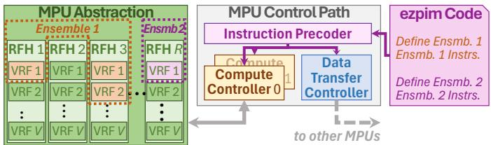 *Fig. 2. MPU overview. A VRF corresponds to one or more memory arrays.*

**结果**

- **性能与能效提升**：在 **RACER**、**MIMDRAM** 和 **Duality Cache** 三种不同的 PUM 微架构上，MPU 相比其原始设计（Baseline）取得了显著改进。
  - 平均性能提升 **1.79×**，平均能效提升 **3.23×**。
  - 对于包含复杂控制流的内核，提升更为显著（例如 RACER 性能提升 **5.6×**，能效提升 **11.3×**）。

| 配置 | 平均性能提升 (vs. Baseline) | 平均能效提升 (vs. Baseline) |
| :--- | :--- | :--- |
| **MPU:RACER** | **1.79×** | **3.23×** |
| **MPU:MIMDRAM** | **1.70×** | **2.34×** |
| **MPU:DualityCache** | **1.12×** | **4.07×** |

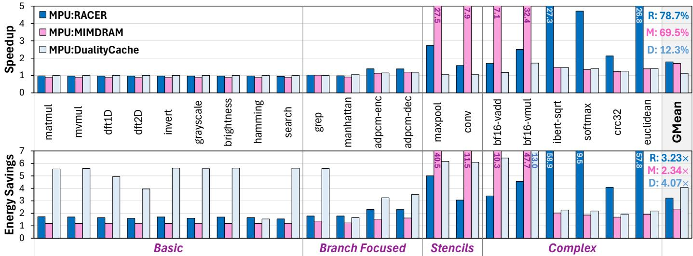

- **对比现代 GPU**：MPU 在数据密集型任务上展现出巨大优势。
  - **MPU:RACER** 相比 **NVIDIA GeForce RTX 4090** GPU，平均性能提升 **67×**，平均能效提升 **47×**。
  - **MPU:MIMDRAM** 平均性能提升 **156×**，平均能效提升 **35×**。

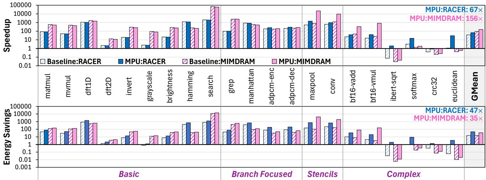

- **端到端应用执行**：成功在 PUM 上完整执行了 **LLMEncode**、**BlackScholes** 和 **EditDistance** 三个复杂应用，无需 CPU 干预。
  - 例如，**MPU:RACER** 执行 **EditDistance** 的速度是 GPU 的 **400×**。
  - 彻底消除了 Baseline 方案中因频繁 **off-chip communication** 导致的巨大开销。

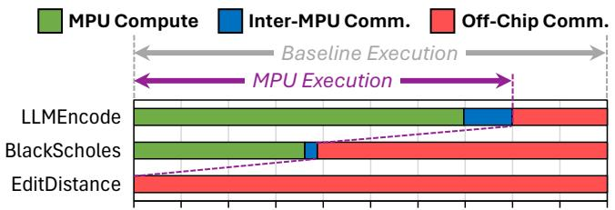

**结论**

- **MPU** 成功地为通用 **bitwise PUM** 架构提供了一个 **microarchitecture-agnostic** 的标准化接口。
- 通过其创新的 **ensemble/RFH** 抽象和配套的控制路径硬件，MPU 实现了 **CPU-free** 的 **end-to-end application execution**，解决了长期制约 PUM 发展的编程性和通用性难题。
- 实验结果证明，MPU 不仅大幅提升了现有 PUM 设计的性能和能效，还为其生态系统的建立（如通用编译器和软件工具链）奠定了坚实基础，使 PUM 技术有望从专用加速器走向更广泛的通用计算领域。

---

## 2. 背景知识与核心贡献

**研究背景**
- **Processing-using-memory (PUM)**，或称 in-memory computing，旨在通过利用存储单元间的电气交互直接执行计算，从而消除数据在处理器与内存间移动所带来的巨大能耗和延迟开销。
- 尽管潜力巨大，现有 PUM 研究主要聚焦于设计特定的 datapath 微架构来加速高度并行的计算内核（如矩阵乘法），但这些方案存在严重局限：
  - 依赖于微架构特有的、类似向量的接口，导致应用中大量非并行或控制流密集的操作必须卸载到外部 **CPU** 执行。
  - 程序员需要深入了解底层硬件细节才能将应用扩展到整个内存芯片，编程负担极重。
  - 由于缺乏统一、通用的接口，阻碍了为 PUM 开发通用的系统软件栈（如编译器、运行时库）。

**研究动机**
- 现有 PUM 方案对 CPU 的强依赖性是其无法处理端到端复杂应用的根本瓶颈。即使仅有少量指令（如文中图1所示，每80条指令中有1条）需要 CPU 参与，也会导致程序整体性能下降 **10.1倍**，对于典型程序，预估 slowdown 高达 **30–40倍**。
- 
- 因此，亟需一个**微架构无关**的通用接口层，既能支持端到端的应用执行，又能简化编程模型，并为跨平台的 PUM 软件生态奠定基础。

**核心贡献**
- 提出 **Memory Processing Unit (MPU)**，一个面向通用 PUM 的、微架构无关的前端接口层，包含三个核心组件：
  - **MPU 指令集架构 (ISA)**：提供一套通用指令，支持应用扩展和任务协调，屏蔽底层硬件差异。
  - **Ensemble Execution Model**：一种新的执行模型，允许程序员动态地将多个 **Vector Register Files (VRFs)** 组合成一个逻辑执行单元（ensemble），该模型能映射到大多数通用 PUM 微架构。
  - **MPU Control Path**：一个全面的控制路径硬件设计，能够高效地跨多个 ensembles 执行 MPU ISA 二进制文件，并支持脱离 CPU 的复杂端到端应用执行。
- 通过实验证明，MPU 能够成功映射到多种先前提出的 PUM datapaths（如 DRAM-based MIMDRAM, ReRAM-based RACER, SRAM-based Duality Cache），并在 **21个** 数据密集型内核上，相比这些原始设计，平均实现 **1.79倍** 的性能提升和 **3.23倍** 的能效提升（相较于现代 GPU，提升高达 **67倍/47倍**）。

---

## 3. 核心技术和实现细节

### 0. 技术架构概览

**整体技术架构**

本文提出了一种名为 **Memory Processing Unit (MPU)** 的通用接口层，旨在解决现有 Processing-Using-Memory (PUM) 架构在编程模型、应用扩展性和系统软件支持方面的根本性限制。其核心目标是实现 **microarchitecture-agnostic**（微架构无关）的端到端应用执行。

- **设计动机**：传统 PUM 方案依赖于特定于微架构的向量接口，导致三个主要问题：
  - 大量操作必须卸载到 CPU，造成严重的性能瓶颈。
  - 程序员需手动处理芯片级扩展，负担沉重。
  - 难以开发通用的系统软件和编程工具链。
- **核心理念**：MPU 在底层 PUM 数据通路之上引入一个轻量级的、硬件感知的运行时和控制路径，将复杂的硬件约束与程序员隔离开来，提供一个统一、高级的编程抽象。

---
**MPU 的三大核心组件**

**1. MPU 指令集架构 (ISA)**
- 定义了一套通用指令集，取代了各 PUM 微架构特有的指令。
- 包含三类关键指令：
  - **Ensemble Deployment**: `COMPUTE`, `MOVE` 等，用于声明计算或数据传输任务的范围。
  - **Control Flow**: `JUMP_COND`, `SETMASK`, `UNMASK` 等，支持 **data-driven control flow**（数据驱动的控制流），如动态循环和条件分支。
  - **Arithmetic & Data Movement**: 标准的算术、逻辑和数据移动指令。
- 该 ISA 被设计为可由一个通用的硬件解码器翻译成不同后端 PUM 技术（如 DRAM, ReRAM, SRAM）所需的底层 **micro-ops**。

**2. Ensemble Execution Model (集成执行模型)**
- 这是 MPU 编程的核心抽象。
- **Ensemble (集成)**: 一个由程序员定义的、执行相同内核代码的 **Vector Register Files (VRFs)** 集合。VRFs 是对底层物理内存阵列的逻辑映射。
- **Register File Holder (RFH, 寄存器文件持有者)**: 一个封装了硬件物理约束（如热密度限制、共享控制单元）的抽象。一个 RFH 包含一组不能同时激活的 VRFs。
- **运行时调度**: MPU 运行时负责将程序员定义的、逻辑上无约束的 Ensemble 映射到物理硬件上，并通过调度算法确保不违反任何 RFH 约束，从而实现了 **hardware-agnostic programming**。

 *Fig. 2. MPU overview. A VRF corresponds to one or more memory arrays.*

**3. MPU 控制路径 (Control Path)**
- 这是实现上述抽象的硬件基础，负责高效执行 MPU ISA 二进制文件。
- 主要包含以下硬件模块：
  - **Precoder**: 存储程序二进制并分发指令。
  - **Compute Controller (CC)**: 管理计算 Ensemble 的执行状态。其核心是一个 **recipe table**，用于将通用 MPU 指令高效地解码为后端特定的 micro-op 序列。
  - **Data Transfer Controller (DTC)**: 处理 VRF 之间的数据移动和 **inter-MPU communication**（MPU 间通信）。
- **关键技术**:
  - **SIMD Gating / Lane Masking**: 通过在每个 VRF 中添加 **mask register**，实现了细粒度的 **per-lane predication**（每通道断言），这是支持复杂控制流（如动态循环）的硬件基础。
  - **Thermal-aware Scheduling**: 调度器根据 RFH 的热约束动态激活 VRFs，确保芯片安全运行。

 *Fig. 8. MPU control path hardware for an abstracted datapath.*

---
**与现有 PUM 数据通路的集成**

MPU 的设计具有高度通用性，论文展示了其如何映射到三种截然不同的 PUM 微架构上：

| PUM Datapath | Underlying Tech | VRF Mapping | RFH Mapping | Constraint Encapsulated |
| :--- | :--- | :--- | :--- | :--- |
| **RACER** | ReRAM | One pipeline (spanning multiple tiles) | One cluster (64 pipelines) | Thermal dissipation limits |
| **MIMDRAM** | DRAM | One DRAM mat | One µPE (controls a group of mats) | Thermal dissipation limits |
| **Duality Cache** | SRAM | One SRAM subarray | One issue window | Shared instruction controller |

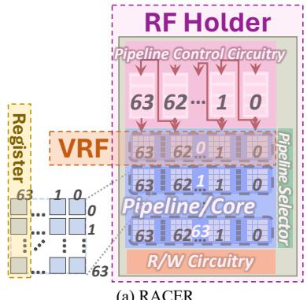 *(a) RACER*

---
**编程与软件栈**

- **ezpim**: 一个高级汇编器，允许程序员使用类似高级语言的语法（如 `for`/`while` 循环, `if`/`else` 分支）编写代码，并自动将其转换为底层的 MPU ISA 指令序列，极大地简化了编程。
- **端到端执行**: 通过集成的控制路径和 ISA，MPU 能够在无需主机 CPU 干预的情况下，独立执行包含复杂控制流的完整应用程序。

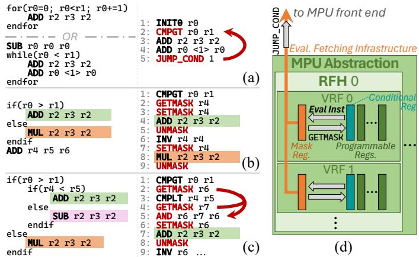 *Fig. 7. ezpim code (left) and MPU ISA output (right) for (a) for/while loops, (b) branches, (c) nested branches; (d) MPU complex control support.*

### 1. Memory Processing Unit (MPU) ISA

**MPU ISA的核心设计目标与作用**

- MPU ISA是一套**微架构无关**的指令集，旨在为各种基于位级操作的PUM（Processing-using-memory）后端提供一个统一的编程接口。
- 其核心作用是**支持端到端应用执行**，通过在内存内部处理复杂的控制流和任务协调，消除对主机CPU的依赖，从而避免高昂的数据移动开销。
- 该ISA将程序员从底层硬件细节（如特定内存技术的微操作、物理阵列布局、热约束等）中解放出来，提供了一个更高级、更易编程的抽象。

**MPU ISA的关键指令类别与实现原理**

MPU ISA的设计围绕三大核心挑战：**任务并行与协调**、**动态数据驱动的控制流**以及**高效的数据移动**。其指令集也相应地分为几大类。

*   **任务协调与执行模型指令**
    - MPU引入了**ensemble execution model**（集成执行模型），这是其编程抽象的核心。
    - `COMPUTE <rfhID> <vrfID>`：此指令用于**实例化一个compute ensemble**。它告诉MPU运行时，指定的VRF（Vector Register File，映射到物理内存阵列）应被包含在当前的任务组中，并由指定的RFH（Register File Holder，封装了硬件约束如热限制）进行管理。
    - `COMPUTE_DONE`：标记一个compute ensemble的结束。
    - `MPU_SYNC`：作为一个**fence**指令，用于同步所有已部署的compute ensembles，确保它们在继续执行后续代码前都已完成。这对于管理共享内存语义下的并发任务至关重要。
    - 这些指令共同构建了一个轻量级的**任务并行**模型，允许程序员动态地将任意数量的VRF分组以执行相同的操作，而无需关心它们的物理位置或硬件约束。

*   **动态控制流指令（核心创新）**
    - 为了支持`if-else`、动态循环等复杂控制流，MPU ISA结合了**硬件辅助的lane masking**（通道掩码）机制。
    - **实现原理**：MPU控制路径为每个VRF维护一个**mask register**（掩码寄存器）。该寄存器的每一位对应一个vector lane（向量通道/内存单元）。通过控制施加到内存阵列上的电压，可以按位启用或禁用计算，从而实现**predicated execution**（谓词执行）。
    - `SETMASK <rs>`：将源寄存器`rs`（通常是从比较指令结果填充的）的内容复制到当前VRF的mask register中，从而**启动谓词执行**。只有掩码位为1的lane才会参与后续的计算。
    - `GETMASK <rd>`：将当前mask register的内容读取到通用数据寄存器`rd`中。这使得程序员可以在软件中修改掩码，以支持**任意深度的嵌套分支**。
    - `UNMASK`：通过将所有掩码位设为1来**禁用谓词执行**，恢复所有lane的活动状态。
    - `JUMP_COND <lineNum>`：这是实现**动态循环**的关键指令。它会检查当前mask register。如果所有位都为0（意味着所有lane都已满足退出条件），则顺序执行下一条指令；否则，跳转到指定的`lineNum`继续循环。MPU控制路径中的**EFI (Evaluation Fetching Infrastructure)** 硬件负责高效地执行此检查。
    - `JUMP <lineNum>` 和 `RETURN`：用于支持**子程序调用**，通过硬件维护的返回地址栈来实现。

*   **数据移动与通信指令**
    - `MEMCPY <vrfSRC> <rs>, <vrfDES> <rd>`：在不同VRF之间复制向量寄存器的内容。此指令只能在**transfer ensemble**（传输集成）的上下文中使用。
    - `MOVE <rfhSRC> <rfhDES>` 和 `MOVE_DONE`：用于界定一个transfer ensemble的开始和结束。`MOVE`指令设置源和目标RFH对，为后续的`MEMCPY`操作建立上下文。
    - `SEND <mpuDES>`, `SEND_DONE`, `RECV <mpuSRC>`：构成一个**显式的message-passing interface**（消息传递接口），用于在多个MPU芯片之间进行可扩展的通信，并保证死锁避免。

**MPU ISA在整体架构中的输入输出关系**

- **输入**：程序员编写的MPU ISA二进制程序（或通过`ezpim`等高级汇编器生成的程序）。
- **处理**：MPU的**控制路径硬件**（包括Precoder, Compute Controller, Data Transfer Controller）负责解释和执行这些指令。
    - Precoder从片上指令存储单元（ISU）中取出指令，并根据指令类型（compute/transfer）将其分发给相应的控制器。
    - Compute Controller负责管理compute ensemble的生命周期，利用**recipe table**将通用的MPU ISA指令（如`ADD`, `MUL`）动态翻译成后端PUM微架构特定的微操作序列（micro-ops）。
    - Data Transfer Controller则串行化地执行transfer ensemble，确保内存一致性。
- **输出**：在PUM内存阵列上直接完成计算和数据移动，最终结果存储在指定的VRF中，整个过程无需与外部CPU交互。

 *Fig. 7. ezpim code (left) and MPU ISA output (right) for (a) for/while loops, (b) branches, (c) nested branches; (d) MPU complex control support.*

---
**MPU ISA指令集概览（部分关键指令）**

| 指令类别 | 指令 | 描述 |
| :--- | :--- | :--- |
| **Ensemble部署** | `COMPUTE <rfhID> <vrfID>` | 标记compute ensemble的开始，激活指定VRF |
| | `COMPUTE_DONE` | 标记compute ensemble的结束 |
| | `MOVE <rfhSRC> <rfhDES>` | 标记transfer ensemble的开始，设置源/目标RFH |
| | `MOVE_DONE` | 标记transfer ensemble的结束 |
| **控制流** | `SETMASK <rs>` | 将rs复制到mask register，启动谓词执行 |
| | `GETMASK <rd>` | 将mask register内容读入rd |
| | `UNMASK` | 停止谓词执行，启用所有lane |
| | `JUMP_COND <lineNum>` | 若mask非全0，则跳转（用于动态循环） |
| | `JUMP <lineNum>` | 无条件跳转（用于子程序调用） |
| | `RETURN` | 从子程序返回 |
| **数据移动** | `MEMCPY ...` | 在VRF间复制数据（仅在transfer ensemble内） |
| | `SEND/RECV ...` | MPU间消息传递 |

### 2. Ensemble Execution Model

**Ensemble Execution Model 的核心设计与实现原理**

- **基本定义**：Ensemble（集合）是程序员定义的一个逻辑单元，用于将一组物理上可能不连续的 **Vector Register Files (VRFs)** 组合在一起，以执行相同的指令序列。这为程序员提供了一个抽象层，使其无需关心底层硬件的具体物理布局和约束。
- **核心目标**：
  - 允许程序员表达**任意程度的并行性**，从高度并行的向量操作到单个标量操作（通过只包含一个 VRF 的 ensemble 实现）。
  - 将**硬件约束管理**（如热密度限制、共享控制单元等）从程序员手中剥离，交由 MPU 运行时系统自动处理。
  - 提供一个**微架构无关**的编程接口，使得为一种 PUM 后端编写的程序可以轻松移植到另一种后端。

**Ensemble 的类型与编程接口**

- **Compute Ensemble**：用于执行计算密集型任务。
  - **Header**：通过一条或多条 `COMPUTE <rfhID> <vrfID>` 指令声明，指定参与该 ensemble 的所有 VRF。
  - **Body**：包含一系列算术、逻辑或控制流指令（如 `ADD`, `MUL`, `JUMP_COND`），这些指令将被应用于 ensemble 中的所有 VRF。
  - **Footer**：以 `COMPUTE_DONE` 指令结束，标志着该 ensemble 执行完毕。
- **Transfer Ensemble**：用于在不同 VRF 或不同 MPU 之间进行数据移动和同步。
  - **Header**：通过 `MOVE <rfhSRC> <rfhDES>` 指令设置源和目标 RFH 对。
  - **Body**：使用 `MEMCPY` 指令在指定的 VRF 对之间复制数据。
  - **Footer**：以 `MOVE_DONE` 指令结束。
- **运行时语义**：与 GPU 的 SIMT 模型不同，ensemble 中的 VRF **不要求并发执行**。MPU 的调度器会根据硬件约束（通过 RFH 抽象）动态决定哪些 VRF 可以同时激活，从而提供了更大的调度灵活性。

**硬件抽象层：VRF 与 RFH**

- **Vector Register File (VRF)**：这是对底层物理内存阵列（如 DRAM mat, ReRAM tile）的直接映射。一个 VRF 代表一个可以独立执行向量操作的单元。
- **Register File Holder (RFH)**：这是一个关键的硬件约束抽象。一个 RFH 包含一组受共同物理限制的 VRF。
  - **约束类型**：
    - **热密度限制**：例如，在 RACER 中，一个 cluster 内的 64 个 pipeline (VRF) 不能全部同时激活，因此整个 cluster 被映射为一个 RFH。
    - **资源共享限制**：例如，在 Duality Cache 中，一组 SRAM subarrays (VRFs) 共享同一个指令控制器（loop FSM），因此它们被映射为一个 RFH。
- **映射示例**：
   *(a) RACER*
  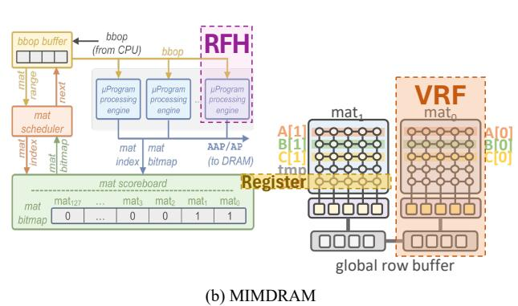
  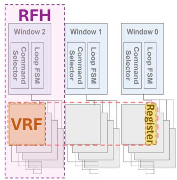

**调度算法与运行时管理**

- **调度目标**：在遵守每个 RFH 的激活限制（例如，每个 RFH 同时只能激活 1 个 VRF）的前提下，最大化硬件利用率。
- **调度流程**（基于图10的算法）：
  - 当一个 ensemble 被提交时，调度器会尝试激活其所有 VRF。
  - 如果某个 RFH 的激活上限已达到，剩余的 VRF 会被放入该 RFH 的**待机队列 (standby queue)**。
  - 当前激活的 VRF 完成执行后，调度器会收到硬件中断，并从待机队列中取出 VRF 进行下一轮激活，直到 ensemble 中所有 VRF 都执行完毕。
- **热感知调度**：调度器利用供应商提供的功耗模型，动态调整激活的 VRF 数量，确保芯片总功耗在安全范围内。

**在整体 MPU 架构中的作用**

- **承上启下**：Ensemble 模型是连接高级编程抽象（如 ezpim）和底层 PUM 微架构的桥梁。
  - **向上**：它为程序员和编译器提供了一个简单、灵活且可扩展的并行编程模型。
  - **向下**：它通过 RFH 抽象，将多样化的硬件约束统一化，使得 MPU 控制路径（如 Compute Controller）可以用一套通用逻辑来管理所有后端。
- **赋能复杂控制流**：通过与 per-lane masking（通过 `SETMASK`/`UNMASK` 指令控制）结合，ensemble 模型能够高效地支持数据驱动的动态循环和分支，这是实现 **CPU-free end-to-end execution** 的关键。
   *Fig. 7. ezpim code (left) and MPU ISA output (right) for (a) for/while loops, (b) branches, (c) nested branches; (d) MPU complex control support.*
- **简化软件栈开发**：由于二进制文件不再硬编码硬件细节（如 VRF 的物理位置），这为开发可移植的编译器、调试器和性能分析工具奠定了基础。

### 3. Register File Holder (RFH) Abstraction

**Register File Holder (RFH) Abstraction 的核心设计原理**

- **RFH 的根本目的**是作为一个**硬件约束的通用封装层**，将底层 PUM 微架构中复杂的物理限制（如热密度、共享控制逻辑）对程序员和编译器隐藏起来。
- 它建立在**Vector Register File **(VRF) 之上。一个 VRF 通常直接映射到一个或多个物理内存阵列（mat/subarray/tile），代表了可被编程模型直接寻址的基本计算单元。
- 一个 **RFH 则包含一组在物理上紧密耦合、无法完全并行激活的 VRF**。这种耦合源于具体的硬件实现约束。

**RFH 所封装的关键硬件约束类型**

- **热密度限制 **(Thermal Dissipation Limits)：
  - 在高密度内存阵列（如 ReRAM, DRAM）中，并行激活过多的 VRF 会导致局部功耗密度过高，超出安全散热阈值。
  - **RFH 将受同一热域限制的 VRF 分组**，确保运行时调度器不会同时激活超过安全数量的 VRF。
  - 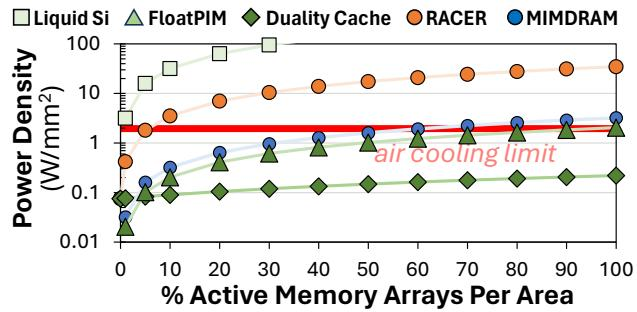
- **共享硬件资源限制 **(Shared Hardware Resource Limits)：
  - 某些微架构中，邻近的 VRF 可能共享关键的控制单元，例如指令控制器、解码器或互连网络端口。
  - 例如，在 **Duality Cache** 中，一组 SRAM 子阵列共享一个**issue window** 和其内部的**loop FSM**，导致它们无法执行不同的指令流。
  - **RFH 将共享同一套控制硬件的 VRF 分组**，确保调度器在同一时刻只为该 RFH 分配一个统一的指令流。

**RFH 在不同 PUM 微架构中的具体映射实例**

 *(a) RACER*

- **RACER **(ReRAM-based)：
  - **VRF 映射**：每个 **pipeline**（由多个按位条带化的 tile 组成）映射为一个 VRF。
  - **RFH 映射**：**一个 cluster**（包含 64 个 pipeline/VRF，并共享一个 **Pipeline Control Circuitry **(PCC)）映射为一个 RFH。这同时满足了热限制和共享 PCC 的约束。
- **MIMDRAM **(DRAM-based)：
  - **VRF 映射**：**单个 DRAM mat** 映射为一个 VRF。
  - **RFH 映射**：**每个 µPE **(micro-Program processing engine) 控制的一组物理邻近的 mats/VRFs 映射为一个 RFH，以遵守热限制。
- **Duality Cache **(SRAM-based)：
  - **VRF 映射**：**单个 SRAM subarray** 映射为一个 VRF。
  - **RFH 映射**：**每个 issue window** 及其直接连接的 SRAM subarrays/VRFs 映射为一个 RFH，因为这些 subarrays 共享同一个指令分发和循环控制 FSM。

**RFH 的运行时调度算法与作用**

- **输入**：程序员定义的 **ensemble**（一个逻辑上要执行相同操作的 VRF 集合，其成员可以来自任意物理位置）。
- **处理流程**：
  - MPU 运行时接收到 ensemble 后，会将其包含的 VRF 按所属的 **RFH 进行分组**。
  - 调度器（如图  *Fig. 8. MPU control path hardware for an abstracted datapath.* 中所示）维护一个 per-RFH 的激活队列和等待队列。
  - 对于每个 RFH，调度器根据预设的**硬件约束**（例如，`Active VRFs Per RFH` 参数，在 RACER 中为 1，在 MIMDRAM/Duality Cache 中为 256，见下表）来决定可以同时激活多少个 VRF。
  - 如果 ensemble 请求激活的 VRF 数量超过了 RFH 的约束上限，多余的 VRF 会被放入**standby queue**（等待队列）。
  - 当前批次激活的 VRF 执行完成后，调度器会从等待队列中取出下一批 VRF 进行激活，直到整个 ensemble 的所有 VRF 都执行完毕。
- **输出**：对底层硬件发出符合物理约束的、分批次的 VRF 激活指令序列，保证了程序的正确性和硬件的安全性。

**系统参数中的 RFH 配置**

| 参数 | RACER | MIMDRAM | Duality Cache | 说明 |
| :--- | :--- | :--- | :--- | :--- |
| **Active VRFs Per RFH** | 1 | 256 | 256 | 由热或互连约束决定的最大并发 VRF 数 |
| **RFHs Per MPU** | 8 | 8 | 8 | 由互连网络拓扑决定 |
| **MPUs on Chip** | 497 | 450 | 12 | 受芯片总面积和 MPU 前端面积限制 |

**RFH 抽象在整体 MPU 架构中的关键作用**

- **解耦编程模型与硬件细节**：程序员只需关注逻辑上的 **ensemble** 并行性，无需了解 VRF 的物理布局和激活限制，极大地简化了编程。
- **保障硬件安全**：通过运行时强制执行 RFH 约束，自动防止了因过度并行激活而导致的**热失控**风险。
- **实现跨平台二进制可移植性**：MPU 二进制文件不包含具体的硬件约束信息。当在不同微架构上运行时，只需加载对应的 RFH/VRF 映射配置，运行时即可自动适配，这是构建通用 PUM 软件栈的基础。

### 4. MPU Control Path Hardware

**MPU控制路径硬件架构**

MPU控制路径硬件是实现其微架构无关接口的核心，负责高效执行MPU ISA二进制文件。其设计围绕三个关键组件展开：预解码器（Precoder）、计算控制器（Compute Controller, CC）和数据传输控制器（Data Transfer Controller, DTC），共同协作以管理程序状态、调度执行并处理数据移动。

 *Fig. 8. MPU control path hardware for an abstracted datapath.*

---
**预解码器 (Precoder)**

- **核心功能**：作为指令分发的前端，负责从片上存储中获取指令并将其路由到正确的控制单元。
- **关键组件**：
  - **指令存储单元 (ISU)**：用于在芯片上存储完整的MPU程序二进制文件。其具体实现技术（如SRAM或与PUM相同的技术）由硬件设计者根据平台需求决定。
  - **取指单元 (Fetcher)**：使用程序计数器（PC）从ISU中检索下一条或多条指令。它利用**ensemble**头尾的元数据来确定应将指令体分发给哪个控制单元（CC或DTC）。
- **作用**：解耦了指令获取与具体执行逻辑，为后续的并行任务调度奠定了基础。

---
**计算控制器 (Compute Controller, CC)**

计算控制器是执行**compute ensemble**的核心，其内部包含多个协同工作的子模块。

- **激活板 (Activation Board)**：
  - 包含一个针对MPU中每个VRF的使能位掩码。
  - 在ensemble启动时，CC根据元数据启用特定的VRF，确保只有目标硬件单元被激活。
- **回放缓冲区 (Playback Buffer)**：
  - 存储从预解码器接收到的计算指令序列。
  - **关键作用**：支持指令序列的重放，这对于两种场景至关重要：(1) 当硬件约束（如热限制）阻止所有VRF同时并发执行时；(2) 在执行包含动态循环的指令时，需要反复迭代。
- **指令到微操作解码器 (I2M)**：
  - **通用性设计**：这是一个**universal I2M**，能够将MPU ISA中的通用指令翻译成后端特定PUM微架构所需的底层微操作（micro-ops）。
  - **基于配方表 (Recipe Table) 的优化**：
    - 配方表是一个并行查找表，存储了每条计算指令对应的微操作序列模板（recipes）。这些模板包含微操作但不包含具体的寄存器地址。
    - **模板填充器 (Template Filler)**：在运行时，根据当前激活的VRF信息，将具体的VRF地址填入模板，生成完整的、可执行的微操作序列。
    - **容量优化机制**（见图9）：
      - **指针表 (Pointer Table)**：允许多个recipe共享公共的子序列，减少冗余存储。
      - **模板查找表 (Template Lookup Table)**：作为二级缓存，动态地将常用recipe从二进制存储加载到容量有限的主配方表中。
      - **跨CC共享**：多个CC可以共享同一个配方表硬件，以节省面积和功耗。

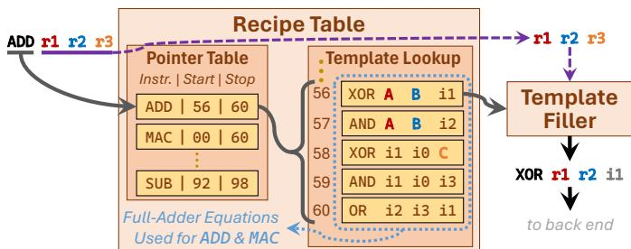 *Fig. 9. Example of an optimized recipe table implementation.*

- **复杂控制流支持**：
  - **向量通道掩码 (Vector Lane Masking)**：通过在每个VRF的数据路径电压供应线上增加一个**mask register**来实现。该寄存器的每一位控制对应通道（lane）是否接收执行操作所需的电压，从而实现硬件级的通道使能/禁用。
  - **评估取指基础设施 (EFI)**：位于CC与数据路径之间。当执行`JUMP_COND`等控制指令时，EFI会读取mask register的内容。如果所有位均为0（即所有通道都已退出循环），则跳转不被执行；否则，程序计数器更新到跳转目标，继续执行。

---
**数据传输控制器 (Data Transfer Controller, DTC)**

DTC专门负责处理**transfer ensemble**和**inter-MPU通信**，确保数据移动的一致性和效率。

- **目标映射 (Target Map)**：
  - 在transfer ensemble的头部，DTC接收源RFH/VRF和目标RFH/VRF的地址对，并将其存储在目标映射中。
  - 对于具有电路交换网络的PUM微架构，此阶段还可用于预先建立网络路径。
- **数据缓冲区 (Data Buffer)**：
  - 可选但关键的组件，用于在传输过程中暂存数据。
  - **主要用途**：
    - 促进长距离数据传输。
    - 支持复杂的数据预处理操作，如广播（broadcast）、转置（transpose）或向量移位（vector shift）。
    - 作为**inter-MPU消息传递**的缓冲区。
- **Inter-MPU控制器**：
  - 当遇到`SEND`或`RECV`指令时被激活。
  - 发送方流程：(1) 通过目标映射从后端请求数据；(2) 等待数据填充到数据缓冲区；(3) 将数据发送至目标MPU。

---
**调度算法与硬件**

MPU的调度器是确保安全、高效执行的关键，尤其需要处理PUM架构固有的**power density**（功率密度）约束。

- **热感知调度算法**（见图10）：
  - 调度器持续跟踪每个**RF holder (RFH)** 中已激活的VRF数量。
  - 如果某个RFH达到其预设的最大激活VRF上限，剩余的VRF会被放入**standby queue**（待命队列）。
  - 当当前激活的VRF完成执行后，调度器会停用它们，并从待命队列中激活下一批VRF，严格遵守RFH的硬件约束。
  - 这一过程循环往复，直到整个ensemble执行完毕。

- **输入输出关系**：
  - **输入**：MPU ISA二进制文件、硬件约束参数（如每个RFH的最大激活VRF数）。
  - **输出**：一系列经过调度、解码并最终在PUM后端执行的微操作序列，以及协调好的数据移动操作。
- **在整体中的作用**：MPU控制路径硬件将程序员友好的、微架构无关的MPU ISA抽象，无缝地转化为针对特定PUM后端（如RACER、MIMDRAM）的高效、安全且符合物理约束的底层操作，从而实现了**end-to-end application execution**（端到端应用执行）的目标，并显著提升了性能和能效。

### 5. SIMD Gating with Lane Masking

**SIMD Gating with Lane Masking 的实现原理**

- 该机制的核心在于将传统的 **SIMD (Single Instruction, Multiple Data)** 执行模型与**每通道（per-lane）的动态控制能力**相结合，从而突破了传统向量处理器在处理**数据驱动控制流**（如 if-else、while 循环）时的局限性。
- 其硬件基础是为每个 **VRF (Vector Register File)** 引入一个专用的 **mask register (掩码寄存器)**。这个寄存器的每一位直接对应 VRF 中的一个 **lane (通道)**。
- **mask register** 被物理地集成到内存阵列的电压供给线上。当某一位为 `1` 时，对应的 **lane** 接收执行操作所需的电压，正常参与计算；当为 `0` 时，该 **lane** 被**电源门控（power gated）**，即被禁用，不参与当前指令的执行。
- 这种在**内存原位（in-memory）** 实现的门控机制，避免了将控制信息传回外部 CPU 或复杂控制单元的开销，实现了真正的 **CPU-free execution**。

**算法流程与关键指令**

- **分支（Branches）处理流程**：
  - 程序员使用 `CMPxx` (如 `CMPEQ`, `CMPGT`) 指令对向量数据进行比较，结果（一个 per-lane 的布尔值）被存入一个特殊的 **conditional register (条件寄存器)**。
  - 通过 `SETMASK <rs>` 指令，可以将 **conditional register** 或任意通用寄存器 `rs` 中的数据加载到 **mask register** 中，从而激活或禁用特定的 lanes。
  - 在 `if` 分支体中，只有 mask 为 `1` 的 lanes 会执行后续指令。
  - 对于 `else` 分支，可以通过软件逻辑先保存当前 mask，然后对其取反再 `SETMASK`，或者直接在 else 体前设置新的 mask。
  - `UNMASK` 指令用于清除所有 mask 位（设为 `1`），重新启用所有 lanes，通常用于分支结束。
- **动态循环（Dynamic Loops）处理流程**：
  - 循环体由 `JUMP_COND <lineNum>` 指令控制。
  - 每次循环迭代后，程序会更新 **mask register**，将满足退出条件的 lanes 对应的 mask 位设为 `0`。
  - 当执行 `JUMP_COND` 时，**EFI (Evaluation Fetching Infrastructure)** 硬件模块会被触发。
  - **EFI** 会从 **mask register** 中读取当前的掩码值，并检查是否**所有位都为 `0`**。
    - 如果**全为 `0`**，说明所有 lanes 都已退出循环，`JUMP_COND` 不执行跳转，程序顺序执行下一条指令。
    - 如果**存在 `1`**，说明仍有 lanes 在循环中，`JUMP_COND` 将程序计数器（PC）跳转回循环体起始行 `lineNum`，继续下一轮迭代。
  - 这种机制支持**任意嵌套深度**的循环和分支，因为程序员可以通过 `GETMASK` 指令将当前 **mask register** 的内容读回一个通用寄存器进行保存和修改，从而管理不同嵌套层级的控制状态。

 *Fig. 7. ezpim code (left) and MPU ISA output (right) for (a) for/while loops, (b) branches, (c) nested branches; (d) MPU complex control support.*

**参数设置与硬件协同**

- **Mask Register 宽度**：其宽度与 VRF 的 **vector width** 严格一致，范围从几十到数千位，以匹配底层 PUM 技术（如 DRAM, ReRAM）的并行度。
- **EFI (Evaluation Fetching Infrastructure)**：这是一个轻量级的硬件逻辑单元，位于 **Compute Controller (CC)** 和 PUM 后端之间。它的唯一功能是高效地读取 **mask register** 并执行“是否全零”的逻辑判断，决策延迟极低。
- **Recipe Table 协同**：在指令解码阶段，**I2M (Instruction-to-Micro-op) decoder** 会利用 **recipe table** 将 MPU ISA 指令（如 `ADD`）翻译成底层微操作序列。这个过程与 lane masking 是正交的——**masking 决定了哪些 lanes 参与执行，而 I2M 决定了执行什么操作**。

**输入输出关系及在整体架构中的作用**

- **输入**：
  - **数据输入**：存储在 VRF 中的向量数据。
  - **控制输入**：由 `CMPxx` 等指令生成的 **conditional register** 值，或由程序逻辑计算出的任意掩码值。
- **输出**：
  - **数据输出**：经过 predicated execution（谓词执行）后的部分更新的向量结果。
  - **控制输出**：由 **EFI** 产生的布尔信号，用于决定 `JUMP_COND` 是否跳转，从而驱动程序流。
- **在 MPU 整体架构中的作用**：
  - **赋能复杂控制流**：这是 MPU 能够实现 **end-to-end application execution** 的关键技术。它使得 PUM 不再局限于执行简单的、无分支的内核（kernels），而是能够处理包含复杂逻辑的真实世界应用。
  - **提升编程抽象**：通过 `ezpim` 等高级汇编器，程序员可以用类似高级语言的 `if/else` 和 `for/while` 语法编写代码，底层细节由 MPU 自动转换为 mask 操作和 `JUMP_COND` 指令，极大降低了编程负担。
  - **维持高能效**：由于控制流决策完全在内存内部完成，避免了与外部 CPU 频繁通信带来的巨大性能和能耗开销。论文图1指出，即使只有 1/80 的指令需要 CPU，也会导致 **10.1×** 的性能下降。SIMD gating 机制正是解决此问题的关键。

---

## 4. 实验方法与实验结果

**实验设置**

- **评估平台**：研究在三种不同的 PUM (Processing-Using-Memory) 微架构上评估了 MPU (Memory Processing Unit)，分别是基于 ReRAM 的 **RACER**、基于 DRAM 的 **MIMDRAM** 和基于 SRAM 的 **Duality Cache**。
- **对比基线**：
  - **Baseline**：指原始的 PUM 架构，它们依赖外部 **host CPU** 来执行控制流等非 PUM 指令。
  - **GPU**：使用现代高性能的 **NVIDIA GeForce RTX 4090** 作为通用加速器的代表进行对比。
  - **CPU**：也与 **Intel Xeon Gold 6544Y** 进行了比较，但因 GPU 性能更优，论文中省略了 CPU 结果。
- **芯片面积约束**：所有 PUM 架构均采用 **iso-area**（等面积）比较原则，即芯片总面积固定为 **4 cm²**。集成 MPU 前端逻辑后，会相应减少后端 PUM 阵列的数量以保持总面积不变。
- **工作负载**：
  - **21 个数据密集型 kernels**：分为四类：基础 kernels、分支密集型 kernels、stencil kernels 和包含复杂控制流的 kernels。
  - **3 个端到端应用**：**LLMEncode**（大语言模型编码器）、**BlackScholes**（金融期权定价模型）和 **EditDistance**（基因组测序中的编辑距离算法）。
- **模拟与建模**：
  - 开发了名为 **MASTODON** 的周期精确模拟器，用于模拟 MPU 及其后端。
  - MPU 关键组件在 **15 nm CMOS** 工艺下进行了综合，目标频率为 **1 GHz**。
  - GPU 结果通过在真实 **RTX 4090** 硬件上运行高度优化的 CUDA 代码获得。

**结果数据分析**

- **MPU 相对于 Baseline 的改进**：
  - **性能**：MPU 在所有三种后端上均实现了显著加速。平均而言，**MPU:RACER** 提升 **1.79×**，**MPU:MIMDRAM** 提升 **1.69×**，**MPU:DualityCache** 提升 **1.12×**。
  - **能效**：MPU 带来了巨大的能量节省。平均而言，**MPU:RACER** 节省 **3.23×** 能量，**MPU:MIMDRAM** 节省 **2.34×**，**MPU:DualityCache** 节省 **4.07×**。
  - 改进的主要来源是 **消除了与 host CPU 的频繁通信开销**，尤其是在处理包含复杂控制流（如动态循环、嵌套分支）的应用时，Baseline 性能急剧下降，而 MPU 能够在内存内独立完成。

- **MPU 相对于 GPU 的优势**：
  - **性能**：MPU 架构展现出压倒性优势。**MPU:RACER** 平均比 RTX 4090 快 **67×**，**MPU:MIMDRAM** 快 **156×**。
  - **能效**：优势更为惊人。**MPU:RACER** 平均节省 **47×** 能量，**MPU:MIMDRAM** 节省 **35×**。
  - 这证明了即使是最先进的 GPU，在处理这些高度数据并行但控制流复杂的任务时，也无法匹敌专为内存内计算设计的 MPU 架构。

- **端到端应用分析**：
  - **Baseline 的致命弱点**：其性能严重依赖于计算块的大小。对于 **EditDistance** 这种需要频繁 CPU-PUM 交互的应用，Baseline 甚至比 GPU 慢 **7.72×**。
  - **MPU 的全面胜利**：由于完全消除了片外通信，MPU 在 **LLMEncode** 和 **EditDistance** 上分别实现了最高 **545×** 的速度提升。
  - **能效反转**：Baseline 在 **BlackScholes** 和 **EditDistance** 上的能耗甚至 **高于 GPU**，而 MPU 则实现了 **5.4× 至 14.2×** 的能效提升。

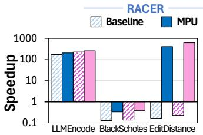
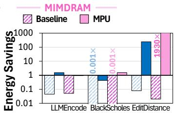

**消融实验与关键洞察**

- **MPU 开销分析**：
  - MPU 前端逻辑（控制路径）的面积开销为 **0.123 mm²**，在 RACER 芯片上约占总面积的 **13%**。
  - 其功耗占系统总功耗的 **40.2%**，主要消耗在存储单元（如 playback buffer, recipe table）上。
  - 对于简单的、无控制流的 **basic kernels**，MPU 由于减少了后端阵列数量，会带来轻微的 **3.1%** 性能下降，这验证了其开销是真实存在的，但在复杂应用中被巨大收益所掩盖。

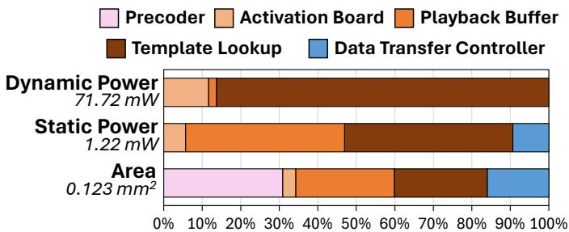

- **不同后端表现差异的原因**：
  - **MPU:DualityCache** 改进较小，原因有二：(1) 它与 CPU 集成在同一芯片上，通信开销本就较低；(2) **SRAM 密度低**导致片上容量有限（仅 0.2GB），大量时间花在与外部内存的数据传输上，限制了 MPU 的优势发挥。
- **控制流支持的关键作用**：
  - 论文通过一个简化研究（Figure 1）指出，即使只有 **1/80** 的指令需要 CPU，也会导致 **10.1×** 的整体减速。
  - MPU 通过引入 **lane masking**、**conditional register** 和 **JUMP_COND** 等硬件/ISA 特性，成功地将控制流执行完全保留在内存内，这是其性能飞跃的根本原因。

- **编程效率提升**：
  - 通过高级汇编器 **ezpim**，端到端应用的代码量大幅减少。例如，**EditDistance** 的代码从 **5428** 行减少到 **120** 行，**BlackScholes** 从 **1059** 行减少到 **383** 行。
  - 这证明了 MPU 抽象（如 ensemble, RFH）极大地简化了针对复杂 PUM 硬件的编程。

---

